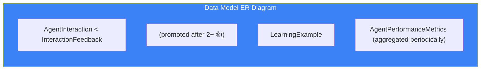

# Page 77: Feedback System & Learning Data Models

> Supplements Page 8 (Learning Agent) with detailed data models, API endpoints, and ER relationships from `learning-agents.md`.

---

## 77.1 Overview

The feedback system is the backbone of ensureStudy's **Type 5 Learning Agent**. It transforms user feedback into concrete learning examples that improve future responses — a lightweight alternative to full RLHF.

---

## 77.2 Data Model ER Diagram



---

## 77.3 Core Models

### AgentInteraction

```python
class AgentInteraction(db.Model):
    id              = Column(UUID, primary_key=True)
    agent_type      = Column(String(50))           # "tutor", "research", etc.
    session_id      = Column(UUID)
    user_id         = Column(UUID, ForeignKey("users.id"))
    query           = Column(Text)                  # Student's question
    response        = Column(Text)                  # Agent's answer
    response_metadata = Column(JSONB)               # Tokens, latency, model
    topic           = Column(String(200))            # Extracted topic
    response_time_ms = Column(Integer)               # Latency
    created_at      = Column(DateTime)
```

### InteractionFeedback

```python
class InteractionFeedback(db.Model):
    id              = Column(UUID, primary_key=True)
    interaction_id  = Column(UUID, ForeignKey("agent_interactions.id"))
    user_id         = Column(UUID, ForeignKey("users.id"))
    feedback_type   = Column(Enum("thumbs", "rating", "text"))
    feedback_value  = Column(Integer)               # +1 (👍) or -1 (👎)
    feedback_text   = Column(Text)                  # Optional comment
    created_at      = Column(DateTime)
```

### LearningExample

```python
class LearningExample(db.Model):
    id              = Column(UUID, primary_key=True)
    agent_type      = Column(String(50))
    topic           = Column(String(200))
    query           = Column(Text)                  # The question
    good_response   = Column(Text)                  # Promoted good answer
    bad_response    = Column(Text)                  # Optional bad example
    source          = Column(String(50))            # "user_feedback" | "manual"
    weight          = Column(Float, default=1.0)
    feedback_score  = Column(Float)                 # Cumulative positive votes
    use_count       = Column(Integer, default=0)    # Times injected in prompts
    created_at      = Column(DateTime)
```

### AgentPerformanceMetrics

```python
class AgentPerformanceMetrics(db.Model):
    id                      = Column(UUID, primary_key=True)
    agent_type              = Column(String(50))
    period_start            = Column(DateTime)
    period_end              = Column(DateTime)
    total_interactions      = Column(Integer)
    positive_feedback_count = Column(Integer)
    negative_feedback_count = Column(Integer)
    satisfaction_rate       = Column(Float)         # positive / total
    topic_metrics           = Column(JSONB)         # Per-topic breakdown
```

---

## 77.4 Feedback API

### Source: `backend/core-service/app/routes/feedback.py`

| Method | Endpoint | Purpose |
|--------|----------|---------|
| POST | `/api/feedback/submit` | Submit 👍/👎 for an interaction |
| GET | `/api/feedback/examples` | Fetch learning examples by topic |
| GET | `/api/feedback/stats/<agent_type>` | Performance metrics |
| POST | `/api/feedback/interactions` | Log an agent interaction |

### Submit Feedback

```python
@feedback_bp.route("/submit", methods=["POST"])
@jwt_required
def submit_feedback():
    data = request.json
    
    feedback = InteractionFeedback(
        interaction_id=data["interaction_id"],
        user_id=g.current_user_id,
        feedback_type="thumbs",
        feedback_value=data["value"]   # +1 or -1
    )
    db.session.add(feedback)
    db.session.commit()
    
    # Auto-promote to LearningExample after 2+ positive
    _maybe_create_learning_example(
        AgentInteraction.query.get(data["interaction_id"])
    )
    
    return jsonify({"status": "recorded"})
```

### Auto-Promotion Logic

```python
def _maybe_create_learning_example(interaction: AgentInteraction):
    positive_count = InteractionFeedback.query.filter(
        InteractionFeedback.interaction_id == interaction.id,
        InteractionFeedback.feedback_value > 0
    ).count()
    
    if positive_count >= 2:  # MIN_POSITIVE_FOR_EXAMPLE = 2
        existing = LearningExample.query.filter_by(
            query=interaction.query,
            agent_type=interaction.agent_type
        ).first()
        
        if not existing:
            example = LearningExample(
                agent_type=interaction.agent_type,
                topic=interaction.topic,
                query=interaction.query,
                good_response=interaction.response,
                source='user_feedback',
                feedback_score=positive_count
            )
            db.session.add(example)
            db.session.commit()
```

---

## 77.5 Few-Shot Injection in Tutor Agent

### Source: `backend/ai-service/app/learning/learning_element.py`

```python
class TutorLearningElement:
    """Fetches and injects high-rated examples into prompts"""
    
    async def get_examples(self, topic: str, limit: int = 2) -> list:
        """Fetch top-rated learning examples for this topic"""
        response = await httpx.get(
            f"{CORE_SERVICE_URL}/api/feedback/examples",
            params={"topic": topic, "limit": limit, "agent_type": "tutor"}
        )
        return response.json().get("examples", [])
    
    def build_few_shot_prompt(self, examples: list) -> str:
        if not examples:
            return ""
        
        sections = ["Here are examples of good responses:"]
        for i, ex in enumerate(examples, 1):
            sections.append(f"""
---
Example {i}:
Student Question: {ex['query']}
Good Response: {ex['good_response']}
---""")
        return "\n".join(sections)
    
    async def enhance_prompt(self, base_prompt: str, topic: str) -> str:
        examples = await self.get_examples(topic)
        few_shot = self.build_few_shot_prompt(examples)
        return f"{base_prompt}\n\n{few_shot}" if few_shot else base_prompt
```

### Before vs After Learning

| Without Learning | With Learning |
|-----------------|--------------|
| Generic system prompt | System prompt + few-shot examples |
| No topic-specific guidance | Topic-matched exemplar responses |
| Static quality | Improves with each 👍 |

---

## 77.6 Performance Monitoring

```bash
GET /api/feedback/stats/tutor?days=7
```

```json
{
    "agent_type": "tutor",
    "period_days": 7,
    "total_interactions": 1250,
    "feedback": {
        "positive": 980,
        "negative": 45,
        "satisfaction_rate": 0.956
    },
    "top_topics": [
        {"topic": "Photosynthesis", "count": 120, "avg_feedback": 0.92},
        {"topic": "French Revolution", "count": 85, "avg_feedback": 0.88}
    ]
}
```

---

## 77.7 Experience Replay Buffer

```python
class ExperienceReplay:
    """Stores interactions for batch analysis"""
    
    async def add_experience(self, interaction_id, query, response, 
                             reward, topic):
        # Store in replay buffer (Redis list)
        await redis.lpush("replay_buffer:tutor", json.dumps({
            "interaction_id": interaction_id,
            "query": query,
            "response": response,
            "reward": reward,
            "topic": topic,
            "timestamp": datetime.utcnow().isoformat()
        }))
    
    def get_positive_examples(self, min_reward: float = 0.5) -> list:
        """Get high-reward interactions for prompt enhancement"""
        buffer = redis.lrange("replay_buffer:tutor", 0, -1)
        return [
            json.loads(item) for item in buffer
            if json.loads(item)["reward"] >= min_reward
        ]
```

---

## 77.8 Configuration

| Variable | Default | Purpose |
|----------|---------|---------|
| `CORE_SERVICE_URL` | `http://localhost:8000` | Core API for feedback |
| `FEEDBACK_CACHE_TTL` | `300` | Cache TTL for examples (seconds) |
| `MIN_POSITIVE_FOR_EXAMPLE` | `2` | Votes needed to promote |
