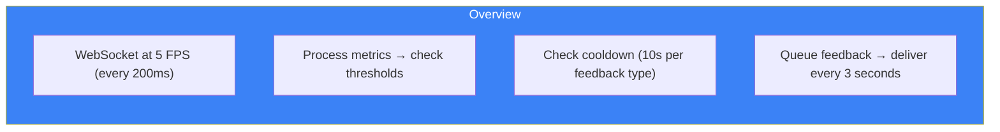
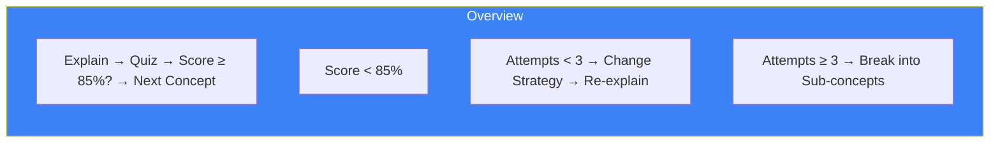

# Page 78: Agent Roadmap — Planned Capabilities

> Documents planned/future agent capabilities from `agent-possibilities.md` that are designed but not yet fully implemented.

---

## 78.1 Overview

This page documents **planned agent extensions** that are architecturally designed and prototyped in the codebase but represent future capabilities. These follow the existing LangGraph StateGraph patterns and agent tool framework.

---

## 78.2 Computerized Adaptive Testing (CAT) Agent

### Status: Designed, Not Deployed

Uses **Item Response Theory (IRT)** to dynamically select questions and estimate student ability with fewer questions than traditional tests.

### IRT 3-Parameter Logistic Model

```python
def probability_correct(theta: float, question: Dict) -> float:
    """3-PL IRT model"""
    a = question["discrimination"]   # How well question differentiates
    b = question["difficulty"]        # Question difficulty (-3 to +3)
    c = question.get("guessing", 0.0) # Guessing probability for MCQ
    
    exponent = a * (theta - b)
    return c + (1 - c) / (1 + np.exp(-exponent))
```

### Adaptive Selection

```python
def select_next_question(self) -> Dict:
    """Select question with maximum Fisher information at current theta"""
    remaining = [q for q in self.questions if q["id"] not in self.administered]
    
    def information(question: Dict) -> float:
        a = question["discrimination"]
        p = self.probability_correct(self.theta_estimate, question)
        return (a ** 2) * p * (1 - p)
    
    return max(remaining, key=information)
```

### Stopping Criteria

| Condition | Threshold |
|-----------|-----------|
| Standard error | < 0.3 |
| Max questions | 30 |
| Time limit | Assessment-defined |

### Output

```json
{
    "ability_estimate": 1.7,
    "standard_error": 0.28,
    "questions_administered": 18,
    "confidence_interval": [1.15, 2.25]
}
```

---

## 78.3 Question Quality Agent

### Status: Designed

Evaluates and improves auto-generated questions using 5 quality dimensions:

| Dimension | Weight | Check |
|-----------|--------|-------|
| Clarity | 25% | Is question unambiguous? |
| Distractors | 25% | Are wrong options plausible? |
| Difficulty | 20% | Matches target level? |
| Bloom's Level | 15% | Tests understanding vs recall? |
| Bias | 15% | Free from cultural/gender bias? |

A question passes quality review if overall score ≥ 7.0/10.

---

## 78.4 Cheat-Resistant Question Agent

### Status: Designed

Generates questions that resist internet lookup using 4 strategies:

| Strategy | Technique | Example |
|----------|-----------|---------|
| Personalized | Use student's name/context | "Alice has 47 kg of..." |
| Novel scenario | Unusual creative setting | "On a Mars colony, calculate..." |
| Material-specific | Questions from uploaded PDFs only | "According to Chapter 5 of your textbook..." |
| Randomized values | Non-round numbers | "A car with mass 1,347 kg..." |

---

## 78.5 Real-Time Presentation Coach

### Status: Partially Implemented

Live feedback during practice presentations with cooldown logic:

```python
class RealTimeCoachAgent:
    cooldown_seconds = 10  # Don't repeat same feedback for 10s
    
    async def process_metrics(self, metrics: Dict) -> Optional[str]:
        feedbacks = []
        
        if metrics.get("eye_contact_rate", 1.0) < 0.4:
            feedbacks.append("👀 Look at the camera more")
        
        wpm = metrics.get("words_per_minute", 130)
        if wpm > 170:
            feedbacks.append("🐇 Slow down a bit")
        elif wpm < 100:
            feedbacks.append("🐢 Try speaking a bit faster")
        
        if metrics.get("filler_detected"):
            feedbacks.append(f"💬 You said '{metrics['filler_detected']}' — try pausing instead")
        
        if metrics.get("posture_score", 1.0) < 0.5:
            feedbacks.append("🧍 Straighten your posture")
        
        return feedbacks[0] if feedbacks else None
```

### Feedback Timing



---

## 78.6 Concept Mastery Agent

### Status: Designed

Ensures true understanding before advancing, using adaptive teaching strategies:



### Teaching Strategies

| Strategy | When | Example |
|----------|------|---------|
| Visual | Abstract concepts | Mermaid diagrams |
| Analogy | New concepts | "RAM is like a desk..." |
| Example | Procedural knowledge | Step-by-step worked examples |
| Formal | Advanced students | Precise definitions, proofs |
| Socratic | Struggling students | Leading questions |

---

## 78.7 Socratic Questioning Agent

### Status: Designed

Guides students to discover answers through questions rather than direct answers:

```python
SOCRATIC_SYSTEM_PROMPT = """
You are a Socratic tutor. You NEVER give direct answers.
Instead, you guide students through questions.

Rules:
1. Respond with 2-3 guiding questions
2. Build on student's prior knowledge
3. If stuck after 3 attempts, give a hint (not answer)
4. Celebrate discovery moments
"""
```

---

## 78.8 Behavioral Pattern Proctoring Agent

### Status: Designed

Reasons about **behavior patterns** over time rather than single-frame threshold violations:

| Pattern | Detection | Risk |
|---------|-----------|------|
| Phone lookup | Repeated gaze to same off-screen point | High |
| Note reading | Brief downward gaze, returns to screen | Low |
| Person assistance | Second face + quick side gaze | Critical |
| Natural break | Brief look away, yawning | None |

### Correlation Analysis

Detects suspicious timing: if answers change within 3 seconds of looking away, it flags a `lookup_then_answer` correlation.

---

## 78.9 7-Worker Web Ingest Pipeline

### Status: Implemented

The Research Agent's web content pipeline uses 7 specialized workers:

| Worker | Role | Input → Output |
|--------|------|----------------|
| W1 | Topic Extractor | Query → key topics (LLM) |
| W2 | DuckDuckGo Search | Topics → article URLs |
| W3 | Wikipedia Search | Topics → article titles |
| W4 | Wikipedia Content | Titles → full text |
| W5 | Parallel Crawler | URLs → raw HTML (httpx) |
| W6 | Content Cleaner | HTML → clean text (trafilatura) |
| W6B | PDF Search | Topics → downloaded PDFs |
| W7 | Chunk & Embed | Text → Qdrant vectors |

---

## 78.10 Future Enhancements Summary

| Feature | Status | Priority |
|---------|--------|----------|
| CAT/IRT adaptive testing | Designed | High |
| Question quality agent | Designed | Medium |
| Cheat-resistant questions | Designed | Medium |
| Real-time presentation coach | Partial | High |
| Concept mastery agent | Designed | High |
| Socratic questioning | Designed | Medium |
| Behavioral pattern proctoring | Designed | Low |
| A/B testing framework | Designed | Low |
| RLHF-lite preference learning | Designed | Low |
| Batch learning pipeline (nightly) | Designed | Medium |
