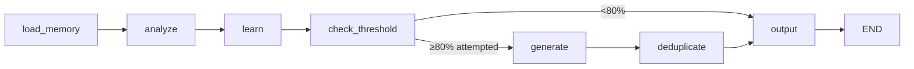

# Page 81: Mock Interview System

> Full AI-powered mock interview system with LangGraph-based question generation, real-time answer evaluation, and adaptive difficulty.

---

## 81.1 Architecture Overview

```mermaid\nflowchart LR\n    FE[\"🎭 Frontend<br/>Avatar + Speech→Text\"] <-->|WebSocket| API[\"📡 Mock Interview API<br/>/api/mock-interview\"]\n    API <-->|CRUD| DB[\"🗄️ Core Service DB<br/>Questions Store\"]\n    API --> IE[\"🎯 InterviewEvaluator<br/>Groq LLM Scoring<br/>llama-3.3-70b\"]\n    IE --> IQA[\"🧠 InterviewQuestion Agent<br/>Type 5 LangGraph<br/>Self-improving\"]\n    IQA -.->|\"New questions\"| DB\n\n    style FE fill:#3b82f6,color:#fff\n    style API fill:#8b5cf6,color:#fff\n    style IE fill:#f59e0b,color:#000\n    style IQA fill:#ef4444,color:#fff\n    style DB fill:#10b981,color:#fff\n```

### Source Files

| File | Path | Size |
|------|------|------|
| Interview Question Agent | `backend/ai-service/app/agents/interview_question_agent.py` | 798 lines |
| Mock Interview Routes | `backend/ai-service/app/api/routes/mock_interview.py` | 1,038 lines |
| Interview Evaluator | `backend/ai-service/app/services/interview_evaluator.py` | 297 lines |
| Core Service Routes | `backend/core-service/app/routes/interview_questions.py` | 12KB |
| Core Service Models | `backend/core-service/app/models/interview_questions.py` | 5KB |

---

## 81.2 InterviewQuestionAgent — Type 5 Learning Agent

### LangGraph State

```python
class InterviewLearningState(TypedDict):
    # Input
    task_type: str           # "learn" | "generate" | "evaluate"
    topic_id: str
    topic_name: str
    topic_description: str
    classroom_id: Optional[str]
    
    # Learning Memory (persistent)
    memory: Dict[str, Any]   # calibrated_difficulty, target_avg_score,
                             # preferred_question_types, avoided_patterns,
                             # successful_prompts, learning_iterations
    
    # Performance Data
    recent_responses: List[Dict]    # Last N interview evaluations
    existing_questions: List[Dict]  # Current question pool
    questions_attempted: int
    total_questions: int
    attempt_percentage: float
    
    # Generation
    generation_strategy: Dict[str, Any]
    generated_questions: List[Dict]
    deduplicated_questions: List[Dict]
    
    # Output
    questions: List[Dict]
    output: Dict
    error: Optional[str]
```

### 7-Node LangGraph Workflow



| Node | Function | Purpose |
|------|----------|---------|
| `load_memory` | `load_interview_memory()` | Load persistent learning memory from DB |
| `analyze` | `analyze_interview_performance()` | Calculate avg scores, identify weak concepts |
| `learn` | `update_interview_learning()` | Adjust difficulty calibration (±0.1), focus on weak areas |
| `check_threshold` | `check_interview_threshold()` | Trigger generation if ≥80% questions attempted |
| `generate` | `generate_interview_questions()` | LLM-based question generation with learned strategy |
| `deduplicate` | `deduplicate_interview_questions()` | Hash + word-overlap (>70%) deduplication |
| `output` | `format_interview_output()` | Format final response with metrics |

### Adaptive Difficulty Calibration

```python
# If students scoring too high → increase difficulty
if avg_score > target_score + 10:
    difficulty = min(1.0, difficulty + 0.1)

# If scoring too low → decrease difficulty
elif avg_score < target_score - 10:
    difficulty = max(0.0, difficulty - 0.1)

# Difficulty bands: <0.33 = easy, 0.33-0.66 = medium, >0.66 = hard
```

### Multi-Layer Deduplication

1. **Hash-based**: SHA-256 of normalized question text
2. **Word overlap**: Jaccard similarity > 0.7 triggers duplicate flag

---

## 81.3 Mock Interview API Routes

### Two Interview Systems

#### System 1: Subject-Based (Static)

| Endpoint | Method | Description |
|----------|--------|-------------|
| `POST /api/mock-interview/start` | POST | Start session with subject + chapter |
| `POST /api/mock-interview/submit` | POST | Submit answer, get evaluation + next question |
| `GET /api/mock-interview/summary/{session_id}` | GET | Get completed interview summary |

**Request Schema:**
```python
class StartInterviewRequest(BaseModel):
    user_id: str
    subject: str        # math, physics, chemistry
    chapter: str        # topic within subject
    avatar: str = "female"  # male or female
```

#### System 2: Topic-Based (DB-backed, Learning Agent)

| Endpoint | Method | Description |
|----------|--------|-------------|
| `POST /api/mock-interview/topics/start` | POST | Start with ClassroomTopic IDs |
| `POST /api/mock-interview/topics/submit` | POST | Submit with evaluation + learning trigger |
| `GET /api/mock-interview/topics/summary/{session_id}` | GET | Get topic-level mastery summary |

**Request Schema:**
```python
class StartTopicInterviewRequest(BaseModel):
    user_id: str
    topic_ids: List[str]           # ClassroomTopic IDs
    avatar: str = "female"
    questions_per_topic: int = 3   # 1-10
    token: str                     # Auth token for API calls
```

### Interview Flow

```
1. POST /start → Creates session → Returns first question
2. POST /submit → Evaluates answer via LLM → Returns score + next question
   └── If final question → triggers learning agent
3. GET /summary → Returns overall score, concept mastery, weak topics, recommendations
```

---

## 81.4 InterviewEvaluator Service

### EvaluationResult

```python
@dataclass
class EvaluationResult:
    score: float                  # 0-100
    feedback: str                 # Narrative feedback
    key_points_covered: List[str] # What the student got right
    key_points_missed: List[str]  # What was missed
    clarity_score: float          # 0-100
    relevance_score: float        # 0-100
    completeness_score: float     # 0-100
    suggestions: List[str]        # Improvement suggestions
```

### Evaluation Pipeline

1. **LLM Evaluation** (primary): Groq `llama-3.3-70b-versatile` scores the answer against expected answer and key concepts
2. **Heuristic Fallback**: If LLM unavailable, uses word count, keyword matching, and structure analysis
3. **Concept Scoring**: Identifies covered vs missed concepts from key_concepts list

### Scoring Prompt Structure

```
Evaluate this interview answer:
Question: {question}
Student's Answer: {user_answer}
Expected Answer: {expected_answer}
Difficulty: {difficulty}

Score (0-100):
Key Points Covered:
Key Points Missed:
Clarity (0-100):
Relevance (0-100):
Completeness (0-100):
Feedback:
Suggestions:
```

---

## 81.5 Interview Summary

After completing all questions, generates:

| Field | Type | Description |
|-------|------|-------------|
| `session_id` | str | Interview session UUID |
| `average_score` | float | Mean across all answers |
| `concept_mastery` | dict | Per-concept score mapping |
| `weak_topics` | List[str] | Topics scoring < 60% |
| `recommendations` | List[str] | LLM-generated improvement tips |
| `duration_minutes` | float | Total interview time |

### Learning Trigger

After interview completion, the system calls:
```python
agent.trigger_on_interview_complete(
    topic_id, topic_name,
    evaluations=session_evaluations,
    existing_questions=current_pool,
    questions_attempted=attempted_count,
    total_questions=pool_size
)
```
This triggers the learning pipeline to adapt future question difficulty.
