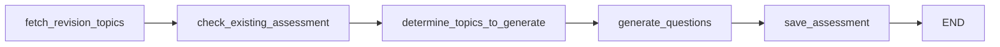

# Page 82: Revision Assessment & Exam Prep

> Daily MCQ generation from AI Revision Schedule + intensive exam preparation with topic prioritization, practice test scheduling, and resource recommendations.

---

## 82.1 RevisionAssessmentAgent — Type 5 LangGraph Agent

### Source: `backend/ai-service/app/agents/revision_assessment_agent.py`

### State Definition

```python
class RevisionAssessmentState(TypedDict):
    user_id: str
    target_date: str              # ISO date for revision
    auth_token: Optional[str]
    revision_topics: List[Dict]   # Topics scheduled for revision today
    existing_assessment_id: Optional[str]
    existing_questions: List[Dict]
    topics_to_generate: List[Dict]
    generated_questions: List[Dict]
    assessment_id: Optional[str]
    total_questions: int
    new_questions_added: int
    error: Optional[str]
```

### 5-Node LangGraph Workflow



| Node | Function | Purpose |
|------|----------|---------|
| `fetch_revision_topics` | Calls Core Service API | Gets topics scheduled for revision on `target_date` |
| `check_existing_assessment` | Checks existing daily assessment | Avoids duplicate assessment creation |
| `determine_topics_to_generate` | Diff existing vs needed | Only generates for uncovered topics |
| `generate_questions` | LLM-based MCQ generation | Creates MCQs using Groq `llama-3.3-70b-versatile` |
| `save_assessment` | Saves to Core Service | Creates or appends to daily revision assessment |

### Agent Class

```python
class RevisionAssessmentAgent:
    async def execute(self, input_data: Dict) -> Dict:
        """
        input_data: {
            user_id: str,
            date: str (ISO, optional — defaults to today),
            auth_token: str
        }
        Returns: {
            assessment_id, total_questions, new_questions_added,
            topics_covered, error
        }
        """
    
    def execute_sync(self, input_data: Dict) -> Dict:
        """Synchronous wrapper using asyncio.run()"""
```

---

## 82.2 Exam Prep Service

### Source: `backend/ai-service/app/services/exam_prep.py`

### Data Models

```python
@dataclass
class ExamInfo:
    exam_id: str
    name: str
    subject: str
    date: str               # YYYY-MM-DD
    curriculum_id: str
    topics: List[str]
    total_marks: int = 100
    duration_minutes: int = 120

@dataclass
class PrepDay:
    day: int
    date: str
    focus_topics: List[str]
    activities: List[Dict]   # study, practice, review
    total_hours: float
    is_review_day: bool = False
    is_exam_day: bool = False

@dataclass
class ExamPrepPlan:
    exam_id: str
    exam_name: str
    exam_date: str
    days_until_exam: int
    total_prep_days: int
    hours_per_day: float
    weak_topics: List[Dict]      # {topic, mastery_score}
    strong_topics: List[Dict]
    prep_days: List[PrepDay]     # Day-by-day schedule
    review_days: List[int]       # Indices of review days
    recommended_resources: List[Dict]
    practice_tests: List[Dict]
```

### ExamPrepService

```python
class ExamPrepService:
    async def create_exam_prep_plan(
        self,
        exam_name: str,
        exam_date: str,        # YYYY-MM-DD
        curriculum_id: str,
        user_id: str,
        hours_per_day: float = 3.0,
        include_resources: bool = True
    ) -> ExamPrepPlan
```

### Prep Plan Strategy

1. **Calculate days until exam** → determines intensity
2. **Identify weak topics** from progress data (mastery < 60%)
3. **Allocate time proportionally** — weak topics get 2× more time
4. **Schedule review days** — every 3rd day is a review/practice day
5. **Generate practice tests** at spaced intervals
6. **Research Agent integration** — recommends external resources per topic

### Time Allocation

| Days Until Exam | Strategy | Hours Focus |
|----------------|----------|-------------|
| > 14 days | Standard pacing | 2-3 hrs/day |
| 7-14 days | Intensified | 3-5 hrs/day |
| < 7 days | Crunch mode | Review + practice tests only |

---

## 82.3 Frontend Components

### DailyRevisionBanner

**Source:** `frontend/components/assessments/DailyRevisionBanner.tsx` (8KB)

Displays a banner when revision assessment is available for today. Shows topic count, question count, and a "Start Revision" CTA.

### RevisionCalendar

**Source:** `frontend/components/curriculum/RevisionCalendar.tsx` (15.6KB)

Monthly calendar view showing:
- Days with scheduled revisions (colored dots)
- Topic names on hover
- Completion status per day
- Link to daily revision assessment

### ExamPrepModal

**Source:** `frontend/components/curriculum/ExamPrepModal.tsx` (10.6KB)

Modal for creating exam prep plans:
- Exam name, date, subject selection
- Hours per day slider
- Topic selection from curriculum
- Preview of generated prep schedule
- Integration with Research Agent for resources

---

## 82.4 Core Service Routes

### Source: `backend/core-service/app/routes/revision.py` (16.7KB)

| Endpoint | Method | Description |
|----------|--------|-------------|
| `GET /api/revision/schedule/{curriculum_id}` | GET | Get revision schedule for curriculum |
| `POST /api/revision/schedule` | POST | Create/update revision schedule |
| `GET /api/revision/today/{user_id}` | GET | Get today's revision topics |
| `POST /api/revision/assessment` | POST | Create daily revision assessment |
| `GET /api/revision/assessment/{id}` | GET | Get revision assessment by ID |
| `PUT /api/revision/assessment/{id}/submit` | PUT | Submit revision assessment answers |
| `GET /api/revision/history/{user_id}` | GET | Get revision history with scores |
