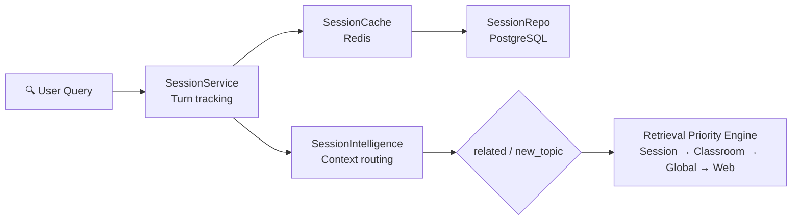
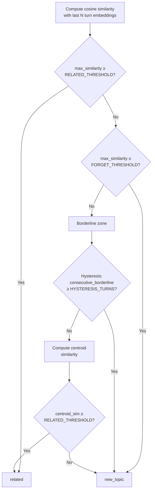
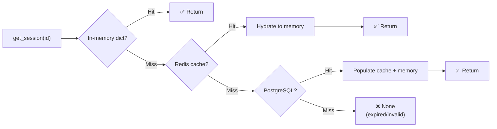

# Page 83: Session Intelligence & Telemetry

> Context routing algorithm, session lifecycle management, resource deduplication, and structured telemetry for tutoring sessions.

---

## 83.1 Architecture Overview



### Source Files

| File | Path | Lines |
|------|------|-------|
| Session Intelligence | `services/session_intelligence.py` | 352 |
| Session Telemetry | `services/session_telemetry.py` | 249 |
| Session Service | `services/session_service.py` | 697 |
| Session Repository | `services/session_repository.py` | 15KB |
| Session Cache | `services/session_cache.py` | 8.7KB |
| Session API Routes | `api/routes/session.py` | 21.7KB |

---

## 83.2 SessionIntelligence — Context Routing

### Algorithm

```python
class SessionIntelligence:
    def compute_decision(
        self,
        query_embedding: List[float],
        turn_embeddings: List[List[float]],  # Last N turns
        last_topic_vector: Optional[List[float]],
        last_decision: str,
        consecutive_borderline: int,
        session_id: str,
        turn_index: int,
        query_text: str
    ) -> SessionDecision
```

### Decision Flow



### Configuration (Environment Variables)

| Variable | Default | Description |
|----------|---------|-------------|
| `RELATED_THRESHOLD` | 0.45 | Above = related to session |
| `FORGET_THRESHOLD` | 0.25 | Below = definitely new topic |
| `RELATED_WINDOW` | 5 | Number of recent turns to compare |
| `HYSTERESIS_TURNS` | 2 | Borderline turns before switching |

### Retrieval Priority Order

| Decision | Priority 1 | Priority 2 | Priority 3 | Priority 4 |
|----------|-----------|-----------|-----------|-----------|
| `related` | Session resources | Classroom materials | Global RAG | Web search |
| `new_topic` | Classroom materials | Global RAG | Web search | Session resources |

---

## 83.3 SessionService — Core Lifecycle

### Data Models

```python
@dataclass
class SessionData:
    session_id: str
    user_id: str
    classroom_id: Optional[str]
    created_at: str
    last_active_at: str
    turn_count: int
    resource_count: int
    config: dict          # ttl_hours, max_turns, max_resources

@dataclass
class TurnData:
    turn_number: int
    question: str
    related: bool
    relatedness_score: Optional[float]
    timestamp: str

@dataclass
class ResourceData:
    resource_id: str
    resource_type: str      # "web", "pdf", "qdrant", "youtube"
    source: str
    url: Optional[str]
    title: str
    preview_summary: Optional[str]
    inline_render: bool
    inserted_at: str
    last_referenced_at: str
    content_hash: Optional[str]
```

### Key Operations

```python
class SessionService:
    # Lifecycle
    create_session(user_id, classroom_id, config) -> SessionData
    get_session(session_id) -> SessionData     # memory → cache → DB
    
    # Turns
    add_turn(session_id, question, embedding) -> TurnData
    compute_relatedness(embedding, session_id) -> (bool, float)
    
    # Resources (with deduplication)
    append_resource(session_id, resource_type, source, url,
                    title, summary, content_hash, inline_render,
                    content_embedding) -> AppendResult
    get_resource_list(session_id) -> List[ResourceData]
```

### Resource Deduplication (3-layer)

| Layer | Method | Threshold |
|-------|--------|-----------|
| 1. URL match | Canonical URL comparison | Exact match |
| 2. Content hash | SHA-256 of content | Exact match |
| 3. Vector similarity | Cosine similarity of embeddings | > 0.95 |

### Session Lookup Chain



### Default Configuration

```python
DEFAULT_CONFIG = {
    "ttl_hours": 24,          # Session expiry
    "max_turns": 100,         # Max turns before auto-close
    "max_resources": 50,      # LRU eviction when exceeded
    "dedup_threshold": 0.95,  # Vector similarity threshold
}
```

---

## 83.4 SessionTelemetry — Structured Logging

### Source: `services/session_telemetry.py`

All events logged with `[TELEMETRY]` prefix for easy filtering.

### Event Types

| Category | Method | What It Tracks |
|----------|--------|---------------|
| Session | `log_session_created()` | user_id, classroom_id, timestamp |
| Session | `log_session_loaded()` | Source (memory/cache/db) |
| Session | `log_session_expired()` | Duration in hours |
| Turn | `log_turn_added()` | turn_number, related (bool), similarity score |
| Resource | `log_resource_appended()` | resource_type, source, inserted/rejected, reason |
| Resource | `log_resource_evicted()` | LRU eviction of oldest resource |
| Cache | `log_cache_hit()` / `log_cache_miss()` | Redis cache performance |
| Cache | `log_db_fallback()` | PostgreSQL fallback after cache miss |
| Retrieval | `log_retrieval_priority()` | session/classroom/global/web hit counts |

### Aggregated Metrics

```python
def get_metrics(self) -> Dict:
    return {
        "sessions_created": int,
        "sessions_loaded": int,
        "sessions_expired": int,
        "turns_added": int,
        "related_turns": int,
        "new_topic_turns": int,
        "relatedness_ratio": float,     # related / total
        "resources_inserted": int,
        "resources_rejected": int,
        "resources_evicted": int,
        "cache_hits": int,
        "cache_misses": int,
        "cache_hit_ratio": float,
        "db_fallbacks": int,
    }
```

---

## 83.5 Session API Routes

### Source: `api/routes/session.py` (21.7KB)

| Endpoint | Method | Description |
|----------|--------|-------------|
| `POST /api/sessions` | POST | Create new session |
| `GET /api/sessions/{id}` | GET | Get session details |
| `POST /api/sessions/{id}/turns` | POST | Add a turn |
| `GET /api/sessions/{id}/resources` | GET | List session resources |
| `POST /api/sessions/{id}/resources` | POST | Append resource |
| `DELETE /api/sessions/{id}` | DELETE | End session |
| `GET /api/sessions/metrics` | GET | Get telemetry metrics |
