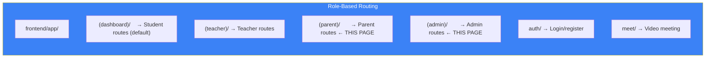

# Page 90: Parent Portal & Admin Panel

> Multi-role frontend: Parent portal for monitoring children's progress, and Admin panel for organization management, licensing, and teacher/student administration.

---

## 90.1 Role-Based Routing



Each route group has its own `layout.tsx` with role-specific navigation.

---

## 90.2 Parent Portal

### Source: `frontend/app/(parent)/`

### Layout: `(parent)/layout.tsx` (16.8KB)
- Sidebar navigation with child selector
- Progress summary header
- Notification badge

### Pages

| Route | File | Description |
|-------|------|-------------|
| `/parent/dashboard` | `dashboard/page.tsx` | Overview of all children's progress |
| `/parent/children` | `children/page.tsx` | Manage linked children |
| `/parent/children/[id]` | `children/[id]/page.tsx` | Individual child profile |
| `/parent/progress` | `progress/page.tsx` | Detailed progress charts |
| `/parent/reports` | `reports/page.tsx` | Download progress reports |
| `/parent/interact` | `interact/page.tsx` | Chat with teachers |
| `/parent/notifications` | `notifications/page.tsx` | Alert center |
| `/parent/settings` | `settings/page.tsx` | Account settings |

### Key Features
- **Child Selector**: Switch between multiple children
- **Progress Tracking**: View mastery levels, assessment scores, study time
- **Report Downloads**: PDF progress reports per child
- **Teacher Communication**: In-app messaging with classroom teachers
- **Notification Center**: Assessment results, teacher messages, attendance

---

## 90.3 Admin Panel

### Source: `frontend/app/(admin)/admin/`

### Layout: `(admin)/layout.tsx` (7.8KB)
- Admin sidebar with organization branding
- License usage bar
- Quick stats header

### Pages

| Route | File | Description |
|-------|------|-------------|
| `/admin/dashboard` | `dashboard/page.tsx` | Organization stats overview |
| `/admin/teachers` | `teachers/page.tsx` | Teacher management |
| `/admin/students` | `students/page.tsx` | Student management |
| `/admin/classrooms` | `classrooms/page.tsx` | Classroom overview |
| `/admin/classrooms/[id]` | `classrooms/[id]/page.tsx` | Individual classroom detail |
| `/admin/billing` | `billing/page.tsx` | License management & billing |
| `/admin/settings` | `settings/page.tsx` | Organization settings |

---

## 90.4 Admin API Routes

### Source: `backend/core-service/app/routes/admin.py` (561 lines)

All routes require `admin_required` decorator:

```python
@admin_required
def decorated(*args, **kwargs):
    token = request.headers.get("Authorization")
    user = verify_token(token)
    if user.role != "admin":
        return jsonify({"error": "Admin access required"}), 403
```

### Endpoints

| Category | Endpoint | Method | Description |
|----------|----------|--------|-------------|
| **Organization** | `/api/admin/organization` | GET | Get org details |
| | `/api/admin/organization` | PUT | Update org details |
| | `/api/admin/organization/token` | POST | Regenerate access token |
| **Dashboard** | `/api/admin/dashboard` | GET | Org stats (users, classrooms, licenses) |
| **Classrooms** | `/api/admin/classrooms` | GET | List all classrooms |
| **Teachers** | `/api/admin/teachers` | GET | List all teachers |
| | `/api/admin/teachers/{id}` | GET | Teacher details + classrooms |
| | `/api/admin/teachers/{id}` | DELETE | Remove teacher |
| **Students** | `/api/admin/students` | GET | List all students |
| | `/api/admin/students/{id}` | GET | Student details + parent |
| | `/api/admin/students/{id}` | DELETE | Remove + release license |
| **Admission** | `/api/admin/admission` | POST | Open/close admission window |
| **Users** | `/api/admin/users/{id}` | GET | Get user details |
| | `/api/admin/users/{id}` | PUT | Update user details |
| **Licensing** | `/api/admin/licenses/purchase` | POST | Initiate purchase |
| | `/api/admin/licenses/confirm` | POST | Confirm after payment |
| | `/api/admin/licenses/history` | GET | Purchase history |

### Dashboard Stats Response

```json
{
    "total_students": 150,
    "total_teachers": 12,
    "total_classrooms": 8,
    "licenses_total": 200,
    "licenses_used": 150,
    "licenses_available": 50,
    "admission_open": true,
    "recent_signups": 5
}
```
