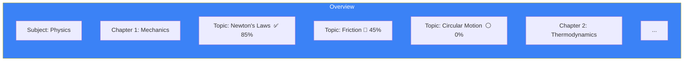

# Page 91: Frontend Curriculum & Assessment Components

> Detailed component documentation for curriculum management (StudyCalendar, ProgressDashboard, LearningStyleQuiz, TopicsSidebar) and assessment UI (ChallengeModal, ReceivedChallenges, LearningAgentStatus, Leaderboard).

---

## 91.1 Curriculum Components

### Source: `frontend/components/curriculum/`

| Component | Size | Description |
|-----------|------|-------------|
| `StudyCalendar.tsx` | 22.3KB | Full interactive study planner |
| `ProgressDashboard.tsx` | 18.5KB | Mastery visualization dashboard |
| `RevisionCalendar.tsx` | 15.6KB | Revision schedule calendar |
| `SyllabusUploadModal.tsx` | 15.2KB | Upload + process syllabus PDFs |
| `TopicsSidebar.tsx` | 18.4KB | Hierarchical topic navigation |
| `ClassroomTopicHierarchy.tsx` | 14KB | Topic tree with mastery indicators |
| `WeeklyCalendar.tsx` | 10.3KB | Week view for study sessions |
| `ExamPrepModal.tsx` | 10.6KB | Create exam prep plans |
| `LearningStyleQuiz.tsx` | 8KB | Discover learning style |
| `index.ts` | 0.3KB | Barrel exports |

### StudyCalendar (22.3KB)

Interactive monthly calendar with:
- **Day cells**: Show scheduled topics with color-coded difficulty
- **Drag-and-drop**: Rearrange study sessions
- **Study hours**: Track planned vs actual hours
- **Integration**: Pulls from curriculum data
- **Mobile responsive**: Swipe navigation between months

### ProgressDashboard (18.5KB)

Visualizations:
- **Mastery radar chart**: Per-subject mastery levels
- **Topic completion bar**: Percentage of curriculum completed
- **Study time trends**: Weekly/monthly line charts
- **Weak areas**: Highlighted topics below mastery threshold
- **Streak tracker**: Consecutive study days

### LearningStyleQuiz (8KB)

Interactive quiz to determine student's learning style:
- **Visual** / **Auditory** / **Reading** / **Kinesthetic** (VARK model)
- Results stored in student profile
- Influences content recommendation priority

### TopicsSidebar (18.4KB)

Hierarchical navigation:

- Mastery percentage badges
- Click → opens topic study page
- Collapsible sections
- Search/filter

---

## 91.2 Assessment Components

### Source: `frontend/components/assessments/`

| Component | Size | Description |
|-----------|------|-------------|
| `CreateAssessmentModal.tsx` | 46.5KB | Full assessment builder |
| `ReceivedChallenges.tsx` | 12.6KB | P2P challenge inbox |
| `LearningAgentStatus.tsx` | 11.7KB | Agent activity monitor |
| `QuestionCard.tsx` | 10.8KB | Question display + answer |
| `ChallengeModal.tsx` | 9.3KB | Send challenge to peer |
| `DailyRevisionBanner.tsx` | 8KB | Revision notification |
| `TopicProgressBar.tsx` | 3.3KB | Topic mastery bar |
| `QuestionNavigator.tsx` | 2.9KB | Question pagination |
| `AssessmentTimer.tsx` | 2KB | Countdown timer |
| `index.ts` | 0.2KB | Barrel exports |

### CreateAssessmentModal (46.5KB — largest component!)

Full-featured assessment builder:
- **Question types**: MCQ (single/multi), descriptive, true/false
- **Source options**: Manual entry, AI generation, from question pool
- **Settings**: Time limit, shuffle, show answers, passing score
- **Preview mode**: Student-facing preview
- **Scheduling**: Set open/close dates

### ChallengeModal & ReceivedChallenges

**Peer-to-Peer Challenge System:**
1. Student A sends challenge → selects topic + difficulty
2. System generates quiz
3. Student B receives in `ReceivedChallenges` inbox
4. Both attempt → compare scores
5. Leaderboard updates

### LearningAgentStatus (11.7KB)

Displays real-time status of AI learning agents:
- Agent type (question generation, revision, analysis)
- Processing status (idle/running/completed)
- Last run timestamp
- Questions generated count
- Learning iterations completed

---

## 91.3 Additional Interactive Components

### Source: `frontend/components/`

| Component | Size | Description |
|-----------|------|-------------|
| `SessionDecisionBadge.tsx` | 6.2KB | Shows "related" / "new_topic" routing |
| `NotificationBell.tsx` | 6.5KB | Header notification bell + dropdown |
| `NotificationProvider.tsx` | 7.3KB | Context provider for notifications |
| `LatexRenderer.tsx` | 5.1KB | Real-time LaTeX math rendering |
| `PptxToPdfViewer.tsx` | 5.1KB | PPTX → PDF conversion viewer |
| `ImageViewer.tsx` | 8.4KB | Pan/zoom image viewer |

---

## 91.4 React Hooks

### Source: `frontend/hooks/`

| Hook | Size | Description |
|------|------|-------------|
| `useRecordingManager.ts` | 16.9KB | Audio/video recording with MediaRecorder |
| `useBehaviorAnalysis.ts` | 10.5KB | Client-side behavior tracking |
| `useSoftSkillsAnalysis.ts` | 10KB | Soft skills WebSocket integration |
| `useProctoring.ts` | 9.2KB | Proctoring WebSocket + camera |

### useRecordingManager (16.9KB)

```typescript
const { startRecording, stopRecording, isRecording, audioBlob } = 
    useRecordingManager({
        onRecordingComplete: (blob) => uploadToServer(blob),
        maxDuration: 300,  // 5 minutes
        audioOnly: true
    });
```

### useProctoring (9.2KB)

```typescript
const { violations, integrityScore, isActive } = useProctoring({
    sessionId: "exam-123",
    onViolation: (v) => showWarning(v.type),
    captureInterval: 100  // ms
});
```
