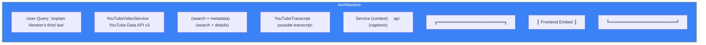

# Page 93: YouTube & Video Integration

> YouTube video search via Data API v3, transcript extraction for RAG context, and educational video embedding.

---

## 93.1 Architecture



### Source Files

| File | Lines | Size |
|------|-------|------|
| `services/youtube_video_service.py` | 179 | 6.5KB |
| `services/youtube_transcript_service.py` | 108 | 3.5KB |

---

## 93.2 YouTube Video Search

### Source: `services/youtube_video_service.py`

```python
async def search_videos_youtube(
    query: str,
    max_results: int = 3,
    educational_filter: bool = True
) -> List[Dict]:
    """
    Two-step search:
    1. Search API → get video IDs + snippets
    2. Videos API → get duration + view count
    """
```

### Search Parameters

```python
search_params = {
    "part": "snippet",
    "q": f"{query} tutorial explanation educational",  # Add educational keywords
    "type": "video",
    "maxResults": min(max_results * 2, 10),
    "relevanceLanguage": "en",
    "safeSearch": "strict",
    "videoEmbeddable": "true",
    "order": "relevance"
}
```

### Response Format

```json
{
    "id": "yt_dQw4w9WgXcQ",
    "title": "Newton's Third Law Explained",
    "url": "https://www.youtube.com/watch?v=dQw4w9WgXcQ",
    "thumbnailUrl": "https://i.ytimg.com/vi/.../hqdefault.jpg",
    "embedUrl": "https://www.youtube.com/embed/dQw4w9WgXcQ",
    "duration": "12:34",
    "source": "Khan Academy",
    "relevance": 95,
    "viewCount": 1500000
}
```

### Sorting
Videos sorted by **view count** (descending) — popular educational content tends to be higher quality.

---

## 93.3 YouTube Transcript Service

### Source: `services/youtube_transcript_service.py`

```python
async def get_youtube_transcript(video_id: str, max_chars: int = 2000) -> Optional[str]:
    """
    Transcript preference order:
    1. Manually created English transcript
    2. Auto-generated English transcript
    3. Any available transcript
    
    Returns: Plain text transcript (max 2000 chars)
    Timeout: 5 seconds
    """
```

### URL Extraction

```python
def extract_video_id(url: str) -> Optional[str]:
    # Supports:
    # youtube.com/watch?v=VIDEO_ID
    # youtu.be/VIDEO_ID
    # youtube.com/embed/VIDEO_ID
    # Just the 11-char ID
```

### Use in RAG Pipeline

Transcripts are fed as additional context to the LLM:
```python
# In the research agent:
transcript = await get_youtube_transcript(video_id)
if transcript:
    context_chunks.append({
        "source": "youtube",
        "text": transcript,
        "url": f"https://youtube.com/watch?v={video_id}"
    })
```

---

## 93.4 Configuration

| Variable | Required | Description |
|----------|----------|-------------|
| `YOUTUBE_API_KEY` | Yes | YouTube Data API v3 key |

> Without `YOUTUBE_API_KEY`, video search silently returns empty results. Transcript extraction works without an API key (uses caption endpoint).
