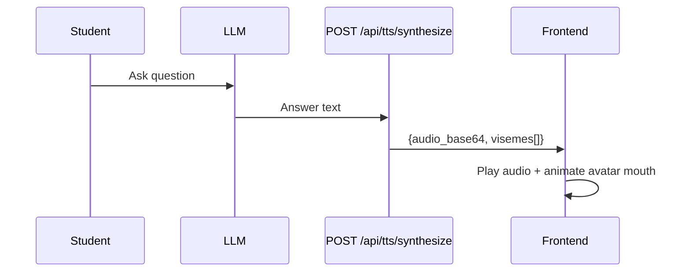
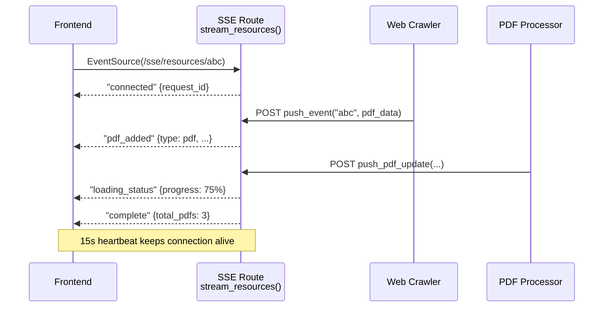

# Page 94: Voice Interface & Real-time Streaming

> Text-to-Speech with AWS Polly (viseme lip sync), Speech-to-Text with local Whisper, and Server-Sent Events for live resource streaming.

---

## 94.1 Text-to-Speech (TTS)

### Source: `api/routes/tts.py` (104 lines) + `services/polly_service.py`

Uses **AWS Polly** neural voices with Oculus-compatible viseme timing for avatar lip synchronization.

### Endpoints

| Endpoint | Method | Description |
|----------|--------|-------------|
| `GET /api/tts/status` | GET | Check TTS availability |
| `POST /api/tts/synthesize` | POST | Synthesize speech |

### Request/Response

```python
class TTSSynthesizeRequest(BaseModel):
    text: str    # Max 3000 chars
    voice: str   # "male" or "female"

class TTSSynthesizeResponse(BaseModel):
    audio_base64: str          # Base64 MP3 audio
    visemes: List[VisemeData]  # Lip sync timing
    voice: str                 # e.g. "Joanna (Neural)"
    duration_ms: int           # Audio duration

class VisemeData(BaseModel):
    time: int     # Milliseconds offset
    value: str    # Oculus viseme ID (e.g. "sil", "PP", "FF", "TH")
```

### Voice Mapping

| Type | Polly Voice | Quality |
|------|-------------|---------|
| `female` | Joanna | Neural |
| `male` | Matthew | Neural |

### Integration with Avatar



---

## 94.2 Speech-to-Text (STT)

### Source: `api/routes/stt.py` (138 lines)

Uses **local OpenAI Whisper** model for offline transcription — no API calls, no cost.

### Endpoints

| Endpoint | Method | Description |
|----------|--------|-------------|
| `GET /api/stt/status` | GET | Check Whisper availability |
| `POST /api/stt/transcribe` | POST | Transcribe audio file |

### Configuration

| Variable | Default | Options |
|----------|---------|---------|
| `WHISPER_STT_MODEL` | `base` | `tiny` (39MB), `base` (74MB), `small` (244MB), `medium` (769MB) |

### Transcription Flow

```python
@router.post("/transcribe")
async def transcribe_audio(audio: UploadFile, language: str = "en"):
    model = await get_whisper_model()  # Cached singleton
    # Save to temp file → whisper.transcribe() → cleanup
    return TranscriptionResponse(
        text="...",
        language="en",
        duration_seconds=5.2,
        confidence=1.0
    )
```

### Fallback Strategy


---

## 94.3 Server-Sent Events (SSE)

### Source: `api/routes/sse.py` (169 lines)

Streams resource discovery updates to the frontend in real-time. When a student asks a question, PDFs and resources are crawled in the background and appear dynamically.

### Endpoints

| Endpoint | Method | Description |
|----------|--------|-------------|
| `GET /sse/resources/{request_id}` | GET | SSE stream (EventSource) |
| `POST /sse/notify/{request_id}` | POST | Backend → push event |

### Event Types

| Event | Data | Purpose |
|-------|------|---------|
| `connected` | `{request_id, message}` | Initial handshake |
| `loading_status` | `{status, progress}` | "Searching for PDFs..." (25%) |
| `pdf_added` | `{type:"pdf", pdf:{...}}` | New PDF discovered |
| `pptx_added` | `{type:"pptx", pptx:{...}}` | New PPTX discovered |
| `complete` | `{total_pdfs}` | All done |
| `heartbeat` | `{timestamp}` | Keep-alive every 15s |

### Architecture



### Connection Management

- In-memory `Dict[request_id, asyncio.Queue]`
- Auto-cleanup on client disconnect
- Auto-close on "complete" event
- 15-second heartbeat to prevent timeouts
