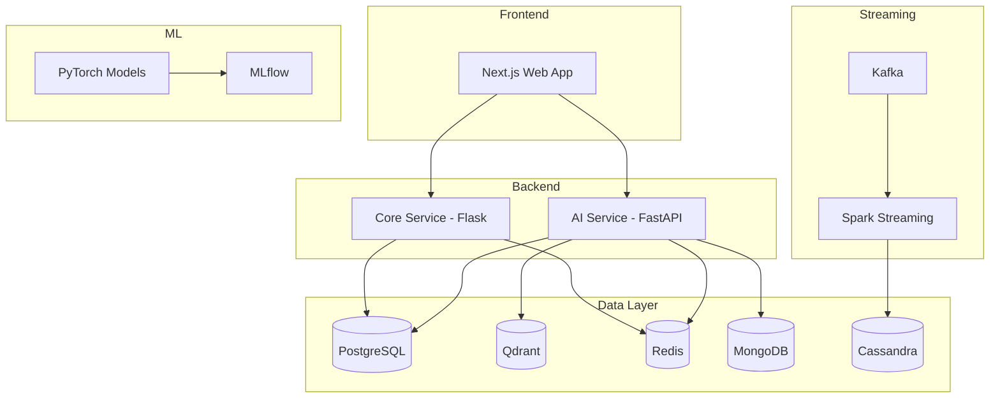

## ensureStudy Documentation

Technical documentation for the ensureStudy AI-powered learning platform.

### Overview

ensureStudy is a full-stack educational platform that combines traditional learning management with AI-driven features including RAG-based tutoring, automated proctoring, soft skills evaluation, and real-time analytics.

### Architecture Summary



### Documentation Index

| Document | Description |
|----------|-------------|
| [architecture.md](architecture.md) | System architecture and design patterns |
| [frontend.md](frontend.md) | Next.js frontend application |
| [core-service.md](core-service.md) | Flask backend for auth and data management |
| [ai-service.md](ai-service.md) | FastAPI service for RAG and AI agents |
| [rag-pipeline.md](rag-pipeline.md) | Retrieval-Augmented Generation system |
| [proctoring.md](proctoring.md) | Online exam proctoring module |
| [softskills.md](softskills.md) | Communication skills evaluation |
| [data-pipelines.md](data-pipelines.md) | PySpark ETL and Kafka streaming |
| [ml-models.md](ml-models.md) | Machine learning models and training |
| [databases.md](databases.md) | Database schemas and usage |
| [deployment.md](deployment.md) | Docker and CI/CD configuration |
| [api-reference.md](api-reference.md) | REST API endpoints |

### Technology Stack

| Layer | Technology |
|-------|------------|
| Frontend | Next.js 14, React, TypeScript, TailwindCSS |
| Core Backend | Flask, SQLAlchemy, Flask-Migrate |
| AI Backend | FastAPI, LangChain, LangGraph |
| Vector DB | Qdrant |
| Primary DB | PostgreSQL 15 |
| Cache | Redis 7 |
| Document Store | MongoDB 7 |
| Time-Series | Cassandra 4 |
| Streaming | Apache Kafka, PySpark |
| ML Framework | PyTorch, scikit-learn |
| Experiment Tracking | MLflow |
| Computer Vision | MediaPipe, YOLO, OpenCV |
| Containerization | Docker, Docker Compose |

### Quick Start

```bash
# Start infrastructure
docker-compose up -d postgres redis qdrant mongodb

# Run backend services
cd backend/core-service && flask run --port 8000
cd backend/ai-service && uvicorn app.main:app --port 8001

# Run frontend
cd frontend && npm run dev
```

### Project Structure

```
ensureStudy/
├── frontend/                    # Next.js application
├── backend/
│   ├── core-service/           # Flask API
│   ├── ai-service/             # FastAPI AI service
│   ├── data-pipelines/         # PySpark ETL
│   └── kafka/                  # Event producers/consumers
├── ml/                         # ML training and inference
├── datadir/                    # Database schemas
├── scripts/                    # Utility scripts
└── docs/                       # Documentation
```

### Contributing

1. Fork the repository
2. Create a feature branch
3. Write tests for new functionality
4. Submit a pull request

### License

