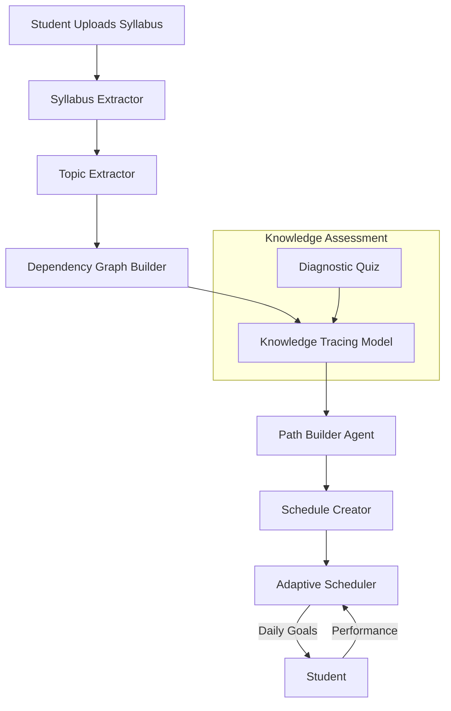
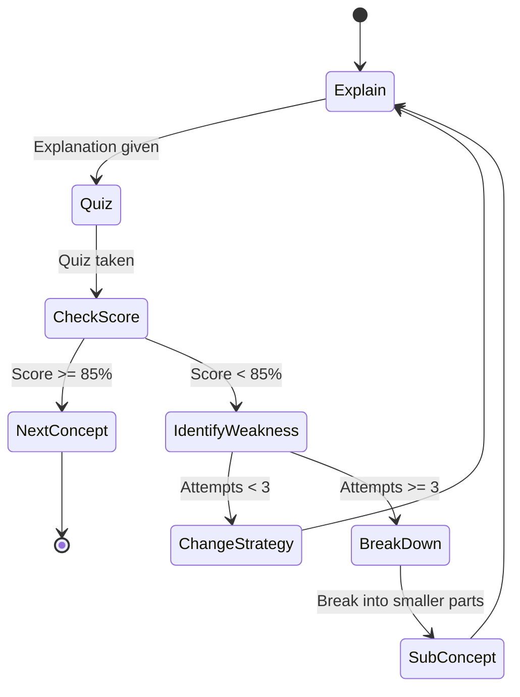
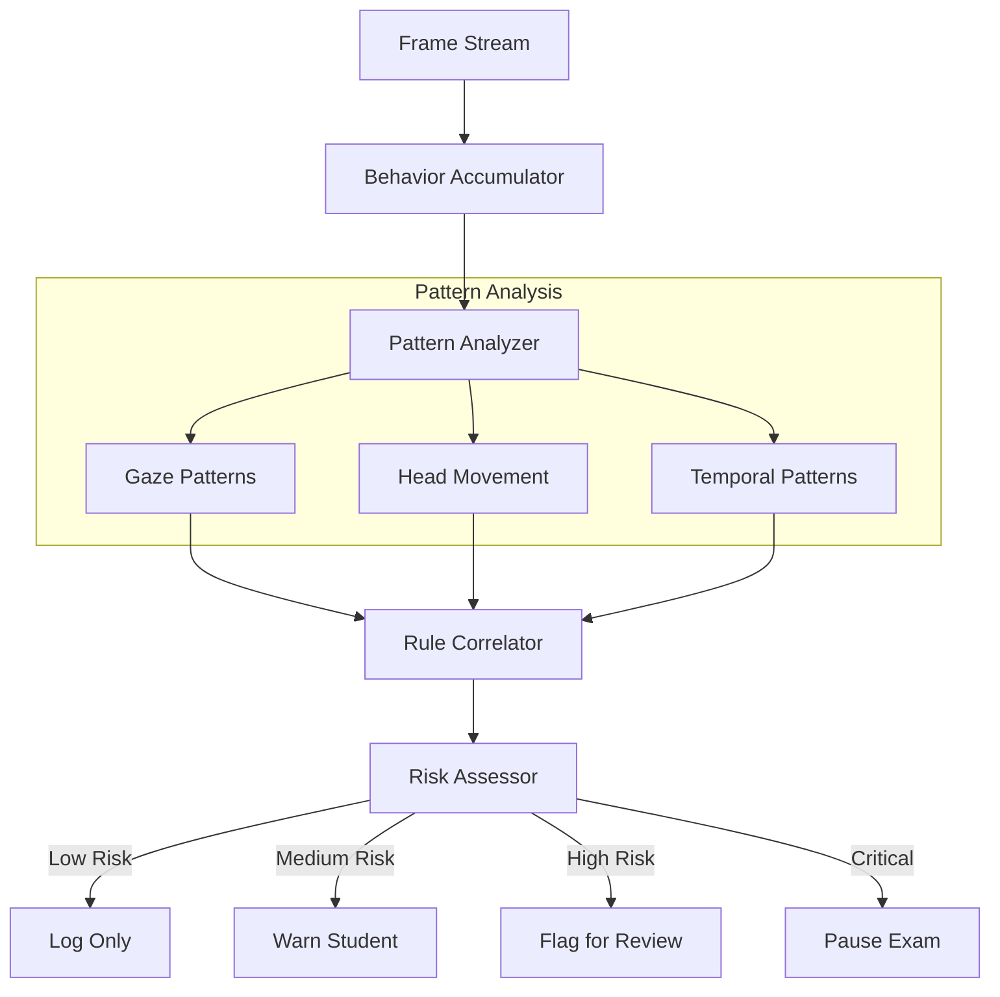
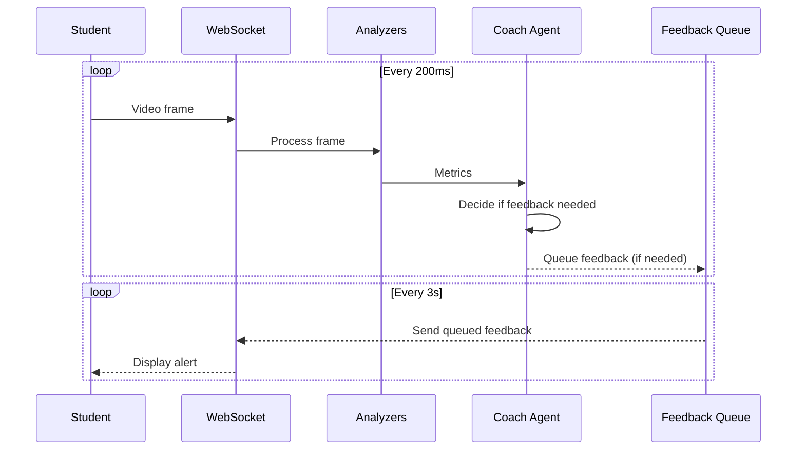

# 🧠 AI Agent Possibilities for ensureStudy

## Complete Deep Dive: Implementation Guide & Architecture

---

## Table of Contents

1. [Platform Overview & Current Capabilities](#platform-overview)
2. [Autonomous Learning Agents](#1-autonomous-learning-agents)
3. [Intelligent Proctoring Agents](#2-intelligent-proctoring-agents)
4. [Adaptive Assessment Agents](#3-adaptive-assessment-agents)
5. [Soft Skills Coaching Agents](#4-soft-skills-coaching-agents)
6. [Multi-Modal Content Agents](#5-multi-modal-content-agents)
7. [Research Automation Agents](#6-research-automation-agents)
8. [Predictive Analytics Agents](#7-predictive-analytics-agents)
9. [Inter-Agent Communication](#8-inter-agent-communication)
10. [Implementation Roadmap](#implementation-roadmap)

---

## Platform Overview

### Current Technology Stack

| Component | Technology | Location |
|-----------|------------|----------|
| Backend API | Flask (Core), FastAPI (AI) | `backend/` |
| Frontend | Next.js + TypeScript | `frontend/` |
| Vector DB | Qdrant | Docker |
| Relational DB | PostgreSQL | Docker |
| Cache | Redis | Docker |
| LLM | Mistral-7B via HuggingFace | AI Service |
| Embeddings | all-MiniLM-L6-v2 | AI Service |
| Agent Framework | **LangGraph** | `app/agents/` |

### Existing Capabilities You Can Leverage

```
┌─────────────────────────────────────────────────────────────────────┐
│                    EXISTING CAPABILITIES                            │
├─────────────────────────────────────────────────────────────────────┤
│ ✅ ABCR (Attention-Based Context Routing)                           │
│    → Detects follow-up questions vs new topics                      │
│    → File: abcr_service.py                                          │
├─────────────────────────────────────────────────────────────────────┤
│ ✅ TAL (Topic Anchor Layer)                                         │
│    → Maintains topic continuity across conversation                 │
│    → File: topic_anchor_service.py                                  │
├─────────────────────────────────────────────────────────────────────┤
│ ✅ MCP (Memory Context Processor)                                   │
│    → Long-term conversation memory with summarization               │
│    → File: mcp_context.py                                           │
├─────────────────────────────────────────────────────────────────────┤
│ ✅ Proctoring (YOLO + MediaPipe)                                    │
│    → Face detection, gaze tracking, phone detection                 │
│    → File: proctor/                                                 │
├─────────────────────────────────────────────────────────────────────┤
│ ✅ Soft Skills Analysis                                             │
│    → Fluency, grammar, vocabulary, eye contact, expression          │
│    → File: softskills_pipeline.py                                   │
├─────────────────────────────────────────────────────────────────────┤
│ ✅ Question Generation                                              │
│    → MCQ, short answer, true/false generation                       │
│    → File: question_generator.py                                    │
├─────────────────────────────────────────────────────────────────────┤
│ ✅ RAG Pipeline                                                     │
│    → Document search, embedding, retrieval                          │
│    → File: rag/, qdrant_service.py                                  │
├─────────────────────────────────────────────────────────────────────┤
│ ✅ Web Search & PDF Download                                        │
│    → Serper API, PDF downloader                                     │
│    → File: search_api.py, pdf_downloader.py                         │
├─────────────────────────────────────────────────────────────────────┤
│ ✅ Tool Framework (19 Tools)                                        │
│    → Reusable tools for all agents                                  │
│    → File: agents/tools/                                            │
└─────────────────────────────────────────────────────────────────────┘
```

---

## 1. Autonomous Learning Agents

### 1.1 Personalized Curriculum Agent

**Purpose**: Create individualized learning paths based on student's syllabus, current knowledge, and pace.

#### Architecture



#### State Definition

```python
class CurriculumAgentState(TypedDict):
    # Input
    syllabus_id: str
    user_id: str
    available_hours_per_day: float
    deadline: datetime
    
    # Extracted Data
    topics: List[Dict]  # {name, subtopics, difficulty, estimated_hours}
    topic_dependencies: Dict[str, List[str]]  # topic → prerequisites
    
    # Student State
    current_knowledge: Dict[str, float]  # topic → mastery (0-1)
    learning_pace: float  # relative to average
    preferred_time_slots: List[str]
    
    # Generated Plan
    daily_schedule: List[Dict]  # [{date, topics, activities, duration}]
    milestones: List[Dict]
    
    # Tracking
    completed_topics: List[str]
    quiz_scores: Dict[str, float]
    schedule_adherence: float
```

#### Implementation

```python
from langgraph.graph import StateGraph, END

class PersonalizedCurriculumAgent:
    def __init__(self):
        self.graph = self._build_graph()
    
    def _build_graph(self):
        workflow = StateGraph(CurriculumAgentState)
        
        # Nodes
        workflow.add_node("extract_syllabus", self.extract_syllabus)
        workflow.add_node("build_dependency_graph", self.build_dependencies)
        workflow.add_node("assess_knowledge", self.assess_current_knowledge)
        workflow.add_node("generate_path", self.generate_learning_path)
        workflow.add_node("create_schedule", self.create_daily_schedule)
        workflow.add_node("adapt_schedule", self.adapt_based_on_progress)
        
        # Flow
        workflow.set_entry_point("extract_syllabus")
        workflow.add_edge("extract_syllabus", "build_dependency_graph")
        workflow.add_edge("build_dependency_graph", "assess_knowledge")
        workflow.add_edge("assess_knowledge", "generate_path")
        workflow.add_edge("generate_path", "create_schedule")
        workflow.add_edge("create_schedule", END)
        
        return workflow.compile()
    
    async def extract_syllabus(self, state: CurriculumAgentState):
        """Use existing syllabus_extractor to get topics"""
        from app.services.syllabus_extractor import extract_topics
        
        topics = await extract_topics(state["syllabus_id"])
        state["topics"] = topics
        return state
    
    async def build_dependencies(self, state: CurriculumAgentState):
        """Use LLM to identify topic prerequisites"""
        from app.agents.tools import invoke_tool
        
        prompt = f"""Analyze these topics and identify prerequisites.
        Topics: {[t['name'] for t in state['topics']]}
        
        Return JSON: {{"topic_name": ["prerequisite1", "prerequisite2"]}}
        """
        
        result = await invoke_tool("llm_generate", prompt=prompt)
        state["topic_dependencies"] = json.loads(result.data["response"])
        return state
    
    async def assess_current_knowledge(self, state: CurriculumAgentState):
        """Generate diagnostic quiz or use historical data"""
        # Option 1: Use past quiz scores
        # Option 2: Generate quick diagnostic questions
        
        from app.agents.tools import invoke_tool
        
        for topic in state["topics"]:
            # Generate 3 quick questions per topic
            result = await invoke_tool(
                "generate_questions",
                topic=topic["name"],
                num_questions=3,
                difficulty="medium"
            )
            # Store for student to take
            
        return state
    
    async def generate_learning_path(self, state: CurriculumAgentState):
        """Topological sort with priority based on knowledge gaps"""
        import networkx as nx
        
        # Build graph
        G = nx.DiGraph()
        for topic in state["topics"]:
            G.add_node(topic["name"])
            for prereq in state["topic_dependencies"].get(topic["name"], []):
                G.add_edge(prereq, topic["name"])
        
        # Topological sort
        ordered_topics = list(nx.topological_sort(G))
        
        # Prioritize by knowledge gap
        gaps = {t: 1 - state["current_knowledge"].get(t, 0) for t in ordered_topics}
        # Topics with bigger gaps get more time
        
        return state
    
    async def create_daily_schedule(self, state: CurriculumAgentState):
        """Distribute topics across days until deadline"""
        from datetime import timedelta
        
        days_available = (state["deadline"] - datetime.now()).days
        hours_total = days_available * state["available_hours_per_day"]
        
        schedule = []
        current_date = datetime.now().date()
        
        for i, topic in enumerate(state["topics"]):
            schedule.append({
                "date": str(current_date + timedelta(days=i)),
                "topic": topic["name"],
                "activities": [
                    {"type": "read", "resource": f"materials for {topic['name']}"},
                    {"type": "practice", "questions": 5},
                    {"type": "review", "duration_min": 15}
                ],
                "estimated_hours": topic.get("estimated_hours", 2)
            })
        
        state["daily_schedule"] = schedule
        return state
```

#### API Endpoint

```python
@router.post("/api/agent/curriculum")
async def create_curriculum(
    syllabus_id: str,
    user_id: str,
    deadline: datetime,
    hours_per_day: float = 2
):
    agent = PersonalizedCurriculumAgent()
    result = await agent.execute({
        "syllabus_id": syllabus_id,
        "user_id": user_id,
        "deadline": deadline,
        "available_hours_per_day": hours_per_day
    })
    return result
```

---

### 1.2 Concept Mastery Agent

**Purpose**: Ensure true understanding before moving to next concept using adaptive teaching strategies.

#### Architecture



#### Teaching Strategies

| Strategy | When to Use | Example |
|----------|-------------|---------|
| **Visual** | Abstract concepts | Diagrams, flowcharts |
| **Analogy** | New concepts | "Think of RAM like a desk..." |
| **Example** | Procedural knowledge | Step-by-step worked examples |
| **Formal** | Advanced students | Precise definitions, proofs |
| **Socratic** | Struggling students | Leading questions |

#### State Definition

```python
class ConceptMasteryState(TypedDict):
    concept: str
    user_id: str
    
    # Learning State
    explanation_attempts: int
    current_strategy: str  # "visual", "analogy", "example", "formal", "socratic"
    strategies_tried: List[str]
    
    # Assessment
    quiz_questions: List[Dict]
    quiz_responses: List[Dict]
    quiz_scores: List[float]
    
    # Mastery
    mastery_level: float  # 0.0 - 1.0
    weak_subconcepts: List[str]
    
    # Output
    current_explanation: str
    next_action: str  # "explain", "quiz", "break_down", "proceed"
```

#### Implementation

```python
class ConceptMasteryAgent:
    STRATEGIES = ["visual", "example", "analogy", "formal", "socratic"]
    MASTERY_THRESHOLD = 0.85
    MAX_ATTEMPTS = 3
    
    async def explain_concept(self, state: ConceptMasteryState):
        """Generate explanation using current strategy"""
        from app.agents.tools import invoke_tool
        
        strategy = state["current_strategy"]
        concept = state["concept"]
        
        strategy_prompts = {
            "visual": f"Explain {concept} using a visual diagram (mermaid format)",
            "example": f"Explain {concept} with 3 worked examples",
            "analogy": f"Explain {concept} using a real-world analogy",
            "formal": f"Provide a formal definition of {concept} with precise terminology",
            "socratic": f"Create 5 leading questions to help discover {concept}"
        }
        
        result = await invoke_tool(
            "llm_generate",
            prompt=strategy_prompts[strategy],
            system_prompt="You are a master teacher adapting to student needs"
        )
        
        state["current_explanation"] = result.data["response"]
        state["explanation_attempts"] += 1
        return state
    
    async def assess_understanding(self, state: ConceptMasteryState):
        """Generate and evaluate quiz"""
        from app.agents.tools import invoke_tool
        
        # Generate targeted questions
        result = await invoke_tool(
            "generate_questions",
            topic=state["concept"],
            num_questions=3,
            question_type="mixed"
        )
        
        state["quiz_questions"] = result.data["questions"]
        return state
    
    async def evaluate_and_route(self, state: ConceptMasteryState):
        """Calculate score and decide next action"""
        # Calculate score from responses
        correct = sum(1 for r in state["quiz_responses"] if r["correct"])
        score = correct / len(state["quiz_responses"])
        state["quiz_scores"].append(score)
        state["mastery_level"] = score
        
        if score >= self.MASTERY_THRESHOLD:
            state["next_action"] = "proceed"
        elif state["explanation_attempts"] >= self.MAX_ATTEMPTS:
            state["next_action"] = "break_down"
        else:
            # Try different strategy
            untried = [s for s in self.STRATEGIES if s not in state["strategies_tried"]]
            state["current_strategy"] = untried[0] if untried else "socratic"
            state["strategies_tried"].append(state["current_strategy"])
            state["next_action"] = "explain"
        
        return state
    
    async def break_into_subconcepts(self, state: ConceptMasteryState):
        """Break complex concept into smaller parts"""
        from app.agents.tools import invoke_tool
        
        result = await invoke_tool(
            "llm_generate",
            prompt=f"""Break down "{state['concept']}" into 3-5 smaller prerequisite concepts.
            The student is struggling with the full concept.
            Return as JSON list: ["subconcept1", "subconcept2", ...]"""
        )
        
        subconcepts = json.loads(result.data["response"])
        state["weak_subconcepts"] = subconcepts
        
        # Recursively apply mastery agent to each subconcept
        return state
```

---

### 1.3 Socratic Questioning Agent

**Purpose**: Guide students to discover answers through questions rather than direct answers.

#### Prompt Engineering Approach

```python
SOCRATIC_SYSTEM_PROMPT = """
You are a Socratic tutor. You NEVER give direct answers.
Instead, you guide students through questions.

Rules:
1. When asked a question, respond with 2-3 guiding questions
2. Build on student's prior knowledge
3. If student answers correctly, confirm and go deeper
4. If student is stuck after 3 attempts, give a hint (not answer)
5. Celebrate discovery moments

Example:
Student: "What causes the seasons?"
Bad: "The seasons are caused by Earth's axial tilt..."
Good: "Great question! Let me help you discover this:
- What do you know about how Earth moves?
- Have you noticed the sun is higher in the sky in summer?
- What do you think would happen if Earth wasn't tilted?"
"""

class SocraticAgent:
    async def respond(self, query: str, history: List[Dict]):
        from app.agents.tools import invoke_tool
        
        # Count how many exchanges on this topic
        topic_exchanges = len([h for h in history if self._same_topic(h, query)])
        
        if topic_exchanges >= 3:
            # Give a hint after 3 attempts
            return await self._give_hint(query, history)
        
        result = await invoke_tool(
            "llm_generate",
            prompt=f"Student asks: {query}\n\nGenerate Socratic questions:",
            system_prompt=SOCRATIC_SYSTEM_PROMPT
        )
        
        return result.data["response"]
```

---

## 2. Intelligent Proctoring Agents

### 2.1 Behavioral Pattern Agent

**Purpose**: Reason about behavior patterns instead of simple threshold violations.

#### Architecture



#### Behavior Patterns to Detect

| Pattern | Detection Method | Risk Level |
|---------|------------------|------------|
| **Phone Lookup** | Gaze to same off-screen point repeatedly | High |
| **Note Reading** | Brief gaze down, returns to screen | Low |
| **Person Assistance** | Second face appears, quick gaze to side | Critical |
| **Screen Sharing** | Unusual eye scanning patterns | High |
| **Natural Break** | Looking away briefly, yawning | None |

#### Implementation

```python
class BehaviorPatternState(TypedDict):
    session_id: str
    
    # Frame History
    frame_analysis_history: List[Dict]  # Last 300 frames (10 seconds)
    
    # Detected Patterns
    gaze_sequences: List[Dict]  # {direction, duration, frequency}
    head_movement_stats: Dict  # {avg_rotation, variance, sudden_movements}
    suspicious_correlations: List[Dict]
    
    # Risk Assessment
    cumulative_risk_score: float
    current_risk_level: str  # "none", "low", "medium", "high", "critical"
    
    # Actions
    warnings_issued: int
    recommended_action: str

class BehavioralPatternAgent:
    def __init__(self):
        self.pattern_rules = self._load_pattern_rules()
    
    async def analyze_frame_batch(self, state: BehaviorPatternState):
        """Analyze patterns across multiple frames"""
        history = state["frame_analysis_history"]
        
        # Gaze pattern analysis
        gaze_data = [f["gaze"] for f in history if f.get("gaze")]
        
        patterns = {
            "repeated_lookaway": self._detect_repeated_lookaway(gaze_data),
            "phone_pattern": self._detect_phone_pattern(gaze_data),
            "reading_pattern": self._detect_reading_pattern(gaze_data),
            "suspicious_timing": self._detect_timing_correlation(history)
        }
        
        state["suspicious_correlations"] = [
            p for p in patterns.values() if p["confidence"] > 0.7
        ]
        
        return state
    
    def _detect_phone_pattern(self, gaze_data: List[Dict]) -> Dict:
        """Detect looking at same off-screen point repeatedly"""
        # Get gaze points outside normal range
        offscreen = [g for g in gaze_data if abs(g["horizontal"]) > 30]
        
        if len(offscreen) < 5:
            return {"pattern": "phone_lookup", "confidence": 0.0}
        
        # Check if they cluster (same phone location)
        positions = [(g["horizontal"], g["vertical"]) for g in offscreen]
        clusters = self._cluster_positions(positions)
        
        # If single dominant cluster, likely phone
        if len(clusters) == 1 and clusters[0]["count"] >= 5:
            return {
                "pattern": "phone_lookup",
                "confidence": 0.9,
                "evidence": f"Looked at position {clusters[0]['center']} {clusters[0]['count']} times"
            }
        
        return {"pattern": "phone_lookup", "confidence": 0.3}
    
    def _detect_timing_correlation(self, history: List[Dict]) -> Dict:
        """Correlate lookaway with answer changes"""
        lookaway_times = [
            f["timestamp"] for f in history 
            if f.get("gaze", {}).get("deviation", 0) > 25
        ]
        
        answer_change_times = [
            f["timestamp"] for f in history 
            if f.get("answer_changed", False)
        ]
        
        # Check if answers change shortly after looking away
        correlations = 0
        for answer_time in answer_change_times:
            for lookaway_time in lookaway_times:
                if 0 < (answer_time - lookaway_time) < 3:  # Within 3 seconds
                    correlations += 1
        
        if correlations >= 3:
            return {
                "pattern": "lookup_then_answer",
                "confidence": 0.85,
                "evidence": f"Answer changed {correlations} times after looking away"
            }
        
        return {"pattern": "lookup_then_answer", "confidence": 0.0}
```

---

### 2.2 Adaptive Threshold Agent

**Purpose**: Learn individual student's baseline behavior and flag deviations.

#### Calibration Phase

```python
class CalibrationPhase:
    def __init__(self, duration_seconds: int = 120):
        self.duration = duration_seconds
        self.baseline = {
            "blink_rate": [],
            "head_movement_range": [],
            "gaze_variance": [],
            "posture_baseline": None
        }
    
    async def calibrate(self, frames: List[np.ndarray]) -> Dict:
        """Analyze first 2 minutes to establish baseline"""
        for frame in frames:
            analysis = await self.analyze_frame(frame)
            
            self.baseline["blink_rate"].append(analysis["blink_rate"])
            self.baseline["head_movement_range"].append(analysis["head_rotation"])
            self.baseline["gaze_variance"].append(analysis["gaze_deviation"])
        
        return {
            "avg_blink_rate": np.mean(self.baseline["blink_rate"]),
            "blink_std": np.std(self.baseline["blink_rate"]),
            "normal_head_range": (
                np.percentile(self.baseline["head_movement_range"], 5),
                np.percentile(self.baseline["head_movement_range"], 95)
            ),
            "normal_gaze_variance": np.std(self.baseline["gaze_variance"])
        }
```

#### Personalized Detection

```python
class PersonalizedProctor:
    def __init__(self, baseline: Dict):
        self.baseline = baseline
        # Thresholds are now relative to personal baseline
        self.thresholds = {
            "head_deviation": baseline["normal_head_range"][1] * 1.5,
            "gaze_deviation": baseline["normal_gaze_variance"] * 2,
            "blink_anomaly": baseline["avg_blink_rate"] * 0.3  # 70% below normal
        }
    
    def is_suspicious(self, current_metrics: Dict) -> Tuple[bool, str]:
        """Compare current behavior to personal baseline"""
        if current_metrics["head_rotation"] > self.thresholds["head_deviation"]:
            return True, "Head rotation unusually large for this student"
        
        if current_metrics["blink_rate"] < self.thresholds["blink_anomaly"]:
            return True, "Unusually low blink rate (high concentration/reading)"
        
        return False, ""
```

---

### 2.3 Post-Exam Forensics Agent

**Purpose**: Review recorded sessions to find sophisticated cheating patterns.

#### Analysis Pipeline

```python
class ForensicsAgent:
    async def analyze_session(self, recording_path: str) -> Dict:
        """Full forensic analysis of recorded session"""
        
        # 1. Extract all data
        video_analysis = await self.analyze_video(recording_path)
        audio_analysis = await self.analyze_audio(recording_path)
        answer_timeline = await self.get_answer_changes(recording_path)
        
        # 2. Correlate patterns
        correlations = await self.find_correlations(
            video_analysis, audio_analysis, answer_timeline
        )
        
        # 3. Generate risk report
        report = {
            "overall_risk": self.calculate_risk(correlations),
            "suspicious_timestamps": correlations["timestamps"],
            "evidence_clips": self.extract_clips(recording_path, correlations),
            "pattern_analysis": correlations["patterns"],
            "recommendation": self.generate_recommendation(correlations)
        }
        
        return report
    
    async def analyze_audio(self, path: str) -> Dict:
        """Detect whispers or external voices"""
        from app.agents.tools import invoke_tool
        
        # Transcribe audio
        result = await invoke_tool("transcribe_audio", audio_path=path)
        transcript = result.data["transcript"]
        
        # Analyze for:
        # - Whispered speech (different frequency profile)
        # - Multiple speakers
        # - Questions being read aloud
        
        return {
            "transcript_segments": result.data["segments"],
            "detected_whispers": self._detect_whispers(path),
            "multiple_speakers": self._detect_speakers(path)
        }
```

---

## 3. Adaptive Assessment Agents

### 3.1 CAT (Computerized Adaptive Testing) Agent

**Purpose**: Dynamically select questions to accurately estimate ability with fewer questions.

#### Item Response Theory (IRT) Implementation

```python
import numpy as np
from scipy.optimize import brentq

class CATAgent:
    def __init__(self, question_bank: List[Dict]):
        """
        question_bank: List of questions with IRT parameters
        Each question: {
            "id": str,
            "content": str,
            "difficulty": float (-3 to +3),  # theta
            "discrimination": float (0.5 to 2.5),  # a parameter
            "guessing": float (0 to 0.25)  # c parameter for MCQ
        }
        """
        self.questions = question_bank
        self.administered = []
        self.responses = []
        self.theta_estimate = 0.0  # Current ability estimate
        self.theta_se = 1.0  # Standard error
    
    def probability_correct(self, theta: float, question: Dict) -> float:
        """3-PL IRT model"""
        a = question["discrimination"]
        b = question["difficulty"]
        c = question.get("guessing", 0.0)
        
        exponent = a * (theta - b)
        return c + (1 - c) / (1 + np.exp(-exponent))
    
    def select_next_question(self) -> Dict:
        """Select question with maximum information at current theta"""
        remaining = [q for q in self.questions if q["id"] not in self.administered]
        
        def information(question: Dict) -> float:
            """Fisher information at current theta"""
            a = question["discrimination"]
            p = self.probability_correct(self.theta_estimate, question)
            q = 1 - p
            return (a ** 2) * p * q
        
        # Select question with maximum information
        best = max(remaining, key=information)
        return best
    
    def update_ability(self, question: Dict, correct: bool):
        """Update theta estimate using MLE"""
        self.administered.append(question["id"])
        self.responses.append({
            "question_id": question["id"],
            "correct": correct,
            "difficulty": question["difficulty"]
        })
        
        # Maximum Likelihood Estimation
        def log_likelihood(theta: float) -> float:
            ll = 0
            for q, r in zip(self.administered_questions, self.responses):
                p = self.probability_correct(theta, q)
                if r["correct"]:
                    ll += np.log(p)
                else:
                    ll += np.log(1 - p)
            return -ll  # Negative for minimization
        
        # Update estimate
        from scipy.optimize import minimize_scalar
        result = minimize_scalar(log_likelihood, bounds=(-3, 3), method='bounded')
        self.theta_estimate = result.x
        
        # Update standard error
        self.theta_se = 1 / np.sqrt(sum(
            self.information(q) for q in self.administered_questions
        ))
    
    def should_stop(self) -> bool:
        """Stop when precision is sufficient or max questions reached"""
        return (
            self.theta_se < 0.3 or  # Sufficient precision
            len(self.administered) >= 30  # Max questions
        )
    
    async def run_adaptive_test(self, user_id: str) -> Dict:
        """Full adaptive test session"""
        while not self.should_stop():
            # Select next question
            question = self.select_next_question()
            
            # Present to student (via API)
            response = await self.present_question(question, user_id)
            
            # Update ability estimate
            self.update_ability(question, response["correct"])
        
        return {
            "ability_estimate": self.theta_estimate,
            "standard_error": self.theta_se,
            "questions_administered": len(self.administered),
            "confidence_interval": (
                self.theta_estimate - 1.96 * self.theta_se,
                self.theta_estimate + 1.96 * self.theta_se
            )
        }
```

---

### 3.2 Question Quality Agent

**Purpose**: Evaluate and improve auto-generated questions.

#### Quality Dimensions

| Dimension | Weight | Check |
|-----------|--------|-------|
| Clarity | 25% | Is question unambiguous? |
| Distractors | 25% | Are wrong options plausible? |
| Difficulty | 20% | Matches target level? |
| Bloom's Level | 15% | Tests understanding vs. recall? |
| Bias | 15% | Free from cultural/gender bias? |

#### Implementation

```python
class QuestionQualityAgent:
    async def evaluate_question(self, question: Dict) -> Dict:
        from app.agents.tools import invoke_tool
        
        evaluation_prompt = f"""
        Evaluate this question for quality:
        
        Question: {question['content']}
        Options: {question.get('options', [])}
        Correct Answer: {question['answer']}
        Target Difficulty: {question.get('difficulty', 'medium')}
        
        Evaluate on these dimensions (1-10 each):
        1. Clarity: Is the question clear and unambiguous?
        2. Distractors: Are wrong options plausible but clearly wrong?
        3. Difficulty: Does it match target {question.get('difficulty', 'medium')} level?
        4. Bloom's Level: Does it test understanding, not just recall?
        5. Bias: Is it free from cultural/demographic bias?
        
        Return JSON with scores and suggestions for each dimension.
        """
        
        result = await invoke_tool("llm_generate", prompt=evaluation_prompt)
        evaluation = json.loads(result.data["response"])
        
        # Calculate overall score
        weights = {"clarity": 0.25, "distractors": 0.25, "difficulty": 0.20, 
                   "blooms": 0.15, "bias": 0.15}
        
        overall = sum(
            evaluation[dim]["score"] * weight 
            for dim, weight in weights.items()
        )
        
        return {
            "overall_score": overall,
            "dimensions": evaluation,
            "pass": overall >= 7.0,
            "improvements": [
                d["suggestion"] for d in evaluation.values() 
                if d["score"] < 7
            ]
        }
```

---

### 3.3 Cheating-Resistant Question Agent

**Purpose**: Generate questions that can't be easily Googled or found online.

#### Strategies

```python
class CheatProofQuestionAgent:
    async def generate_cheat_resistant(
        self, 
        topic: str, 
        student_context: Dict,
        uploaded_materials: List[str]
    ) -> Dict:
        
        strategies = [
            self._personalized_question,
            self._novel_scenario,
            self._material_specific,
            self._random_values
        ]
        
        questions = []
        for strategy in strategies:
            q = await strategy(topic, student_context, uploaded_materials)
            questions.append(q)
        
        return questions
    
    async def _personalized_question(self, topic, context, materials):
        """Use student's name or context in question"""
        prompt = f"""
        Create a math word problem about {topic} that:
        1. Uses the name "{context['student_name']}"
        2. References their location "{context.get('location', 'a city')}"
        3. Uses realistic numbers that aren't round
        
        The question should be unsearchable online.
        """
        return await self._generate(prompt)
    
    async def _novel_scenario(self, topic, context, materials):
        """Create unique, creative scenarios"""
        prompt = f"""
        Create a question about {topic} using a creative scenario:
        - Set in an unusual context (e.g., space station, underwater city)
        - Use fictional but realistic data
        - Test the same concept but in a novel way
        """
        return await self._generate(prompt)
    
    async def _material_specific(self, topic, context, materials):
        """Generate from uploaded PDFs (answers not online)"""
        from app.agents.tools import invoke_tool
        
        # Get content from their uploaded materials
        for material in materials:
            content = await invoke_tool(
                "extract_pdf_text",
                pdf_path=material
            )
            
            prompt = f"""
            Based on this specific content from the student's textbook:
            {content.data['text'][:2000]}
            
            Create a question that:
            1. Can ONLY be answered using this specific text
            2. References specific details from the material
            3. Cannot be answered by general internet search
            """
            return await self._generate(prompt)
    
    async def _random_values(self, topic, context, materials):
        """Use randomized numerical values"""
        import random
        
        # Generate random but reasonable values
        values = {
            "velocity": random.randint(10, 99),
            "time": random.uniform(2.5, 9.5),
            "distance": random.randint(100, 9999),
            "percentage": random.randint(5, 95)
        }
        
        prompt = f"""
        Create a calculation question about {topic} using these exact values:
        {values}
        
        The answer should be a specific number that can only be calculated,
        not looked up.
        """
        return await self._generate(prompt)
```

---

## 4. Soft Skills Coaching Agents

### 4.1 Real-Time Presentation Coach

**Purpose**: Give live feedback during practice presentations.

#### Architecture



#### Implementation

```python
class RealTimeCoachAgent:
    def __init__(self):
        self.feedback_queue = []
        self.last_feedback_time = {}
        self.cooldown_seconds = 10  # Don't repeat same feedback for 10s
    
    async def process_metrics(self, metrics: Dict) -> Optional[str]:
        """Decide if real-time feedback is needed"""
        
        feedbacks = []
        
        # Eye contact
        if metrics.get("eye_contact_rate", 1.0) < 0.4:
            if self._can_give_feedback("eye_contact"):
                feedbacks.append("👀 Look at the camera more")
        
        # Speaking pace
        wpm = metrics.get("words_per_minute", 130)
        if wpm > 170:
            if self._can_give_feedback("pace_fast"):
                feedbacks.append("🐇 Slow down a bit")
        elif wpm < 100:
            if self._can_give_feedback("pace_slow"):
                feedbacks.append("🐢 Try speaking a bit faster")
        
        # Filler words
        if metrics.get("filler_detected"):
            filler = metrics["filler_detected"]
            if self._can_give_feedback(f"filler_{filler}"):
                feedbacks.append(f"💬 You said '{filler}' - try pausing instead")
        
        # Posture
        if metrics.get("posture_score", 1.0) < 0.5:
            if self._can_give_feedback("posture"):
                feedbacks.append("🧍 Straighten your posture")
        
        # Volume
        if metrics.get("volume_low"):
            if self._can_give_feedback("volume"):
                feedbacks.append("🔊 Speak a bit louder")
        
        return feedbacks[0] if feedbacks else None
    
    def _can_give_feedback(self, feedback_type: str) -> bool:
        """Check cooldown to avoid overwhelming student"""
        last = self.last_feedback_time.get(feedback_type, 0)
        now = time.time()
        
        if now - last > self.cooldown_seconds:
            self.last_feedback_time[feedback_type] = now
            return True
        return False
```

---

### 4.2 Interview Prep Agent

**Purpose**: Simulate real interviews with feedback.

#### Flow

```python
class InterviewPrepAgent:
    async def start_session(
        self, 
        user_id: str,
        role: str,  # "software engineer", "product manager", etc.
        company: str = None
    ) -> Dict:
        
        # Research interview style for company
        if company:
            interview_style = await self._research_company_style(company)
        else:
            interview_style = "standard behavioral + technical"
        
        # Generate question bank
        questions = await self._generate_interview_questions(role, interview_style)
        
        return {
            "session_id": str(uuid.uuid4()),
            "role": role,
            "company": company,
            "questions": questions,
            "current_question_index": 0
        }
    
    async def _generate_interview_questions(self, role: str, style: str) -> List[Dict]:
        from app.agents.tools import invoke_tool
        
        result = await invoke_tool(
            "llm_generate",
            prompt=f"""Generate 10 interview questions for a {role} position.
            Interview style: {style}
            
            Include:
            - 3 behavioral questions (STAR format expected)
            - 4 technical/role-specific questions
            - 2 situational questions
            - 1 "tell me about yourself"
            
            Return as JSON array with question text and expected answer structure.
            """
        )
        
        return json.loads(result.data["response"])
    
    async def evaluate_response(
        self, 
        question: Dict,
        response_transcript: str,
        soft_skills_metrics: Dict
    ) -> Dict:
        
        # Content evaluation
        content_eval = await self._evaluate_content(question, response_transcript)
        
        # Delivery evaluation (from soft skills)
        delivery_eval = {
            "fluency": soft_skills_metrics.get("fluency_score", 70),
            "confidence": soft_skills_metrics.get("eye_contact_score", 70),
            "clarity": soft_skills_metrics.get("grammar_score", 70)
        }
        
        # Combined feedback
        feedback = await self._generate_feedback(
            question, response_transcript, content_eval, delivery_eval
        )
        
        return {
            "content_score": content_eval["score"],
            "delivery_score": np.mean(list(delivery_eval.values())),
            "overall_score": (content_eval["score"] + np.mean(list(delivery_eval.values()))) / 2,
            "feedback": feedback,
            "improved_answer": await self._generate_model_answer(question)
        }
    
    async def _generate_feedback(self, question, response, content, delivery):
        from app.agents.tools import invoke_tool
        
        result = await invoke_tool(
            "llm_generate",
            prompt=f"""
            Interview Question: {question['content']}
            Student's Response: {response}
            
            Content Analysis: {content}
            Delivery Metrics: {delivery}
            
            Provide specific, actionable feedback:
            1. What they did well
            2. What to improve (be specific)
            3. A concrete tip for next time
            
            Keep feedback encouraging but honest.
            """
        )
        
        return result.data["response"]
```

---

### 4.3 Debate Coach Agent

**Purpose**: Train argumentation skills through AI debates.

#### Multi-Agent Debate

```python
class DebateCoachAgent:
    async def run_debate_session(
        self,
        topic: str,
        student_position: str  # "for" or "against"
    ) -> Dict:
        
        # Create opponent agent
        opponent_position = "against" if student_position == "for" else "for"
        
        debate_state = {
            "topic": topic,
            "rounds": [],
            "current_round": 0,
            "max_rounds": 3
        }
        
        # Opening statements
        ai_opening = await self._generate_opening(topic, opponent_position)
        
        debate_state["rounds"].append({
            "round": 0,
            "type": "opening",
            "ai_argument": ai_opening,
            "student_response": None  # Will be filled
        })
        
        return debate_state
    
    async def process_student_argument(
        self, 
        state: Dict,
        student_argument: str
    ) -> Dict:
        
        # Evaluate student's argument
        evaluation = await self._evaluate_argument(student_argument)
        
        # Generate counter-argument
        counter = await self._generate_counter(
            state["topic"],
            student_argument,
            state["rounds"]
        )
        
        state["rounds"].append({
            "round": state["current_round"],
            "student_argument": student_argument,
            "argument_evaluation": evaluation,
            "ai_counter": counter,
            "rebuttal_tips": await self._suggest_rebuttals(counter)
        })
        
        state["current_round"] += 1
        
        return state
    
    async def _evaluate_argument(self, argument: str) -> Dict:
        from app.agents.tools import invoke_tool
        
        result = await invoke_tool(
            "llm_generate",
            prompt=f"""
            Evaluate this debate argument:
            "{argument}"
            
            Score (1-10) and comment on:
            1. Logic: Is the reasoning sound?
            2. Evidence: Are claims supported?
            3. Clarity: Is the argument clear?
            4. Persuasiveness: How convincing?
            5. Structure: Well-organized?
            
            Return as JSON.
            """
        )
        
        return json.loads(result.data["response"])
```

---

## 5. Multi-Modal Content Agents

### 5.1 Visual Learning Agent

**Purpose**: Create visual representations for any concept.

```python
class VisualLearningAgent:
    async def visualize_concept(self, concept: str) -> Dict:
        from app.agents.tools import invoke_tool
        
        visuals = {}
        
        # 1. Flowchart/Diagram
        flowchart_result = await invoke_tool(
            "generate_flowchart",
            topic=concept,
            chart_type="concept_map"
        )
        visuals["concept_map"] = flowchart_result.data["mermaid_code"]
        
        # 2. Analogy diagram
        analogy_result = await invoke_tool(
            "llm_generate",
            prompt=f"""Create a visual analogy for {concept}.
            Compare it to something in everyday life.
            Describe a diagram that shows this analogy.
            Return as Mermaid diagram code."""
        )
        visuals["analogy"] = analogy_result.data["response"]
        
        # 3. Timeline (if applicable)
        timeline_result = await invoke_tool(
            "llm_generate",
            prompt=f"""If {concept} has a historical or sequential component,
            create a timeline in Mermaid gantt chart format.
            If not applicable, return "N/A"."""
        )
        if timeline_result.data["response"] != "N/A":
            visuals["timeline"] = timeline_result.data["response"]
        
        # 4. YouTube videos
        video_result = await invoke_tool(
            "youtube_search",
            query=f"{concept} explained visually",
            num_results=3
        )
        visuals["videos"] = video_result.data["videos"]
        
        return visuals
```

---

### 5.2 Video Summarizer Agent

**Purpose**: Convert lecture recordings into comprehensive study materials.

```python
class VideoSummarizerAgent:
    async def summarize_video(self, video_path: str) -> Dict:
        from app.agents.tools import invoke_tool
        
        # 1. Transcribe
        transcript_result = await invoke_tool(
            "transcribe_audio",
            audio_path=video_path,
            language="en"
        )
        transcript = transcript_result.data["transcript"]
        segments = transcript_result.data["segments"]
        
        # 2. Identify key topics
        topics_result = await invoke_tool(
            "llm_generate",
            prompt=f"""Analyze this lecture transcript and identify:
            1. Main topics covered (with timestamps)
            2. Key concepts defined
            3. Important examples given
            
            Transcript: {transcript[:5000]}...
            
            Return as JSON.
            """
        )
        topics = json.loads(topics_result.data["response"])
        
        # 3. Generate structured notes
        notes_result = await invoke_tool(
            "generate_notes",
            topic="lecture",
            content=transcript,
            style="cornell"
        )
        
        # 4. Create flashcards
        flashcards = await self._generate_flashcards(topics["key_concepts"])
        
        # 5. Generate quiz
        quiz_result = await invoke_tool(
            "generate_questions",
            topic=topics["main_topics"][0],
            content=transcript[:3000],
            num_questions=10
        )
        
        return {
            "transcript": transcript,
            "segments_with_timestamps": segments,
            "topics": topics,
            "notes": notes_result.data["notes"],
            "flashcards": flashcards,
            "quiz": quiz_result.data["questions"],
            "summary": await self._generate_summary(transcript)
        }
```

---

## 6. Research Automation Agents

### 6.1 Literature Review Agent

```python
class LiteratureReviewAgent:
    async def conduct_review(
        self,
        topic: str,
        num_sources: int = 10
    ) -> Dict:
        
        from app.agents.tools import invoke_tool
        
        # 1. Search for sources
        web_results = await invoke_tool(
            "web_search",
            query=f"{topic} research paper site:scholar.google.com OR site:arxiv.org",
            num_results=num_sources
        )
        
        pdf_results = await invoke_tool(
            "pdf_search",
            query=f"{topic} academic paper",
            num_results=5
        )
        
        # 2. Download and process PDFs
        downloaded = await invoke_tool(
            "download_pdfs_batch",
            urls=[r["url"] for r in pdf_results.data["results"]],
            user_id="literature_agent",
            topic=topic
        )
        
        # 3. Extract key information from each
        sources = []
        for pdf in downloaded.data["downloaded"]:
            text = await invoke_tool(
                "extract_pdf_text",
                pdf_path=pdf["file_path"]
            )
            
            analysis = await invoke_tool(
                "llm_generate",
                prompt=f"""Analyze this academic paper extract:
                {text.data['text'][:3000]}
                
                Extract:
                1. Main thesis/argument
                2. Methodology used
                3. Key findings
                4. Limitations mentioned
                5. How it relates to: {topic}
                
                Return as JSON.
                """
            )
            
            sources.append({
                "title": pdf["file_name"],
                "analysis": json.loads(analysis.data["response"]),
                "citation": await self._generate_citation(pdf, "APA")
            })
        
        # 4. Synthesize into literature review
        synthesis = await invoke_tool(
            "llm_generate",
            prompt=f"""Based on these source analyses:
            {json.dumps(sources, indent=2)}
            
            Write a structured literature review that:
            1. Groups sources by theme/approach
            2. Identifies areas of consensus
            3. Highlights debates/disagreements
            4. Identifies gaps in research
            5. Suggests future research directions
            """
        )
        
        return {
            "sources": sources,
            "literature_review": synthesis.data["response"],
            "bibliography": [s["citation"] for s in sources]
        }
```

---

## 7. Predictive Analytics Agents

### 7.1 At-Risk Student Detector

```python
class AtRiskDetectorAgent:
    async def analyze_student(self, user_id: str) -> Dict:
        # Gather metrics
        metrics = await self._collect_metrics(user_id)
        
        risk_factors = []
        risk_score = 0
        
        # Check engagement decline
        if metrics["login_trend"] < -0.3:  # 30% decline
            risk_factors.append({
                "factor": "Declining engagement",
                "detail": f"Login frequency down {abs(metrics['login_trend']*100):.0f}%",
                "weight": 0.25
            })
            risk_score += 0.25
        
        # Check performance decline
        if metrics["grade_trend"] < -0.2:
            risk_factors.append({
                "factor": "Declining performance",
                "detail": f"Quiz scores down {abs(metrics['grade_trend']*100):.0f}%",
                "weight": 0.30
            })
            risk_score += 0.30
        
        # Check topic skipping
        if metrics["skip_rate"] > 0.3:
            risk_factors.append({
                "factor": "Skipping content",
                "detail": f"Skipping {metrics['skip_rate']*100:.0f}% of assigned topics",
                "weight": 0.20
            })
            risk_score += 0.20
        
        # Check session duration decline
        if metrics["session_duration_trend"] < -0.4:
            risk_factors.append({
                "factor": "Shorter sessions",
                "detail": "Study sessions getting significantly shorter",
                "weight": 0.15
            })
            risk_score += 0.15
        
        # Generate intervention suggestions
        interventions = await self._suggest_interventions(risk_factors, metrics)
        
        return {
            "user_id": user_id,
            "risk_score": min(risk_score, 1.0),
            "risk_level": self._categorize_risk(risk_score),
            "risk_factors": risk_factors,
            "suggested_interventions": interventions,
            "alert_teacher": risk_score > 0.5
        }
```

---

## 8. Inter-Agent Communication

### 8.1 Multi-Agent Classroom System

```python
class MultiAgentClassroom:
    def __init__(self):
        self.agents = {
            "supervisor": SupervisorAgent(),
            "tutor": TutorAgent(),
            "assessment": AssessmentAgent(),
            "progress": ProgressTrackerAgent(),
            "alert": AlertAgent()
        }
        self.shared_state = {}
    
    async def process_student_interaction(
        self,
        user_id: str,
        query: str
    ) -> Dict:
        
        # 1. Supervisor decides which agents to involve
        plan = await self.agents["supervisor"].plan(query, self.shared_state)
        
        results = {}
        
        # 2. Execute agent chain
        for step in plan["steps"]:
            agent = self.agents[step["agent"]]
            result = await agent.execute({
                "query": query,
                "user_id": user_id,
                "previous_results": results,
                "shared_state": self.shared_state
            })
            results[step["agent"]] = result
            
            # Update shared state
            self.shared_state.update(result.get("state_updates", {}))
        
        # 3. Check if alert needed
        if results.get("progress", {}).get("struggling"):
            await self.agents["alert"].notify_teacher(user_id, results)
        
        return {
            "response": results.get("tutor", {}).get("answer"),
            "quiz": results.get("assessment", {}).get("quiz"),
            "progress_update": results.get("progress"),
            "agents_used": list(results.keys())
        }

class SupervisorAgent:
    async def plan(self, query: str, state: Dict) -> Dict:
        """Decide which agents to invoke and in what order"""
        
        # Classify query intent
        intents = await self._classify_intents(query)
        
        steps = []
        
        # Always use tutor for Q&A
        if "learn" in intents:
            steps.append({"agent": "tutor", "action": "answer"})
        
        # Check if assessment would help
        if state.get("questions_since_quiz", 0) >= 5:
            steps.append({"agent": "assessment", "action": "mini_quiz"})
            state["questions_since_quiz"] = 0
        
        # Always update progress
        steps.append({"agent": "progress", "action": "update"})
        
        return {"steps": steps}
```

---

## Implementation Roadmap

### Phase 1: Quick Wins (1-2 weeks)

| Feature | Effort | Files to Modify |
|---------|--------|-----------------|
| Socratic Mode | 2 days | `tutor_agent.py` - add prompt mode |
| Real-time Soft Skills Alerts | 3 days | `softskills_pipeline.py` + WebSocket |
| Cheating-Resistant Questions | 2 days | `question_generator.py` |

### Phase 2: Core Agents (3-4 weeks)

| Feature | Effort | New Files |
|---------|--------|-----------|
| Concept Mastery Agent | 1 week | `agents/mastery_agent.py` |
| CAT Testing | 1 week | `agents/cat_agent.py` |
| Video Summarizer | 1 week | `agents/video_agent.py` |

### Phase 3: Advanced Systems (4-6 weeks)

| Feature | Effort | Description |
|---------|--------|-------------|
| Behavioral Proctoring | 2 weeks | Pattern-based analysis |
| Personalized Curriculum | 2 weeks | Full learning path system |
| Multi-Agent Classroom | 2 weeks | Agent orchestration |

### Phase 4: Intelligence Layer (ongoing)

| Feature | Description |
|---------|-------------|
| At-Risk Detection | ML model for early warning |
| Knowledge Gap Prediction | Prerequisite analysis |
| Study Time Optimizer | Personal optimal times |

---

## Getting Started

1. **Pick 1 Quick Win** - Implement in next sprint
2. **Pick 1 Core Agent** - Design and spec out
3. **Review existing tools** - See what's reusable

Let me know which features excite you most and I'll create detailed implementation plans!
