# Multi-Agent Architecture

The ensureStudy platform uses a sophisticated multi-agent AI system built on LangGraph for intelligent task orchestration. This document details the architecture, design patterns, and implementation of each agent.

---

## Agent Classification

Our agents are classified using Russell & Norvig's taxonomy:

| Agent Type | Description | Our Agents |
|------------|-------------|------------|
| Type 1: Simple Reflex | Action based on current percept | Proctoring (YOLO detections) |
| Type 2: Model-Based | Maintains internal state | Session memory in Redis |
| Type 3: Goal-Based | Plans to achieve goals | Orchestrator, Research, Curriculum |
| Type 5: Learning | Improves over time | **Tutor Agent** (with feedback loop) |

---

## System Overview


---

## Orchestrator Agent

The central coordinator using the **Supervisor Pattern** to route requests to specialized sub-agents.

### Architecture


### Intent Classification

```python
class Intent(Enum):
    LEARN = "learn"       # Q&A, explanations → TutorAgent
    RESEARCH = "research" # Find content, PDFs → ResearchAgent
    CREATE = "create"     # Generate notes, quizzes → ContentAgent
    EVALUATE = "evaluate" # Grade, feedback → EvaluationAgent
    MIXED = "mixed"       # Multiple intents
```

**Keyword Matching:**

| Intent | Keywords |
|--------|----------|
| LEARN | what is, explain, how does, why, define |
| RESEARCH | find, search, resources, pdf, download |
| CREATE | create, generate, notes, quiz, summary |
| EVALUATE | grade, check, evaluate, score, feedback |

### State Definition

```python
class OrchestratorState(TypedDict):
    query: str
    user_id: str
    session_id: str
    classroom_id: Optional[str]
    
    primary_intent: str
    secondary_intents: List[str]
    intent_confidence: float
    extracted_topic: str
    
    selected_agents: List[str]
    tutor_result: Optional[Dict]
    research_result: Optional[Dict]
    content_result: Optional[Dict]
    
    final_response: str
    sources: List[Dict]
```

### LangGraph Workflow


---

## Tutor Agent (Type 5 Learning)

The primary learning assistant with advanced context management and continuous improvement.

### Core Components

| Component | Full Name | Purpose |
|-----------|-----------|---------|
| ABCR | Attention-Based Context Routing | Detects follow-up vs new topic queries |
| TAL | Topic Anchor Layer | Maintains topic continuity across turns |
| MCP | Memory Context Processor | Isolates web vs classroom content |
| Learning Element | Few-Shot Injector | Injects high-rated examples into prompts |

### Learning Agent Architecture

```mermaid
flowchart TB
    subgraph "Performance Element"
        Query[Student Query] --> Moderate[Moderation]
        Moderate --> ABCR[ABCR Routing]
        ABCR --> Retrieve[RAG Retrieval]
        Retrieve --> MCP[MCP Filtering]
        MCP --> Generate[LLM Generation]
    end
    
    subgraph "Learning Element"
        Examples[(Learning Examples)]
        FewShot[Few-Shot Injection]
        Examples --> FewShot
        FewShot --> Generate
    end
    
    subgraph "Critic"
        Generate --> Response[Response]
        Response --> User[Student]
        User --> Feedback{👍 / 👎}
        Feedback --> Store[Store Feedback]
        Store --> Analyze[Analyze Patterns]
        Analyze --> Examples
    end
    
    subgraph "Experience Replay"
        Generate --> Log[Log Interaction]
        Log --> Buffer[(Replay Buffer)]
        Buffer --> Analyze
    end
```



### State Flow


### ABCR Service

Determines if a query is a follow-up using semantic similarity:

```python
class ABCRService:
    def compute_relatedness(
        self,
        query_text: str,
        turn_texts: List[str],
        threshold: float = 0.65
    ) -> ABCRResult:
        """
        Compare query embedding against recent turns.
        Returns decision: "related" or "new_topic"
        """
```

**Hysteresis:** Prevents rapid topic switching by lowering threshold after "related" decisions.

### TAL Service

Maintains topic anchors for conversation coherence:

```python
class TopicAnchor:
    id: str
    session_id: str
    canonical_title: str  # "French Revolution"
    created_at: datetime
    
    def to_prompt_fragment(self) -> str:
        return f"Current Topic: {self.canonical_title}\n..."
```

### Learning Element Integration

The Tutor Agent fetches high-rated examples and injects them as few-shot prompts:

```python
# In generate_answer():
learning = get_learning_element()
examples = await learning.get_examples(topic, limit=2)
few_shot_section = learning.build_few_shot_prompt(examples)

system_prompt = f"""You are a helpful academic tutor.
{anchor_prompt}
{few_shot_section}
Instructions:
- Give a clear, educational answer
..."""
```

### Feedback Collection


---

## Research Agent

Discovers and indexes educational content from multiple sources.

### Pipeline


### Capabilities

| Source | Search Method | Output |
|--------|--------------|--------|
| Web | DuckDuckGo API | Articles, summaries |
| PDFs | Google Scholar | Downloaded files, indexed |
| YouTube | YouTube Data API | Video links, transcripts |
| Wikipedia | MediaWiki API | Full articles |

### Web Ingest Workers

Seven-worker pipeline for parallel content processing:

| Worker | Function |
|--------|----------|
| W1: Topic Extractor | Extracts key topics from query |
| W2: DuckDuckGo | Searches web for articles |
| W3: Wikipedia Search | Finds Wikipedia articles |
| W4: Wikipedia Content | Fetches full content |
| W5: Parallel Crawler | Downloads pages concurrently |
| W6: Content Cleaner | Removes boilerplate HTML |
| W7: Chunk & Embed | Splits, embeds, stores in Qdrant |

---

## Curriculum Agent

Creates personalized learning paths based on syllabus and student progress.

### Pipeline


### Dependency Analysis

Uses LLM to identify prerequisite relationships:

```python
prompt = f"""
Analyze these topics and identify prerequisites:
{topics}

Return as JSON:
[{{"topic": "X", "prerequisites": ["A", "B"]}}]
"""
```

### Schedule Generation

```python
class LearningPath:
    topics: List[TopicSchedule]
    total_hours: int
    daily_hours: int
    milestones: List[Milestone]
    
class TopicSchedule:
    topic: str
    day: int
    duration_hours: float
    resources: List[Resource]
```

---

## Document Processing Agent

Ingests and indexes documents for RAG retrieval.

### 7-Stage Pipeline


### Supported Formats

| Format | Extraction Method |
|--------|------------------|
| PDF (text) | PyMuPDF |
| PDF (scanned) | PyMuPDF + TrOCR |
| Images | TrOCR / Pytesseract |
| DOCX | python-docx |
| PPTX | python-pptx |
| Markdown | Direct parse |

### Chunking Strategy

Uses semantic chunking with:
- Chunk size: 500 tokens
- Overlap: 50 tokens
- Sentence boundary preservation

---

## Assessment Agent

Handles quiz generation and answer evaluation.

### Capabilities


### Question Generation

```python
class QuestionGenerator:
    def generate(
        self,
        content: str,
        question_type: str,  # "mcq", "short", "essay"
        count: int,
        difficulty: str  # "easy", "medium", "hard"
    ) -> List[Question]
```

### Grading

```python
class GradingResult:
    score: float
    max_score: float
    feedback: List[CriterionFeedback]
    suggestions: List[str]
```

---

## Notes Agent

Generates study notes from classroom materials.

### Output Types

| Type | Description |
|------|-------------|
| Summary | Condensed overview |
| Key Concepts | Bullet points of main ideas |
| Q&A | Questions and answers |
| Flashcards | Term/definition pairs |
| Mind Map | Hierarchical structure |

---

## Web Enrichment Agent

Enhances responses with web content.

### Features

- Article crawling and summarization
- Image search (Brave API)
- YouTube video discovery
- Trust score calculation for sources

### Trust Score Calculation

```python
def calculate_trust_score(source: Source) -> float:
    """
    Factors:
    - Domain authority (Wikipedia = 0.95)
    - HTTPS presence
    - Content relevance score
    - Source age
    """
```

---

## Base Agent Interface

All agents inherit from `BaseAgent`:

```python
class BaseAgent(ABC):
    def __init__(self, context: AgentContext):
        self.context = context
        
    @abstractmethod
    async def execute(self, input_data: Dict) -> Dict:
        """Main execution method"""
        pass
    
    def validate_input(self, data: Dict, required: List[str]):
        """Validate required fields"""
        
    def format_output(self, data: Any, metadata: Dict = None) -> Dict:
        """Standardized MCP output format"""
```

### Agent Contexts

```python
class AgentContext(Enum):
    TUTOR = "tutor"
    STUDY_PLANNER = "study_planner"
    ASSESSMENT = "assessment"
    NOTES_GENERATOR = "notes_generator"
    MODERATION = "moderation"
    SCRAPER = "scraper"
```

---

## LangGraph Integration

All agents use LangGraph's `StateGraph` for workflow orchestration:


### Benefits

- Visual workflow definition
- Conditional branching
- Parallel execution
- State checkpointing
- Error recovery

---

## Configuration

```python
# Environment Variables
HUGGINGFACE_API_KEY=hf_xxx
LLM_MODEL=mistralai/Mistral-7B-Instruct-v0.2
EMBEDDING_MODEL=sentence-transformers/all-MiniLM-L6-v2
QDRANT_URL=http://localhost:6333
REDIS_URL=redis://localhost:6379
CORE_SERVICE_URL=http://localhost:8000
```

---

## Running Agents

```bash
# Start AI service with agents
cd backend/ai-service
uvicorn app.main:app --reload --port 8001

# Test orchestrator
curl -X POST http://localhost:8001/api/tutor/chat \
  -H "Content-Type: application/json" \
  -d '{"message": "Explain photosynthesis", "session_id": "test-123"}'
```
