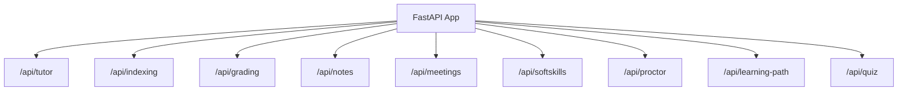
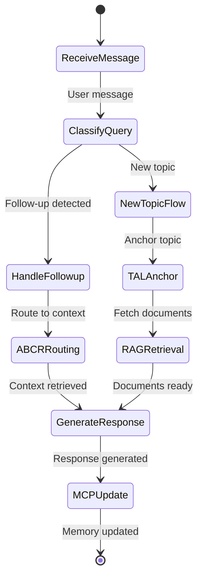
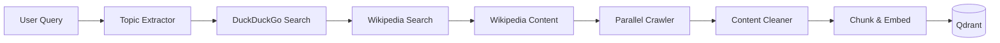

## AI Service

The AI Service is a FastAPI application that provides intelligent tutoring, document processing, RAG-based retrieval, and various AI-powered features. It integrates LangChain, LangGraph, and custom algorithms for context-aware responses.

### Technology Stack

| Technology | Purpose |
|------------|---------|
| FastAPI | Async web framework |
| LangChain | LLM orchestration |
| LangGraph | Agent state machines |
| Qdrant | Vector database |
| HuggingFace | Embeddings (all-MiniLM-L6-v2) |
| Mistral 7B via HuggingFace | LLM inference |
| PyMuPDF | PDF processing |
| Redis | Response caching |

### Project Structure

```
backend/ai-service/
├── app/
│   ├── main.py                   # FastAPI application
│   ├── config.py                 # Configuration
│   ├── agents/
│   │   ├── tutor_agent.py        # LangGraph tutor
│   │   └── assessment_agent.py   # Assessment generation
│   ├── api/
│   │   └── routes/
│   │       ├── tutor.py          # Chat endpoints
│   │       ├── indexing.py       # Document indexing
│   │       ├── grading.py        # Auto-grading
│   │       ├── notes.py          # Note generation
│   │       ├── meetings.py       # Meeting analysis
│   │       └── softskills.py     # Soft skills evaluation
│   ├── rag/
│   │   ├── retriever.py          # RAGRetriever class
│   │   ├── indexer.py            # Document indexer
│   │   └── embeddings.py         # Embedding utilities
│   ├── proctor/
│   │   └── api.py                # Proctoring endpoints
│   ├── services/
│   │   ├── abcr_service.py       # Attention-Based Context Routing
│   │   ├── tal_service.py        # Topic Anchor Layer
│   │   ├── mcp_service.py        # Memory Context Processor
│   │   └── web_ingest_service.py # Web content ingestion
│   └── utils/
│       └── text_processing.py
└── tests/
```

### API Routes



| Route Group | Endpoints | Description |
|-------------|-----------|-------------|
| `/api/tutor` | chat, context, followup | AI tutoring conversations |
| `/api/indexing` | upload, status, delete | Document indexing to Qdrant |
| `/api/grading` | grade, rubric | Automated assessment grading |
| `/api/notes` | generate, summarize | Meeting/lecture notes |
| `/api/meetings` | analyze, transcript | Meeting analysis |
| `/api/softskills` | evaluate, feedback | Soft skills assessment |
| `/api/proctor` | start, frame, result | Proctoring sessions |

### Tutor Agent Architecture

The tutor uses LangGraph for state machine-based conversation flow:



### ABCR Service (Attention-Based Context Routing)

ABCR determines whether a query is a follow-up and routes it appropriately:

```python
class ABCRService:
    def __init__(self):
        self.embedding_model = SentenceTransformer('all-MiniLM-L6-v2')
        self.attention_threshold = 0.65
        self.hysteresis_factor = 0.1
        
    def compute_attention_scores(self, query: str, context_chunks: List[str]) -> List[float]:
        """
        Compute token-level attention between query and context chunks.
        Uses cosine similarity on embeddings.
        """
        query_embedding = self.embedding_model.encode(query)
        chunk_embeddings = self.embedding_model.encode(context_chunks)
        
        scores = cosine_similarity([query_embedding], chunk_embeddings)[0]
        return scores.tolist()
    
    def is_followup(self, query: str, history: List[dict], threshold: float = None) -> bool:
        """
        Determine if query is a follow-up using attention + hysteresis.
        """
        if not history:
            return False
            
        threshold = threshold or self.attention_threshold
        recent_context = [h['content'] for h in history[-3:]]
        scores = self.compute_attention_scores(query, recent_context)
        
        # Apply hysteresis to prevent rapid switching
        max_score = max(scores)
        adjusted_threshold = threshold - self.hysteresis_factor
        
        return max_score > adjusted_threshold
```

### TAL Service (Topic Anchor Layer)

TAL maintains topic continuity across conversation:

```python
class TALService:
    def __init__(self):
        self.topic_stack = []
        self.max_depth = 5
        
    def extract_topic(self, query: str, context: str = None) -> str:
        """
        Extract the main topic from query using LLM.
        """
        prompt = f"""
        Extract the main academic topic from this query.
        Query: {query}
        Context: {context or 'None'}
        
        Return only the topic name (e.g., "Calculus - Integration")
        """
        return self.llm.invoke(prompt).strip()
    
    def anchor_topic(self, topic: str):
        """
        Push topic to stack, maintaining hierarchy.
        """
        if topic not in self.topic_stack:
            self.topic_stack.append(topic)
            if len(self.topic_stack) > self.max_depth:
                self.topic_stack.pop(0)
    
    def get_topic_chain(self) -> str:
        """
        Return topic hierarchy for context injection.
        """
        return " > ".join(self.topic_stack)
```

### MCP Service (Memory Context Processor)

MCP handles long-term conversation memory:

```python
class MCPService:
    def __init__(self, redis_client):
        self.redis = redis_client
        self.memory_ttl = 3600  # 1 hour
        
    def store_memory(self, session_id: str, turn: dict):
        """
        Store conversation turn with summarization for long sessions.
        """
        key = f"memory:{session_id}"
        memory = self.redis.get(key) or []
        memory.append(turn)
        
        # Summarize if memory exceeds threshold
        if len(memory) > 20:
            memory = self._summarize_memory(memory)
            
        self.redis.setex(key, self.memory_ttl, json.dumps(memory))
    
    def retrieve_memory(self, session_id: str, query: str) -> List[dict]:
        """
        Retrieve relevant memory chunks using semantic search.
        """
        key = f"memory:{session_id}"
        memory = json.loads(self.redis.get(key) or '[]')
        
        if not memory:
            return []
            
        # Score relevance and return top-k
        scored = self._score_relevance(query, memory)
        return sorted(scored, key=lambda x: x['score'], reverse=True)[:5]
```

### RAG Pipeline

The retriever handles document retrieval from Qdrant:

```python
class RAGRetriever:
    def __init__(self):
        self.client = QdrantClient(url=settings.QDRANT_URL)
        self.embeddings = HuggingFaceEmbeddings(
            model_name='sentence-transformers/all-MiniLM-L6-v2'
        )
        self.collection = 'documents'
        
    def retrieve(
        self, 
        query: str, 
        top_k: int = 5,
        filters: dict = None
    ) -> List[Document]:
        """
        Retrieve relevant documents with optional filters.
        """
        query_vector = self.embeddings.embed_query(query)
        
        search_params = {
            'collection_name': self.collection,
            'query_vector': query_vector,
            'limit': top_k
        }
        
        if filters:
            search_params['query_filter'] = Filter(
                must=[
                    FieldCondition(
                        key=k,
                        match=MatchValue(value=v)
                    ) for k, v in filters.items()
                ]
            )
            
        results = self.client.search(**search_params)
        
        return [
            Document(
                page_content=hit.payload['text'],
                metadata=hit.payload.get('metadata', {})
            )
            for hit in results
        ]
```

### Web Ingest Pipeline

Seven-worker pipeline for web content ingestion:



| Worker | Function |
|--------|----------|
| Topic Extractor | Extracts key topics from query |
| DuckDuckGo Search | Finds relevant web pages |
| Wikipedia Search | Finds Wikipedia articles |
| Wikipedia Content | Fetches full article content |
| Parallel Crawler | Crawls URLs concurrently |
| Content Cleaner | Removes boilerplate, normalizes |
| Chunk & Embed | Splits text, generates embeddings |

### Document Indexing Endpoint

```python
@router.post("/upload")
async def upload_document(
    file: UploadFile = File(...),
    classroom_id: str = Query(...),
    document_type: str = Query(default="material")
):
    """
    Upload and index a document to Qdrant.
    
    Supported formats: PDF, DOCX, TXT, MD
    """
    # Extract text
    if file.filename.endswith('.pdf'):
        text = extract_pdf_text(file.file)
    elif file.filename.endswith('.docx'):
        text = extract_docx_text(file.file)
    else:
        text = file.file.read().decode('utf-8')
    
    # Chunk text
    chunks = text_splitter.split_text(text)
    
    # Generate embeddings and store
    embeddings = embedding_model.embed_documents(chunks)
    
    points = [
        PointStruct(
            id=str(uuid4()),
            vector=emb,
            payload={
                'text': chunk,
                'metadata': {
                    'classroom_id': classroom_id,
                    'document_type': document_type,
                    'filename': file.filename
                }
            }
        )
        for chunk, emb in zip(chunks, embeddings)
    ]
    
    qdrant_client.upsert(
        collection_name='documents',
        points=points
    )
    
    return {"status": "indexed", "chunks": len(chunks)}
```

### Chat Endpoint

```python
@router.post("/chat")
async def chat(request: ChatRequest):
    """
    Process chat message through tutor agent.
    """
    session_id = request.session_id
    message = request.message
    classroom_id = request.classroom_id
    
    # Initialize or retrieve session state
    state = await get_session_state(session_id)
    
    # Run through agent graph
    result = await tutor_agent.ainvoke({
        'messages': state.messages + [HumanMessage(content=message)],
        'classroom_id': classroom_id,
        'user_id': request.user_id
    })
    
    # Update session state
    await update_session_state(session_id, result)
    
    return ChatResponse(
        message=result['messages'][-1].content,
        sources=result.get('sources', []),
        topic=result.get('current_topic')
    )
```

### Grading Service

```python
@router.post("/grade")
async def grade_submission(request: GradingRequest):
    """
    Grade student submission against rubric.
    """
    rubric = request.rubric
    submission = request.submission
    max_score = request.max_score
    
    prompt = f"""
    You are a grading assistant. Grade the following submission against the rubric.
    
    Rubric:
    {rubric}
    
    Submission:
    {submission}
    
    Provide:
    1. Score out of {max_score}
    2. Detailed feedback for each rubric criterion
    3. Suggestions for improvement
    
    Format as JSON:
    {{
        "score": <number>,
        "feedback": [
            {{"criterion": "...", "score": <number>, "comment": "..."}}
        ],
        "suggestions": ["..."]
    }}
    """
    
    response = await llm.ainvoke(prompt)
    return json.loads(response.content)
```

### Configuration

```python
class Settings(BaseSettings):
    # API
    API_HOST: str = "0.0.0.0"
    API_PORT: int = 8000
    
    # LLM
    HUGGINGFACE_API_KEY: str
    LLM_MODEL: str = "mistralai/Mistral-7B-Instruct-v0.2"
    
    # Vector DB
    QDRANT_URL: str = "http://localhost:6333"
    QDRANT_API_KEY: str = None
    
    # Embeddings
    EMBEDDING_MODEL: str = "sentence-transformers/all-MiniLM-L6-v2"
    
    # Redis
    REDIS_URL: str = "redis://localhost:6379"
    
    # Services
    CORE_SERVICE_URL: str = "http://localhost:5000"
    
    class Config:
        env_file = ".env"
```

### Running the Service

```bash
# Development
uvicorn app.main:app --reload --port 8000

# Production
gunicorn app.main:app -w 4 -k uvicorn.workers.UvicornWorker -b 0.0.0.0:8000

# With multiple workers
uvicorn app.main:app --workers 4 --port 8000
```

### API Documentation

FastAPI auto-generates OpenAPI documentation:
- Swagger UI: `http://localhost:8000/docs`
- ReDoc: `http://localhost:8000/redoc`
- OpenAPI JSON: `http://localhost:8000/openapi.json`
