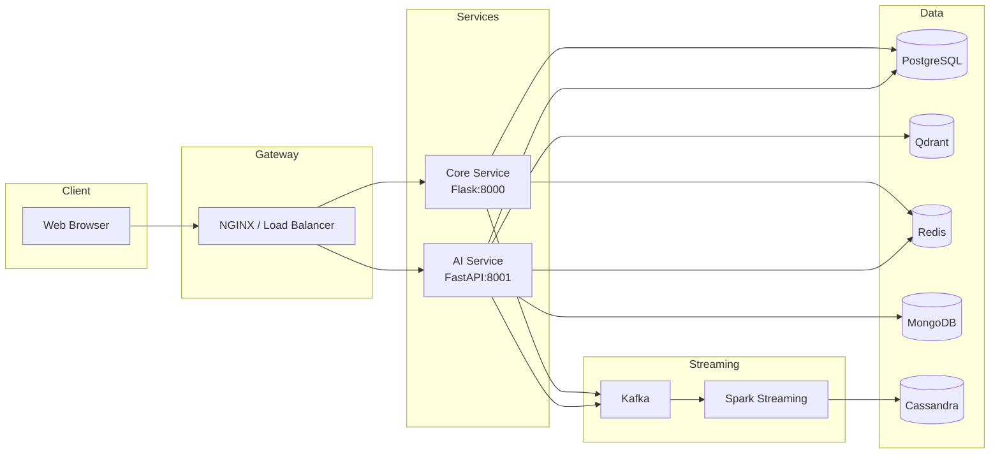
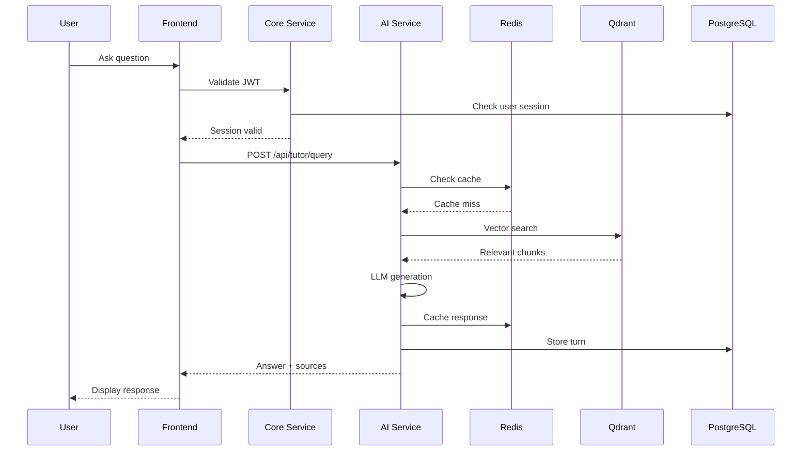
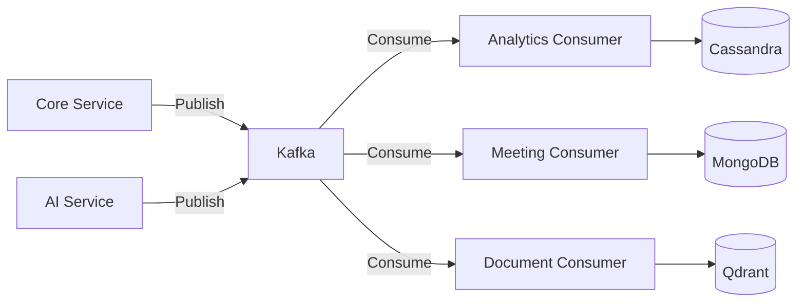
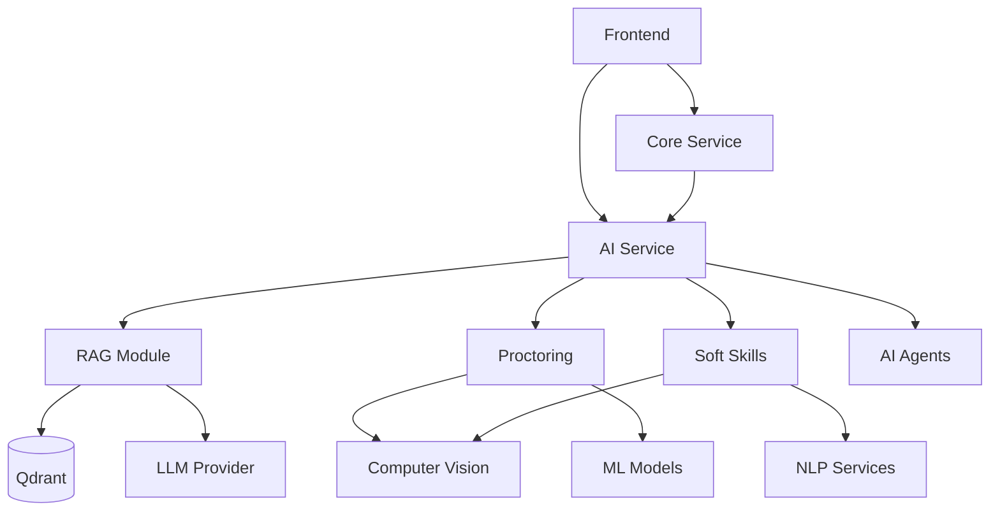
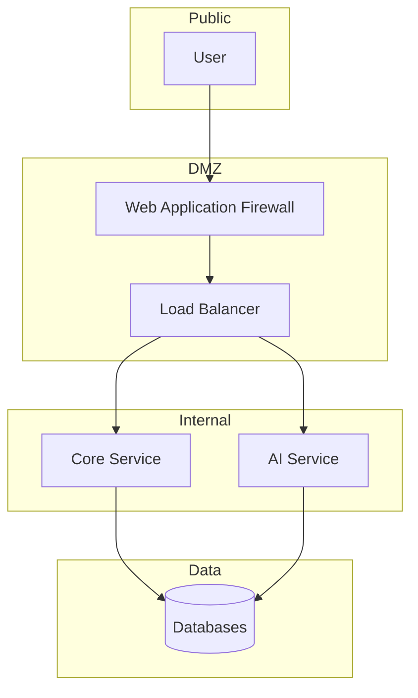

## System Architecture

This document describes the high-level architecture of ensureStudy, including service boundaries, data flow, and design decisions.

### Service Architecture

The platform follows a microservices architecture with two primary backend services and supporting infrastructure.

### Service Responsibilities

| Service | Port | Responsibilities |
|---------|------|------------------|
| Core Service | 8000 | Authentication, user management, classroom operations, file uploads, assessments |
| AI Service | 8001 | RAG queries, tutoring agents, proctoring, soft skills evaluation, document indexing |
| Frontend | 3000 | User interface, real-time updates, WebSocket connections |

### Request Flow

A typical user query to the AI tutor follows this path:

### Data Flow Patterns

The system uses three primary data flow patterns:

**Synchronous Request-Response**

Used for user-facing operations requiring immediate feedback. The frontend waits for a response from the backend.

**Asynchronous Event Processing**

Kafka handles event streaming for operations that dont require immediate user feedback:

**Batch Processing**

PySpark handles large-scale data processing for analytics and model training.

### Module Dependencies

### Scalability Considerations

**Horizontal Scaling**

| Component | Scaling Strategy |
|-----------|------------------|
| Core Service | Multiple replicas behind load balancer |
| AI Service | Multiple replicas with sticky sessions for WebSocket |
| Qdrant | Cluster mode with sharding |
| Redis | Redis Cluster |
| PostgreSQL | Read replicas for query distribution |
| Kafka | Partition-based parallelism |

**Vertical Scaling**

AI Service requires GPU resources for certain operations:
- Embedding generation (CPU/GPU)
- Proctoring inference (GPU preferred)
- LLM inference (GPU for local models)

### Security Architecture

**Authentication Flow**

1. User submits credentials to Core Service
2. Core Service validates against PostgreSQL
3. JWT token issued with role claims
4. Token stored in HTTP-only cookie
5. Subsequent requests include token in Authorization header
6. AI Service validates token via Core Service or shared secret

### Configuration Management

Environment variables control service behavior:

| Category | Variables |
|----------|-----------|
| Database | `DATABASE_URL`, `REDIS_URL`, `QDRANT_HOST` |
| Auth | `JWT_SECRET`, `JWT_EXPIRATION_HOURS` |
| AI | `LLM_MODEL`, `EMBEDDING_MODEL` |
| Kafka | `KAFKA_BOOTSTRAP_SERVERS` |
| Feature Flags | `SKIP_MODERATION`, `ABCR_ENABLED` |

### Monitoring Points

Key metrics to monitor:

| Metric | Source | Threshold |
|--------|--------|-----------|
| API latency | FastAPI/Flask middleware | p99 < 500ms |
| RAG retrieval time | AI Service | < 200ms |
| LLM response time | AI Service | < 5s |
| Cache hit rate | Redis | > 80% |
| Queue depth | Kafka | < 10000 messages |
| Error rate | All services | < 1% |

### Failure Modes

| Failure | Impact | Mitigation |
|---------|--------|------------|
| PostgreSQL down | Auth fails, data loss | Read replicas, connection pooling |
| Qdrant down | RAG disabled | Fallback to keyword search |
| Redis down | No caching, rate limits fail | Local cache, circuit breaker |
| Kafka down | Events queued locally | Local file buffer, retry logic |
| LLM API down | No AI responses | Cached responses, fallback model |
