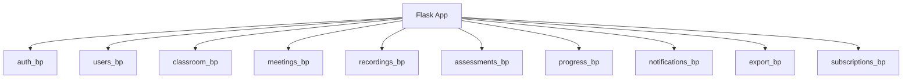
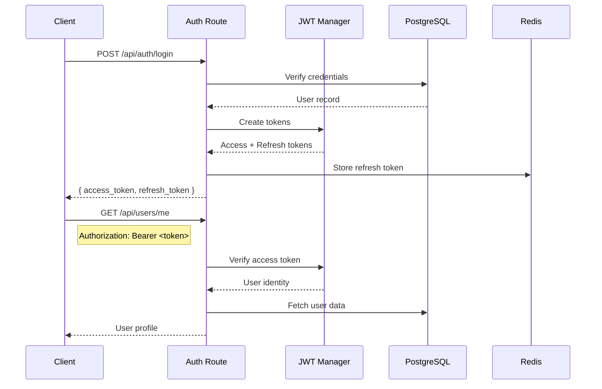

## Core Service

The Core Service is a Flask application that handles authentication, user management, classroom operations, and serves as the primary API gateway. It uses SQLAlchemy ORM with PostgreSQL as the database.

### Technology Stack

| Technology | Version | Purpose |
|------------|---------|---------|
| Flask | 3.x | Web framework |
| SQLAlchemy | 2.x | ORM |
| Flask-JWT-Extended | 4.x | JWT authentication |
| Flask-Mail | 0.10+ | Email notifications |
| Celery | 5.x | Background tasks |
| Redis | - | Session cache, Celery broker |
| PostgreSQL | 15+ | Primary database |

### Application Factory

The application uses the factory pattern for configuration:

```python
def create_app(config_name='development'):
    app = Flask(__name__)
    app.config.from_object(config[config_name])
    
    # Initialize extensions
    db.init_app(app)
    jwt.init_app(app)
    mail.init_app(app)
    migrate.init_app(app, db)
    
    # Register blueprints
    register_blueprints(app)
    
    return app
```

### Project Structure

```
backend/core-service/
├── app/
│   ├── __init__.py           # App factory
│   ├── config.py             # Configuration classes
│   ├── extensions.py         # Flask extensions
│   ├── models/               # SQLAlchemy models
│   │   ├── user.py
│   │   ├── classroom.py
│   │   ├── meeting.py
│   │   ├── assessment.py
│   │   ├── recording.py
│   │   └── progress.py
│   ├── routes/               # Route blueprints
│   │   ├── auth.py
│   │   ├── users.py
│   │   ├── classroom.py
│   │   ├── meetings.py
│   │   ├── recordings.py
│   │   ├── assessments.py
│   │   └── progress.py
│   ├── services/             # Business logic
│   ├── schemas/              # Marshmallow schemas
│   └── utils/                # Helper functions
├── migrations/               # Alembic migrations
├── tests/                    # Test suite
└── run.py                    # Entry point
```

### Route Blueprints



| Blueprint | Prefix | Endpoints |
|-----------|--------|-----------|
| auth | `/api/auth` | login, register, refresh, logout, forgot-password |
| users | `/api/users` | profile, update, preferences |
| classroom | `/api/classrooms` | CRUD, members, materials |
| meetings | `/api/meetings` | create, join, schedule |
| recordings | `/api/recordings` | list, playback, transcripts |
| assessments | `/api/assessments` | create, submit, grade |
| progress | `/api/progress` | analytics, reports |

### Authentication Flow



JWT configuration:

```python
# Access token: short-lived (15 minutes)
JWT_ACCESS_TOKEN_EXPIRES = timedelta(minutes=15)

# Refresh token: long-lived (30 days)
JWT_REFRESH_TOKEN_EXPIRES = timedelta(days=30)

# Token storage
JWT_TOKEN_LOCATION = ['headers']
JWT_HEADER_NAME = 'Authorization'
JWT_HEADER_TYPE = 'Bearer'
```

### Database Models

**User Model**

```python
class User(db.Model):
    __tablename__ = 'users'
    
    id = db.Column(UUID, primary_key=True, default=uuid4)
    email = db.Column(db.String(255), unique=True, nullable=False)
    password_hash = db.Column(db.String(255), nullable=False)
    name = db.Column(db.String(100))
    role = db.Column(db.Enum(UserRole), default=UserRole.STUDENT)
    created_at = db.Column(db.DateTime, default=datetime.utcnow)
    
    # Relationships
    classrooms = db.relationship('ClassroomMember', back_populates='user')
    progress = db.relationship('Progress', back_populates='user')
```

**Classroom Model**

```python
class Classroom(db.Model):
    __tablename__ = 'classrooms'
    
    id = db.Column(UUID, primary_key=True, default=uuid4)
    name = db.Column(db.String(200), nullable=False)
    description = db.Column(db.Text)
    subject = db.Column(db.String(100))
    teacher_id = db.Column(UUID, db.ForeignKey('users.id'))
    created_at = db.Column(db.DateTime, default=datetime.utcnow)
    
    # Relationships
    teacher = db.relationship('User', foreign_keys=[teacher_id])
    members = db.relationship('ClassroomMember', back_populates='classroom')
    meetings = db.relationship('Meeting', back_populates='classroom')
    materials = db.relationship('Material', back_populates='classroom')
```

**Meeting Model**

```python
class Meeting(db.Model):
    __tablename__ = 'meetings'
    
    id = db.Column(UUID, primary_key=True, default=uuid4)
    classroom_id = db.Column(UUID, db.ForeignKey('classrooms.id'))
    title = db.Column(db.String(200))
    scheduled_at = db.Column(db.DateTime)
    duration_minutes = db.Column(db.Integer, default=60)
    status = db.Column(db.Enum(MeetingStatus), default=MeetingStatus.SCHEDULED)
    meeting_url = db.Column(db.String(500))
    
    # Relationships
    classroom = db.relationship('Classroom', back_populates='meetings')
    recordings = db.relationship('Recording', back_populates='meeting')
```

### Classroom Routes

| Method | Endpoint | Description |
|--------|----------|-------------|
| POST | `/api/classrooms` | Create classroom (teacher) |
| GET | `/api/classrooms` | List user's classrooms |
| GET | `/api/classrooms/<id>` | Get classroom details |
| PUT | `/api/classrooms/<id>` | Update classroom |
| DELETE | `/api/classrooms/<id>` | Delete classroom |
| POST | `/api/classrooms/<id>/join` | Join with code |
| GET | `/api/classrooms/<id>/members` | List members |
| POST | `/api/classrooms/<id>/materials` | Upload material |

Route implementation pattern:

```python
@classroom_bp.route('/', methods=['POST'])
@jwt_required()
@role_required(UserRole.TEACHER)
def create_classroom():
    data = request.get_json()
    schema = ClassroomCreateSchema()
    validated = schema.load(data)
    
    classroom = Classroom(
        name=validated['name'],
        description=validated.get('description'),
        subject=validated.get('subject'),
        teacher_id=get_jwt_identity()
    )
    
    db.session.add(classroom)
    db.session.commit()
    
    return jsonify(ClassroomSchema().dump(classroom)), 201
```

### Role-Based Access Control

```python
class UserRole(Enum):
    STUDENT = 'student'
    TEACHER = 'teacher'
    ADMIN = 'admin'
    PARENT = 'parent'

def role_required(*roles):
    def decorator(fn):
        @wraps(fn)
        @jwt_required()
        def wrapper(*args, **kwargs):
            user_id = get_jwt_identity()
            user = User.query.get(user_id)
            if user.role not in roles:
                abort(403, description='Insufficient permissions')
            return fn(*args, **kwargs)
        return wrapper
    return decorator
```

Permission matrix:

| Resource | Student | Teacher | Admin |
|----------|---------|---------|-------|
| View classrooms | Own | Own | All |
| Create classroom | No | Yes | Yes |
| Manage members | No | Own | All |
| Create assessments | No | Yes | Yes |
| Submit assessments | Yes | No | No |
| View analytics | Own | Class | All |

### Background Tasks (Celery)

```python
# tasks.py
from celery import shared_task

@shared_task
def send_email_notification(user_id, template, context):
    user = User.query.get(user_id)
    msg = Message(
        subject=context['subject'],
        recipients=[user.email],
        html=render_template(template, **context)
    )
    mail.send(msg)

@shared_task
def process_meeting_recording(recording_id):
    recording = Recording.query.get(recording_id)
    # Extract transcript
    # Generate summary
    # Update recording record
```

Task scheduling:

```python
# celeryconfig.py
beat_schedule = {
    'send-meeting-reminders': {
        'task': 'app.tasks.send_meeting_reminders',
        'schedule': crontab(minute='*/15'),
    },
    'cleanup-expired-sessions': {
        'task': 'app.tasks.cleanup_sessions',
        'schedule': crontab(hour=3, minute=0),
    }
}
```

### API Response Format

Consistent response structure:

```python
# Success
{
    "data": { ... },
    "message": "Operation successful",
    "status": "success"
}

# Error
{
    "error": {
        "code": "VALIDATION_ERROR",
        "message": "Invalid input",
        "details": { ... }
    },
    "status": "error"
}

# Paginated
{
    "data": [ ... ],
    "pagination": {
        "page": 1,
        "per_page": 20,
        "total": 150,
        "pages": 8
    }
}
```

### Error Handling

```python
@app.errorhandler(ValidationError)
def handle_validation_error(error):
    return jsonify({
        'error': {
            'code': 'VALIDATION_ERROR',
            'message': str(error),
            'details': error.messages
        },
        'status': 'error'
    }), 400

@app.errorhandler(404)
def handle_not_found(error):
    return jsonify({
        'error': {
            'code': 'NOT_FOUND',
            'message': error.description or 'Resource not found'
        },
        'status': 'error'
    }), 404
```

### Database Migrations

```bash
# Create migration
flask db migrate -m "Add meeting recordings table"

# Apply migrations
flask db upgrade

# Rollback
flask db downgrade
```

Migration naming conventions:
- `add_<table>_table` for new tables
- `add_<column>_to_<table>` for new columns
- `rename_<old>_to_<new>_in_<table>` for renames

### Testing

```python
# tests/conftest.py
@pytest.fixture
def app():
    app = create_app('testing')
    with app.app_context():
        db.create_all()
        yield app
        db.drop_all()

@pytest.fixture
def client(app):
    return app.test_client()

@pytest.fixture
def auth_headers(client):
    # Create test user and login
    response = client.post('/api/auth/login', json={
        'email': 'test@example.com',
        'password': 'testpass'
    })
    token = response.json['access_token']
    return {'Authorization': f'Bearer {token}'}
```

### Environment Configuration

| Variable | Description | Default |
|----------|-------------|---------|
| `DATABASE_URL` | PostgreSQL connection string | - |
| `REDIS_URL` | Redis connection string | - |
| `JWT_SECRET_KEY` | Secret for JWT signing | - |
| `MAIL_SERVER` | SMTP server | - |
| `CELERY_BROKER_URL` | Celery broker (Redis) | - |

### Running the Service

```bash
# Development
flask run --port 5000

# Production (Gunicorn)
gunicorn -w 4 -b 0.0.0.0:5000 "app:create_app('production')"

# With Celery worker
celery -A app.celery worker --loglevel=info
celery -A app.celery beat --loglevel=info
```
