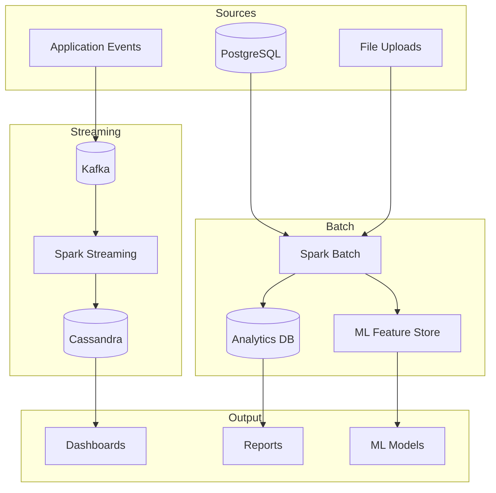
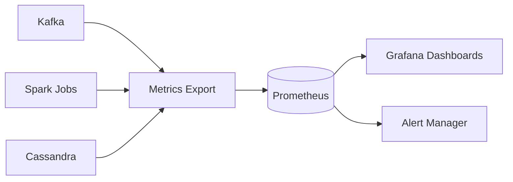

## Data Pipelines

The data pipeline infrastructure handles batch processing and real-time streaming for analytics, ETL, and event processing. It uses Apache Spark for batch processing and Kafka for event streaming.

### Architecture Overview



### Technology Stack

| Component | Technology | Purpose |
|-----------|------------|---------|
| Message Broker | Apache Kafka | Event streaming |
| Stream Processing | PySpark Structured Streaming | Real-time ETL |
| Batch Processing | PySpark | Large-scale data processing |
| Time-series Storage | Cassandra | High-write analytics data |
| Orchestration | Apache Airflow | Batch job scheduling |

### Kafka Topics

| Topic | Partitions | Description |
|-------|------------|-------------|
| `user.events` | 6 | User activity events |
| `meeting.events` | 4 | Meeting lifecycle events |
| `assessment.events` | 4 | Assessment submissions |
| `proctoring.violations` | 4 | Proctoring violation events |
| `learning.progress` | 6 | Learning progress updates |

Topic configuration:

```yaml
topics:
  - name: user.events
    partitions: 6
    replication_factor: 3
    config:
      retention.ms: 604800000  # 7 days
      cleanup.policy: delete
      
  - name: meeting.events
    partitions: 4
    replication_factor: 3
    config:
      retention.ms: 2592000000  # 30 days
```

### Event Schemas

**User Event**

```json
{
  "event_id": "uuid",
  "event_type": "page_view | click | session_start | session_end",
  "user_id": "uuid",
  "timestamp": "2024-01-15T10:30:00Z",
  "properties": {
    "page": "/dashboard",
    "duration_ms": 5000,
    "device": "desktop"
  }
}
```

**Meeting Event**

```json
{
  "event_id": "uuid",
  "event_type": "meeting_created | participant_joined | meeting_ended",
  "meeting_id": "uuid",
  "classroom_id": "uuid",
  "timestamp": "2024-01-15T10:30:00Z",
  "properties": {
    "participant_count": 25,
    "duration_minutes": 60
  }
}
```

### Kafka Producers

```python
from confluent_kafka import Producer
import json

class EventProducer:
    def __init__(self):
        self.producer = Producer({
            'bootstrap.servers': settings.KAFKA_BROKERS,
            'client.id': 'ensurestudy-producer',
            'acks': 'all',
            'enable.idempotence': True,
            'retries': 3
        })
        
    def send_event(self, topic: str, event: dict, key: str = None):
        """
        Send event to Kafka topic.
        """
        self.producer.produce(
            topic=topic,
            key=key.encode('utf-8') if key else None,
            value=json.dumps(event).encode('utf-8'),
            callback=self._delivery_callback
        )
        self.producer.poll(0)  # Trigger delivery callbacks
        
    def _delivery_callback(self, err, msg):
        if err:
            logger.error(f"Delivery failed: {err}")
        else:
            logger.debug(f"Delivered to {msg.topic()}[{msg.partition()}]")
    
    def flush(self):
        self.producer.flush()
```

Usage in application:

```python
# In Core Service
@app.after_request
def track_request(response):
    if current_user.is_authenticated:
        event_producer.send_event(
            topic='user.events',
            event={
                'event_id': str(uuid4()),
                'event_type': 'page_view',
                'user_id': str(current_user.id),
                'timestamp': datetime.utcnow().isoformat(),
                'properties': {
                    'page': request.path,
                    'method': request.method,
                    'status_code': response.status_code
                }
            },
            key=str(current_user.id)
        )
    return response
```

### Kafka Consumers

```python
from confluent_kafka import Consumer

class MeetingEventConsumer:
    def __init__(self):
        self.consumer = Consumer({
            'bootstrap.servers': settings.KAFKA_BROKERS,
            'group.id': 'meeting-analytics-group',
            'auto.offset.reset': 'earliest',
            'enable.auto.commit': True,
            'auto.commit.interval.ms': 5000
        })
        
        self.consumer.subscribe(['meeting.events'])
        
    def process(self):
        """
        Consume and process meeting events.
        """
        while True:
            msg = self.consumer.poll(1.0)
            
            if msg is None:
                continue
            if msg.error():
                logger.error(f"Consumer error: {msg.error()}")
                continue
            
            event = json.loads(msg.value().decode('utf-8'))
            
            try:
                self._handle_event(event)
            except Exception as e:
                logger.error(f"Error processing event: {e}")
                
    def _handle_event(self, event: dict):
        event_type = event['event_type']
        
        if event_type == 'meeting_ended':
            # Calculate meeting analytics
            self._process_meeting_end(event)
        elif event_type == 'participant_joined':
            # Update participant count
            self._update_participant_count(event)
```

### PySpark Structured Streaming

Real-time analytics pipeline:

```python
from pyspark.sql import SparkSession
from pyspark.sql.functions import (
    from_json, col, window, count, avg, 
    to_timestamp, expr
)
from pyspark.sql.types import (
    StructType, StructField, StringType, 
    TimestampType, MapType
)

# Initialize Spark
spark = SparkSession.builder \
    .appName("EnsureStudy-Streaming") \
    .config("spark.jars.packages", 
            "org.apache.spark:spark-sql-kafka-0-10_2.12:3.5.0") \
    .config("spark.cassandra.connection.host", settings.CASSANDRA_HOST) \
    .getOrCreate()

# Define event schema
event_schema = StructType([
    StructField("event_id", StringType()),
    StructField("event_type", StringType()),
    StructField("user_id", StringType()),
    StructField("timestamp", StringType()),
    StructField("properties", MapType(StringType(), StringType()))
])

# Read from Kafka
df = spark.readStream \
    .format("kafka") \
    .option("kafka.bootstrap.servers", settings.KAFKA_BROKERS) \
    .option("subscribe", "user.events") \
    .option("startingOffsets", "latest") \
    .load()

# Parse JSON
parsed = df.select(
    from_json(col("value").cast("string"), event_schema).alias("event")
).select("event.*")

# Convert timestamp
parsed = parsed.withColumn(
    "event_time",
    to_timestamp(col("timestamp"))
)

# Windowed aggregation - page views per 5 minutes
page_views = parsed \
    .filter(col("event_type") == "page_view") \
    .groupBy(
        window(col("event_time"), "5 minutes"),
        col("properties.page")
    ) \
    .agg(count("*").alias("view_count"))

# Write to Cassandra
query = page_views.writeStream \
    .outputMode("update") \
    .foreachBatch(write_to_cassandra) \
    .option("checkpointLocation", "/tmp/checkpoints/page_views") \
    .start()

def write_to_cassandra(batch_df, batch_id):
    batch_df.write \
        .format("org.apache.spark.sql.cassandra") \
        .options(table="page_view_stats", keyspace="analytics") \
        .mode("append") \
        .save()
```

### Session Analytics Pipeline

```python
# Calculate learning session metrics
session_analytics = parsed \
    .filter(col("event_type").isin(["session_start", "session_end"])) \
    .groupBy(
        window(col("event_time"), "1 hour"),
        col("user_id")
    ) \
    .agg(
        count(when(col("event_type") == "session_start", 1)).alias("sessions"),
        avg(col("properties.duration_ms").cast("long")).alias("avg_duration")
    )

# User engagement scoring
engagement = parsed \
    .groupBy(
        window(col("event_time"), "1 day"),
        col("user_id")
    ) \
    .agg(
        count("*").alias("total_events"),
        countDistinct(col("properties.page")).alias("unique_pages"),
        sum(when(col("event_type") == "click", 1).otherwise(0)).alias("clicks")
    ) \
    .withColumn(
        "engagement_score",
        (col("total_events") * 0.3 + 
         col("unique_pages") * 0.4 + 
         col("clicks") * 0.3)
    )
```

### Batch Processing Pipeline

Daily ETL job:

```python
from pyspark.sql import SparkSession
from pyspark.sql.functions import *

def run_daily_etl(execution_date: str):
    spark = SparkSession.builder \
        .appName("EnsureStudy-DailyETL") \
        .getOrCreate()
    
    # Read from PostgreSQL
    users_df = spark.read \
        .format("jdbc") \
        .option("url", f"jdbc:postgresql://{settings.DB_HOST}/ensurestudy") \
        .option("dbtable", "users") \
        .option("user", settings.DB_USER) \
        .option("password", settings.DB_PASSWORD) \
        .load()
    
    progress_df = spark.read \
        .format("jdbc") \
        .option("dbtable", "progress") \
        .load()
    
    # Join and aggregate
    daily_stats = progress_df \
        .filter(col("date") == execution_date) \
        .groupBy("user_id") \
        .agg(
            sum("time_spent_minutes").alias("total_time"),
            count("lesson_id").alias("lessons_completed"),
            avg("score").alias("average_score")
        ) \
        .join(users_df.select("id", "name", "email"), 
              progress_df.user_id == users_df.id)
    
    # Calculate rankings
    daily_stats = daily_stats.withColumn(
        "daily_rank",
        dense_rank().over(
            Window.orderBy(col("total_time").desc())
        )
    )
    
    # Write to analytics database
    daily_stats.write \
        .format("jdbc") \
        .option("url", f"jdbc:postgresql://{settings.ANALYTICS_DB_HOST}/analytics") \
        .option("dbtable", "daily_user_stats") \
        .mode("overwrite") \
        .save()
    
    spark.stop()
```

### Airflow DAGs

```python
from airflow import DAG
from airflow.operators.python import PythonOperator
from airflow.operators.bash import BashOperator
from datetime import datetime, timedelta

default_args = {
    'owner': 'data-team',
    'depends_on_past': False,
    'email_on_failure': True,
    'email': ['data-alerts@example.com'],
    'retries': 2,
    'retry_delay': timedelta(minutes=5)
}

with DAG(
    'daily_analytics_etl',
    default_args=default_args,
    description='Daily ETL for analytics',
    schedule_interval='0 2 * * *',  # 2 AM daily
    start_date=datetime(2024, 1, 1),
    catchup=False
) as dag:
    
    extract_users = PythonOperator(
        task_id='extract_user_data',
        python_callable=extract_user_data
    )
    
    extract_progress = PythonOperator(
        task_id='extract_progress_data',
        python_callable=extract_progress_data
    )
    
    transform = BashOperator(
        task_id='run_spark_transform',
        bash_command='spark-submit /opt/spark/jobs/daily_transform.py {{ ds }}'
    )
    
    load_analytics = PythonOperator(
        task_id='load_to_analytics_db',
        python_callable=load_analytics_data
    )
    
    [extract_users, extract_progress] >> transform >> load_analytics
```

### Cassandra Schema

Time-series tables for analytics:

```cql
CREATE KEYSPACE IF NOT EXISTS analytics
WITH replication = {
    'class': 'SimpleStrategy',
    'replication_factor': 3
};

CREATE TABLE analytics.page_view_stats (
    date date,
    hour int,
    page text,
    view_count bigint,
    PRIMARY KEY ((date), hour, page)
) WITH CLUSTERING ORDER BY (hour DESC, page ASC);

CREATE TABLE analytics.user_engagement (
    user_id uuid,
    date date,
    total_events bigint,
    unique_pages int,
    session_count int,
    total_time_minutes int,
    engagement_score double,
    PRIMARY KEY ((user_id), date)
) WITH CLUSTERING ORDER BY (date DESC);

CREATE TABLE analytics.learning_progress (
    user_id uuid,
    subject text,
    week_start date,
    lessons_completed int,
    time_spent_minutes int,
    average_score double,
    PRIMARY KEY ((user_id, subject), week_start)
) WITH CLUSTERING ORDER BY (week_start DESC);
```

### Monitoring



Key metrics to monitor:

| Metric | Source | Alert Threshold |
|--------|--------|-----------------|
| Consumer lag | Kafka | > 10000 messages |
| Processing time | Spark | > 5 minutes |
| Write latency | Cassandra | > 100ms p99 |
| Failed batches | Spark | > 0 |
| Topic disk usage | Kafka | > 80% |

### Running the Pipelines

```bash
# Start Kafka consumer
python -m backend.kafka.consumers.meeting_consumer

# Submit Spark streaming job
spark-submit \
    --packages org.apache.spark:spark-sql-kafka-0-10_2.12:3.5.0 \
    --conf spark.cassandra.connection.host=localhost \
    backend/data-pipelines/streaming/kafka_spark_streaming.py

# Run Airflow scheduler
airflow scheduler

# Trigger manual DAG run
airflow dags trigger daily_analytics_etl --conf '{"date": "2024-01-15"}'
```
