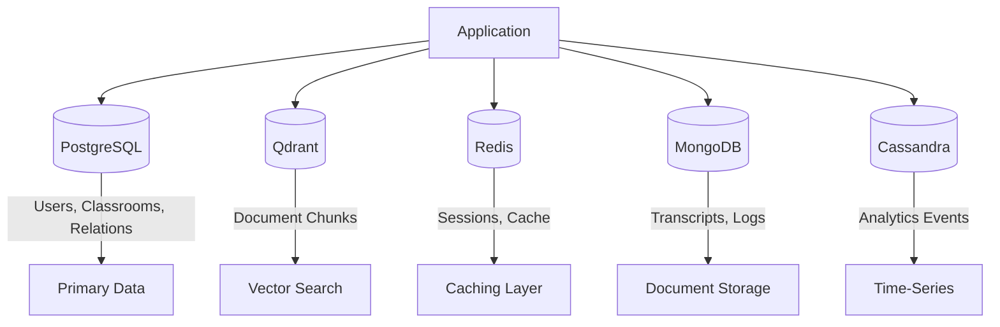

## Databases

The system uses multiple databases optimized for different data patterns: PostgreSQL for relational data, Qdrant for vector embeddings, Redis for caching, MongoDB for documents, and Cassandra for time-series analytics.

### Database Overview



### Database Selection Criteria

| Database | Use Case | Data Pattern |
|----------|----------|--------------|
| PostgreSQL | Core entities | Relational, ACID transactions |
| Qdrant | RAG retrieval | High-dimensional vectors |
| Redis | Sessions, cache | Key-value, TTL-based |
| MongoDB | Semi-structured | Flexible documents |
| Cassandra | Analytics | Time-series, high write |

### PostgreSQL Schema

**Users and Authentication**

```sql
CREATE TABLE users (
    id UUID PRIMARY KEY DEFAULT gen_random_uuid(),
    email VARCHAR(255) UNIQUE NOT NULL,
    password_hash VARCHAR(255) NOT NULL,
    name VARCHAR(100),
    role VARCHAR(20) NOT NULL DEFAULT 'student',
    avatar_url VARCHAR(500),
    created_at TIMESTAMP DEFAULT NOW(),
    updated_at TIMESTAMP DEFAULT NOW(),
    last_login TIMESTAMP,
    is_active BOOLEAN DEFAULT TRUE
);

CREATE INDEX idx_users_email ON users(email);
CREATE INDEX idx_users_role ON users(role);

CREATE TABLE user_preferences (
    user_id UUID PRIMARY KEY REFERENCES users(id) ON DELETE CASCADE,
    theme VARCHAR(20) DEFAULT 'light',
    language VARCHAR(10) DEFAULT 'en',
    notification_email BOOLEAN DEFAULT TRUE,
    notification_push BOOLEAN DEFAULT TRUE,
    difficulty_preference INTEGER DEFAULT 3
);
```

**Classrooms and Members**

```sql
CREATE TABLE classrooms (
    id UUID PRIMARY KEY DEFAULT gen_random_uuid(),
    name VARCHAR(200) NOT NULL,
    description TEXT,
    subject VARCHAR(100),
    teacher_id UUID NOT NULL REFERENCES users(id),
    join_code VARCHAR(8) UNIQUE,
    is_active BOOLEAN DEFAULT TRUE,
    created_at TIMESTAMP DEFAULT NOW()
);

CREATE TABLE classroom_members (
    id UUID PRIMARY KEY DEFAULT gen_random_uuid(),
    classroom_id UUID NOT NULL REFERENCES classrooms(id) ON DELETE CASCADE,
    user_id UUID NOT NULL REFERENCES users(id) ON DELETE CASCADE,
    role VARCHAR(20) NOT NULL DEFAULT 'student',
    joined_at TIMESTAMP DEFAULT NOW(),
    UNIQUE(classroom_id, user_id)
);

CREATE INDEX idx_classroom_members_user ON classroom_members(user_id);
CREATE INDEX idx_classroom_members_classroom ON classroom_members(classroom_id);
```

**Meetings and Recordings**

```sql
CREATE TABLE meetings (
    id UUID PRIMARY KEY DEFAULT gen_random_uuid(),
    classroom_id UUID NOT NULL REFERENCES classrooms(id),
    title VARCHAR(200),
    description TEXT,
    scheduled_at TIMESTAMP NOT NULL,
    duration_minutes INTEGER DEFAULT 60,
    status VARCHAR(20) DEFAULT 'scheduled',
    meeting_url VARCHAR(500),
    created_by UUID REFERENCES users(id),
    created_at TIMESTAMP DEFAULT NOW()
);

CREATE INDEX idx_meetings_classroom ON meetings(classroom_id);
CREATE INDEX idx_meetings_scheduled ON meetings(scheduled_at);

CREATE TABLE recordings (
    id UUID PRIMARY KEY DEFAULT gen_random_uuid(),
    meeting_id UUID NOT NULL REFERENCES meetings(id),
    file_url VARCHAR(500) NOT NULL,
    duration_seconds INTEGER,
    file_size_bytes BIGINT,
    transcript TEXT,
    summary TEXT,
    created_at TIMESTAMP DEFAULT NOW()
);
```

**Assessments**

```sql
CREATE TABLE assessments (
    id UUID PRIMARY KEY DEFAULT gen_random_uuid(),
    classroom_id UUID NOT NULL REFERENCES classrooms(id),
    title VARCHAR(200) NOT NULL,
    description TEXT,
    type VARCHAR(20) NOT NULL,
    total_points INTEGER NOT NULL,
    due_date TIMESTAMP,
    time_limit_minutes INTEGER,
    is_proctored BOOLEAN DEFAULT FALSE,
    created_by UUID REFERENCES users(id),
    created_at TIMESTAMP DEFAULT NOW()
);

CREATE TABLE assessment_questions (
    id UUID PRIMARY KEY DEFAULT gen_random_uuid(),
    assessment_id UUID NOT NULL REFERENCES assessments(id) ON DELETE CASCADE,
    question_text TEXT NOT NULL,
    question_type VARCHAR(20) NOT NULL,
    points INTEGER NOT NULL,
    options JSONB,
    correct_answer TEXT,
    order_index INTEGER NOT NULL
);

CREATE TABLE submissions (
    id UUID PRIMARY KEY DEFAULT gen_random_uuid(),
    assessment_id UUID NOT NULL REFERENCES assessments(id),
    user_id UUID NOT NULL REFERENCES users(id),
    answers JSONB NOT NULL,
    score DECIMAL(5,2),
    submitted_at TIMESTAMP DEFAULT NOW(),
    graded_at TIMESTAMP,
    graded_by UUID REFERENCES users(id),
    feedback TEXT,
    UNIQUE(assessment_id, user_id)
);
```

**Learning Progress**

```sql
CREATE TABLE progress (
    id UUID PRIMARY KEY DEFAULT gen_random_uuid(),
    user_id UUID NOT NULL REFERENCES users(id),
    topic_id UUID NOT NULL,
    mastery_level DECIMAL(3,2) DEFAULT 0,
    time_spent_minutes INTEGER DEFAULT 0,
    last_activity TIMESTAMP DEFAULT NOW(),
    UNIQUE(user_id, topic_id)
);

CREATE INDEX idx_progress_user ON progress(user_id);
CREATE INDEX idx_progress_topic ON progress(topic_id);
```

### Qdrant Collections

**Documents Collection**

```python
# Collection configuration
{
    "collection_name": "documents",
    "vectors_config": {
        "size": 384,  # all-MiniLM-L6-v2
        "distance": "Cosine"
    },
    "hnsw_config": {
        "m": 16,
        "ef_construct": 128
    }
}

# Point structure
{
    "id": "uuid-string",
    "vector": [0.1, 0.2, ...],  # 384 dimensions
    "payload": {
        "text": "Chunk content...",
        "classroom_id": "uuid",
        "document_type": "material",
        "filename": "chapter1.pdf",
        "page_number": 5,
        "chunk_index": 12,
        "created_at": "2024-01-15T10:30:00Z"
    }
}
```

Payload indexes for filtering:

```python
client.create_payload_index(
    collection_name="documents",
    field_name="classroom_id",
    field_schema=PayloadSchemaType.KEYWORD
)

client.create_payload_index(
    collection_name="documents",
    field_name="document_type",
    field_schema=PayloadSchemaType.KEYWORD
)
```

**Web Content Collection**

```python
{
    "collection_name": "web_content",
    "vectors_config": {
        "size": 384,
        "distance": "Cosine"
    }
}

# Point structure
{
    "id": "uuid-string",
    "vector": [...],
    "payload": {
        "text": "Web content chunk...",
        "source_url": "https://...",
        "title": "Page title",
        "topic": "extracted topic",
        "ingested_at": "2024-01-15T10:30:00Z"
    }
}
```

### Redis Data Structures

**Session Storage**

```
Key: session:{session_id}
Type: Hash
TTL: 3600 (1 hour)

Fields:
- user_id: UUID
- email: string
- role: string
- created_at: timestamp
- last_activity: timestamp
```

**Rate Limiting**

```
Key: ratelimit:{user_id}:{endpoint}
Type: String (counter)
TTL: 60 (1 minute)

Value: request_count
```

**Chat History Cache**

```
Key: chat:{session_id}:history
Type: List
TTL: 7200 (2 hours)

Elements: JSON-encoded messages
```

**Proctoring Session**

```
Key: proctor:session:{session_id}
Type: Hash
TTL: 7200 (2 hours)

Fields:
- user_id: UUID
- assessment_id: UUID
- started_at: timestamp
- status: string
- violations: JSON array
```

Redis commands for common operations:

```python
# Session management
redis.hset(f"session:{session_id}", mapping={
    "user_id": str(user_id),
    "email": email,
    "role": role
})
redis.expire(f"session:{session_id}", 3600)

# Rate limiting
current = redis.incr(f"ratelimit:{user_id}:{endpoint}")
if current == 1:
    redis.expire(f"ratelimit:{user_id}:{endpoint}", 60)
if current > limit:
    raise RateLimitExceeded()

# Chat history
redis.lpush(f"chat:{session_id}:history", json.dumps(message))
redis.ltrim(f"chat:{session_id}:history", 0, 99)  # Keep last 100
```

### MongoDB Collections

**Meeting Transcripts**

```javascript
// Collection: transcripts
{
    "_id": ObjectId("..."),
    "meeting_id": "uuid-string",
    "segments": [
        {
            "speaker_id": "uuid-string",
            "speaker_name": "John Doe",
            "start_time": 0.5,
            "end_time": 5.2,
            "text": "Welcome to today's class...",
            "confidence": 0.95
        }
    ],
    "full_text": "Complete transcript...",
    "word_count": 1500,
    "duration_seconds": 3600,
    "language": "en",
    "created_at": ISODate("2024-01-15T10:30:00Z")
}
```

**Proctoring Reports**

```javascript
// Collection: proctoring_reports
{
    "_id": ObjectId("..."),
    "session_id": "uuid-string",
    "user_id": "uuid-string",
    "assessment_id": "uuid-string",
    "integrity_score": 85.5,
    "risk_level": "low",
    "started_at": ISODate("..."),
    "ended_at": ISODate("..."),
    "violations": [
        {
            "type": "gaze_deviation",
            "timestamp": ISODate("..."),
            "details": {
                "horizontal": 35,
                "vertical": 10
            }
        }
    ],
    "frame_snapshots": [
        {
            "timestamp": ISODate("..."),
            "image_url": "s3://...",
            "violations": ["multiple_faces"]
        }
    ]
}
```

**Activity Logs**

```javascript
// Collection: activity_logs
{
    "_id": ObjectId("..."),
    "user_id": "uuid-string",
    "action": "document_upload",
    "resource_type": "material",
    "resource_id": "uuid-string",
    "metadata": {
        "filename": "notes.pdf",
        "file_size": 1024000
    },
    "ip_address": "192.168.1.1",
    "user_agent": "Mozilla/5.0...",
    "timestamp": ISODate("2024-01-15T10:30:00Z")
}

// Indexes
db.activity_logs.createIndex({ "user_id": 1, "timestamp": -1 })
db.activity_logs.createIndex({ "action": 1 })
db.activity_logs.createIndex({ "timestamp": 1 }, { expireAfterSeconds: 7776000 }) // 90 days TTL
```

### Cassandra Tables

**Page View Statistics**

```cql
CREATE TABLE analytics.page_view_stats (
    date date,
    hour int,
    page text,
    view_count counter,
    PRIMARY KEY ((date), hour, page)
) WITH CLUSTERING ORDER BY (hour DESC, page ASC);

-- Query: Views for a specific date
SELECT * FROM page_view_stats WHERE date = '2024-01-15';
```

**User Engagement Metrics**

```cql
CREATE TABLE analytics.user_engagement (
    user_id uuid,
    date date,
    total_events bigint,
    unique_pages int,
    session_count int,
    total_time_minutes int,
    engagement_score double,
    PRIMARY KEY ((user_id), date)
) WITH CLUSTERING ORDER BY (date DESC);

-- Query: User's engagement history
SELECT * FROM user_engagement 
WHERE user_id = ? 
LIMIT 30;
```

**Learning Progress Time-Series**

```cql
CREATE TABLE analytics.learning_progress (
    user_id uuid,
    subject text,
    week_start date,
    lessons_completed int,
    time_spent_minutes int,
    average_score double,
    topics_mastered set<text>,
    PRIMARY KEY ((user_id, subject), week_start)
) WITH CLUSTERING ORDER BY (week_start DESC);

-- Query: Progress in a subject
SELECT * FROM learning_progress 
WHERE user_id = ? AND subject = 'Mathematics';
```

**Real-time Events**

```cql
CREATE TABLE analytics.events (
    partition_key text,  -- YYYY-MM-DD-HH
    event_time timestamp,
    event_id uuid,
    event_type text,
    user_id uuid,
    properties map<text, text>,
    PRIMARY KEY ((partition_key), event_time, event_id)
) WITH CLUSTERING ORDER BY (event_time DESC, event_id ASC)
AND default_time_to_live = 604800;  -- 7 days

-- Time-bucketed writes for even distribution
INSERT INTO events (partition_key, event_time, event_id, event_type, user_id, properties)
VALUES ('2024-01-15-10', '2024-01-15 10:30:00', uuid(), 'page_view', ?, {'page': '/dashboard'});
```

### Connection Pooling

```python
# PostgreSQL (SQLAlchemy)
engine = create_engine(
    DATABASE_URL,
    pool_size=10,
    max_overflow=20,
    pool_pre_ping=True,
    pool_recycle=3600
)

# Redis
redis_pool = redis.ConnectionPool(
    host='localhost',
    port=6379,
    max_connections=50,
    decode_responses=True
)
redis_client = redis.Redis(connection_pool=redis_pool)

# MongoDB
mongo_client = MongoClient(
    MONGO_URL,
    maxPoolSize=50,
    minPoolSize=10,
    maxIdleTimeMS=30000
)

# Cassandra
cluster = Cluster(
    contact_points=['cassandra-1', 'cassandra-2'],
    protocol_version=4
)
session = cluster.connect('analytics')
```

### Backup Strategy

| Database | Method | Frequency | Retention |
|----------|--------|-----------|-----------|
| PostgreSQL | pg_dump + WAL archiving | Daily + continuous | 30 days |
| Qdrant | Snapshot API | Daily | 7 days |
| Redis | RDB + AOF | Hourly + continuous | 7 days |
| MongoDB | mongodump | Daily | 30 days |
| Cassandra | Snapshot | Daily | 14 days |
