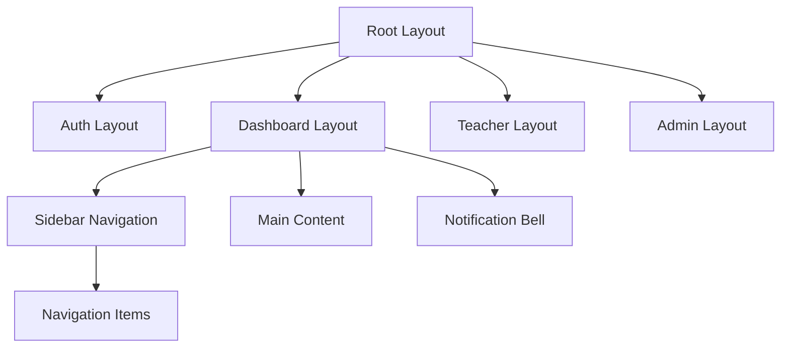

## Frontend Application

The frontend is a Next.js 14 application using the App Router, React Server Components, and TypeScript. It provides the user interface for students, teachers, and administrators.

### Technology Stack

| Technology | Purpose |
|------------|---------|
| Next.js 14 | React framework with App Router |
| TypeScript | Type safety |
| TailwindCSS | Utility-first styling |
| NextAuth.js | Authentication |
| React Hot Toast | Notifications |
| Heroicons | Icon library |
| clsx | Conditional class names |

### Project Structure

```
frontend/
├── app/
│   ├── (admin)/              # Admin routes (grouped)
│   ├── (dashboard)/          # Student dashboard routes
│   ├── (parent)/             # Parent portal routes
│   ├── (teacher)/            # Teacher dashboard routes
│   ├── api/                  # API routes
│   │   └── auth/            # NextAuth handlers
│   ├── auth/                 # Auth pages
│   │   ├── signin/
│   │   ├── signup/
│   │   └── error/
│   ├── meet/                 # Video meeting pages
│   │   └── [id]/
│   ├── pricing/
│   ├── layout.tsx            # Root layout
│   ├── page.tsx              # Landing page
│   └── globals.css           # Global styles
├── components/
│   ├── avatar/               # AI avatar components
│   ├── chat/                 # Chat UI components
│   ├── meeting/              # Meeting components
│   ├── softskills/           # Soft skills UI
│   └── viewers/              # Document viewers
├── hooks/                    # Custom React hooks
├── utils/                    # Utility functions
└── public/                   # Static assets
```

### Route Groups

Next.js route groups organize pages by user role without affecting URL structure.

| Group | Routes | Access |
|-------|--------|--------|
| `(dashboard)` | `/dashboard`, `/chat`, `/assessments`, `/progress` | Students |
| `(teacher)` | `/teacher/dashboard`, `/teacher/classrooms` | Teachers |
| `(admin)` | `/admin/dashboard`, `/admin/users` | Administrators |
| `(parent)` | `/parent/dashboard` | Parents |

### Authentication

NextAuth.js handles authentication with the following configuration:

```typescript
// Credentials provider connects to Core Service
providers: [
  CredentialsProvider({
    credentials: {
      email: { label: "Email", type: "email" },
      password: { label: "Password", type: "password" }
    },
    authorize: async (credentials) => {
      // POST to Core Service /api/auth/login
      // Returns user object with role
    }
  })
]
```

Session includes user role for client-side routing:

```typescript
interface Session {
  user: {
    id: string
    email: string
    name: string
    role: 'student' | 'teacher' | 'admin' | 'parent'
  }
}
```

### Layout Structure



The dashboard layout includes:
- Collapsible sidebar navigation
- Top header with user info
- Notification system
- Responsive design for mobile

### Key Components

**DocumentContextPanel**

Displays document context alongside chat:

```typescript
interface DocumentContextPanelProps {
  documentId: string
  pageNumber?: number
  highlight?: BoundingBox
}
```

**PDFViewerWithHighlight**

Renders PDF with bounding box highlights for OCR results:

```typescript
interface PDFViewerProps {
  url: string
  highlights: Array<{
    page: number
    bbox: [number, number, number, number]
    text: string
  }>
}
```

**MarkdownRenderer**

Renders AI responses with LaTeX support:

```typescript
// Uses KaTeX for math rendering
// Handles code blocks with syntax highlighting
// Supports tables, lists, and links
```

**AvatarViewer**

3D avatar for soft skills practice:

```typescript
interface AvatarViewerProps {
  avatarId: string
  speaking: boolean
  emotion?: 'neutral' | 'happy' | 'thinking'
}
```

### State Management

The application uses React state patterns without a global state library:

| Pattern | Use Case |
|---------|----------|
| `useState` | Local component state |
| `useContext` | Theme, notifications |
| `useSession` | Auth state (NextAuth) |
| Server Components | Data fetching |

### API Communication

API calls use the `utils/api.ts` utility:

```typescript
// Base configuration
const API_BASE = process.env.NEXT_PUBLIC_API_URL      // Core Service
const AI_API_BASE = process.env.NEXT_PUBLIC_AI_SERVICE_URL  // AI Service

// Authenticated fetch wrapper
async function fetchWithAuth(url: string, options: RequestInit) {
  const session = await getSession()
  return fetch(url, {
    ...options,
    headers: {
      ...options.headers,
      'Authorization': `Bearer ${session?.accessToken}`
    }
  })
}
```

### Real-time Features

**WebSocket Connections**

Used for:
- Soft skills real-time frame analysis
- Meeting participant updates
- Live proctoring feedback

```typescript
// WebSocket hook pattern
function useWebSocket(url: string) {
  const [socket, setSocket] = useState<WebSocket | null>(null)
  const [lastMessage, setLastMessage] = useState(null)
  
  useEffect(() => {
    const ws = new WebSocket(url)
    ws.onmessage = (event) => setLastMessage(JSON.parse(event.data))
    setSocket(ws)
    return () => ws.close()
  }, [url])
  
  return { socket, lastMessage }
}
```

### Styling Conventions

TailwindCSS with custom configuration:

```javascript
// tailwind.config.js
module.exports = {
  theme: {
    extend: {
      fontFamily: {
        sans: ['var(--font-inter)'],
        display: ['var(--font-arimo)'],
      },
      colors: {
        primary: { /* custom palette */ },
        accent: { /* custom palette */ }
      }
    }
  }
}
```

Class naming patterns:
- Use `clsx` for conditional classes
- Prefer Tailwind utilities over custom CSS
- Extract repeated patterns to components

### Environment Variables

| Variable | Description |
|----------|-------------|
| `NEXT_PUBLIC_API_URL` | Core Service URL (client-side) |
| `NEXT_PUBLIC_AI_SERVICE_URL` | AI Service URL (client-side) |
| `NEXTAUTH_URL` | Base URL for auth callbacks |
| `NEXTAUTH_SECRET` | Secret for session encryption |

### Build and Deployment

```bash
# Development
npm run dev

# Production build
npm run build
npm start

# Docker build
docker build -t ensurestudy-frontend .
```

Build output structure:
- Server-side pages rendered at request time
- Static pages pre-rendered at build time
- API routes bundled as serverless functions

### Performance Optimization

| Technique | Implementation |
|-----------|----------------|
| Image optimization | Next.js Image component |
| Code splitting | Dynamic imports for heavy components |
| Font optimization | `next/font` for Google Fonts |
| Caching | ISR for semi-static content |
| Bundle analysis | `@next/bundle-analyzer` |

### Testing

```bash
# Unit tests
npm run test

# E2E tests (Playwright)
npm run test:e2e
```

Test file locations:
- `__tests__/` for unit tests
- `e2e/` for end-to-end tests
