# Type 5 Learning Agent System

This document describes the Learning Agent infrastructure that enables the Tutor Agent to improve over time based on user feedback.

---

## Overview

The Learning Agent system implements a continuous improvement loop:

```mermaid
flowchart LR
    Student[Student] --> Query[Ask Question]
    Query --> Agent[Tutor Agent]
    Agent --> Response[Generate Response]
    Response --> Feedback{Feedback}
    Feedback -->|👍| Store[Store as Example]
    Feedback -->|👎| Analyze[Analyze Failure]
    Store --> Examples[(Learning Examples)]
    Examples --> Agent
```



---

## Components

### 1. Feedback Collection (Frontend)

Located in `frontend/app/(dashboard)/chat/page.tsx`:

```tsx
{/* Feedback Buttons */}
<button onClick={() => submitFeedback(msg.id, 1)}>👍</button>
<button onClick={() => submitFeedback(msg.id, -1)}>👎</button>
```

### 2. Feedback API (Backend)

Located in `backend/core-service/app/routes/feedback.py`:

| Endpoint | Method | Description |
|----------|--------|-------------|
| `/api/feedback/submit` | POST | Submit thumbs up/down |
| `/api/feedback/examples` | GET | Fetch learning examples |
| `/api/feedback/stats/:agent_type` | GET | Performance metrics |
| `/api/feedback/interactions` | POST | Log agent interaction |

### 3. Database Models

Located in `backend/core-service/app/models/feedback.py`:


### 4. Learning Element (AI Service)

Located in `backend/ai-service/app/learning/learning_element.py`:

```python
class TutorLearningElement:
    """Fetches and injects few-shot examples"""
    
    async def get_examples(topic: str, limit: int) -> List[LearningExample]
    def build_few_shot_prompt(examples: List) -> str
    async def enhance_prompt(base_prompt: str, topic: str) -> str
```

### 5. Experience Replay

```python
class ExperienceReplay:
    """Stores interactions for batch learning"""
    
    async def add_experience(...)
    def get_positive_examples(min_reward: float) -> List[Dict]
```

---

## Learning Loop


---

## Few-Shot Prompt Injection

The learning element injects high-rated examples into prompts:

**Before (without learning):**
```
You are a helpful academic tutor.

Instructions:
- Give a clear, educational answer
...
```

**After (with learning examples):**
```
You are a helpful academic tutor.

Here are examples of good responses:
---
Example 1:
Student Question: What is photosynthesis?
Good Response: Photosynthesis is the process by which plants convert...
---

Instructions:
- Give a clear, educational answer
...
```

---

## Automatic Example Creation

When an interaction receives 2+ positive feedback votes, it's automatically promoted to a `LearningExample`:

```python
def _maybe_create_learning_example(interaction: AgentInteraction):
    positive_count = InteractionFeedback.query.filter(
        InteractionFeedback.interaction_id == interaction.id,
        InteractionFeedback.feedback_value > 0
    ).count()
    
    if positive_count >= 2:
        example = LearningExample(
            agent_type=interaction.agent_type,
            topic=interaction.topic,
            query=interaction.query,
            good_response=interaction.response,
            source='user_feedback',
            feedback_score=positive_count
        )
        db.session.add(example)
```

---

## Performance Monitoring

Get agent performance stats:

```bash
curl http://localhost:8000/api/feedback/stats/tutor?days=7
```

Response:
```json
{
    "agent_type": "tutor",
    "period_days": 7,
    "total_interactions": 1250,
    "feedback": {
        "positive": 980,
        "negative": 45,
        "satisfaction_rate": 0.956
    },
    "top_topics": [
        {"topic": "Photosynthesis", "count": 120, "avg_feedback": 0.92},
        {"topic": "French Revolution", "count": 85, "avg_feedback": 0.88}
    ]
}
```

---

## Configuration

| Environment Variable | Default | Description |
|---------------------|---------|-------------|
| `CORE_SERVICE_URL` | `http://localhost:8000` | Core API URL for feedback |
| `FEEDBACK_CACHE_TTL` | `300` | Cache TTL for examples (seconds) |
| `MIN_POSITIVE_FOR_EXAMPLE` | `2` | Minimum votes to create example |

---

## Testing the Learning Loop

1. **Start services:**
   ```bash
   ./run-local.sh
   ```

2. **Ask the tutor a question:**
   Navigate to the chat and ask something like "Explain photosynthesis"

3. **Provide positive feedback:**
   Click the 👍 button

4. **Check feedback was stored:**
   ```bash
   curl http://localhost:8000/api/feedback/stats/tutor
   ```

5. **After 2+ positive feedbacks on similar queries:**
   The response becomes a learning example and gets injected into future prompts

---

## Future Enhancements

### A/B Testing Framework

```python
class AgentABTest:
    def create_experiment(variant_a, variant_b, traffic_split)
    def get_variant(user_id, experiment_id)
    def record_outcome(experiment_id, variant, success)
```

### Preference Learning (RLHF-lite)

Present two responses and let users choose the better one:


### Batch Learning Pipeline

Nightly job to:
1. Analyze day's feedback
2. Extract patterns from positive examples
3. Update prompt templates
4. Retire low-performing examples

---

## Files Reference

| File | Location |
|------|----------|
| Feedback Models | `backend/core-service/app/models/feedback.py` |
| Feedback API | `backend/core-service/app/routes/feedback.py` |
| Learning Element | `backend/ai-service/app/learning/learning_element.py` |
| Tutor Integration | `backend/ai-service/app/agents/tutor_agent.py` |
| Frontend Buttons | `frontend/app/(dashboard)/chat/page.tsx` |
