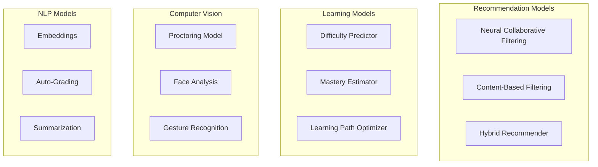

## Machine Learning Models

The ML subsystem provides recommendation engines, content difficulty prediction, learning path optimization, and various PyTorch models for educational personalization.

### Model Overview



### Technology Stack

| Technology | Purpose |
|------------|---------|
| PyTorch | Deep learning framework |
| scikit-learn | Classical ML algorithms |
| MLflow | Experiment tracking |
| ONNX | Model export/serving |
| Ray | Distributed training |

### Neural Collaborative Filtering

User-item recommendation using deep learning:

```python
import torch
import torch.nn as nn

class NeuralCollaborativeFiltering(nn.Module):
    def __init__(
        self,
        num_users: int,
        num_items: int,
        embedding_dim: int = 64,
        hidden_layers: list = [128, 64, 32]
    ):
        super().__init__()
        
        # User embeddings for GMF and MLP
        self.user_embedding_gmf = nn.Embedding(num_users, embedding_dim)
        self.user_embedding_mlp = nn.Embedding(num_users, embedding_dim)
        
        # Item embeddings for GMF and MLP
        self.item_embedding_gmf = nn.Embedding(num_items, embedding_dim)
        self.item_embedding_mlp = nn.Embedding(num_items, embedding_dim)
        
        # MLP layers
        mlp_layers = []
        input_size = embedding_dim * 2
        for hidden_size in hidden_layers:
            mlp_layers.append(nn.Linear(input_size, hidden_size))
            mlp_layers.append(nn.ReLU())
            mlp_layers.append(nn.Dropout(0.2))
            input_size = hidden_size
        self.mlp = nn.Sequential(*mlp_layers)
        
        # Final prediction layer
        self.output = nn.Linear(hidden_layers[-1] + embedding_dim, 1)
        
        self._init_weights()
        
    def _init_weights(self):
        for m in self.modules():
            if isinstance(m, nn.Embedding):
                nn.init.normal_(m.weight, std=0.01)
            elif isinstance(m, nn.Linear):
                nn.init.xavier_uniform_(m.weight)
                
    def forward(self, user_ids: torch.Tensor, item_ids: torch.Tensor) -> torch.Tensor:
        # GMF path
        user_gmf = self.user_embedding_gmf(user_ids)
        item_gmf = self.item_embedding_gmf(item_ids)
        gmf_output = user_gmf * item_gmf  # Element-wise product
        
        # MLP path
        user_mlp = self.user_embedding_mlp(user_ids)
        item_mlp = self.item_embedding_mlp(item_ids)
        mlp_input = torch.cat([user_mlp, item_mlp], dim=-1)
        mlp_output = self.mlp(mlp_input)
        
        # Combine GMF and MLP
        combined = torch.cat([gmf_output, mlp_output], dim=-1)
        prediction = torch.sigmoid(self.output(combined))
        
        return prediction.squeeze()
```

### Content-Based Recommender

Feature-based item similarity:

```python
class ContentBasedRecommender(nn.Module):
    def __init__(
        self,
        num_items: int,
        feature_dim: int,
        hidden_dim: int = 128
    ):
        super().__init__()
        
        # Item feature encoder
        self.feature_encoder = nn.Sequential(
            nn.Linear(feature_dim, hidden_dim),
            nn.ReLU(),
            nn.Linear(hidden_dim, hidden_dim),
            nn.ReLU(),
            nn.Linear(hidden_dim, 64)
        )
        
        # Item embedding for collaborative signal
        self.item_embedding = nn.Embedding(num_items, 64)
        
        # Scoring network
        self.scorer = nn.Sequential(
            nn.Linear(128, 64),
            nn.ReLU(),
            nn.Linear(64, 1)
        )
        
    def forward(
        self,
        item_ids: torch.Tensor,
        item_features: torch.Tensor,
        user_history_features: torch.Tensor
    ) -> torch.Tensor:
        # Encode item features
        item_encoded = self.feature_encoder(item_features)
        
        # Get item embeddings
        item_emb = self.item_embedding(item_ids)
        
        # Combine encoded features and embeddings
        item_repr = torch.cat([item_encoded, item_emb], dim=-1)
        
        # User preference from history
        user_pref = self.feature_encoder(user_history_features)
        
        # Score items against user preference
        combined = torch.cat([item_repr, user_pref.unsqueeze(1).expand(-1, item_repr.size(1), -1)], dim=-1)
        scores = self.scorer(combined)
        
        return scores.squeeze()
```

### Difficulty Predictor

Estimate content difficulty based on features:

```python
class DifficultyPredictor(nn.Module):
    def __init__(self, text_dim: int = 768):
        super().__init__()
        
        # Text encoder (assumes pre-computed embeddings)
        self.text_encoder = nn.Sequential(
            nn.Linear(text_dim, 256),
            nn.ReLU(),
            nn.Dropout(0.3),
            nn.Linear(256, 128)
        )
        
        # Metadata features (word count, sentence length, etc.)
        self.meta_encoder = nn.Sequential(
            nn.Linear(10, 32),
            nn.ReLU(),
            nn.Linear(32, 32)
        )
        
        # Combined prediction
        self.predictor = nn.Sequential(
            nn.Linear(160, 64),
            nn.ReLU(),
            nn.Dropout(0.2),
            nn.Linear(64, 5)  # 5 difficulty levels
        )
        
    def forward(
        self,
        text_embedding: torch.Tensor,
        metadata: torch.Tensor
    ) -> torch.Tensor:
        text_features = self.text_encoder(text_embedding)
        meta_features = self.meta_encoder(metadata)
        
        combined = torch.cat([text_features, meta_features], dim=-1)
        logits = self.predictor(combined)
        
        return logits  # Use cross-entropy loss for training
    
    def predict_difficulty(self, text_embedding, metadata):
        logits = self.forward(text_embedding, metadata)
        probs = torch.softmax(logits, dim=-1)
        return torch.argmax(probs, dim=-1)
```

### Learning Path Optimizer

Sequence-to-sequence model for optimal learning paths:

```python
class LearningPathOptimizer(nn.Module):
    def __init__(
        self,
        num_topics: int,
        embedding_dim: int = 128,
        hidden_dim: int = 256,
        num_layers: int = 2
    ):
        super().__init__()
        
        # Topic embeddings
        self.topic_embedding = nn.Embedding(num_topics, embedding_dim)
        
        # Encoder for user state
        self.user_encoder = nn.LSTM(
            input_size=embedding_dim + 1,  # embedding + mastery score
            hidden_size=hidden_dim,
            num_layers=num_layers,
            batch_first=True,
            dropout=0.2
        )
        
        # Decoder for path generation
        self.decoder = nn.LSTM(
            input_size=embedding_dim,
            hidden_size=hidden_dim,
            num_layers=num_layers,
            batch_first=True
        )
        
        # Output projection
        self.output_proj = nn.Linear(hidden_dim, num_topics)
        
    def forward(
        self,
        completed_topics: torch.Tensor,
        mastery_scores: torch.Tensor,
        target_topics: torch.Tensor = None,
        max_length: int = 10
    ):
        batch_size = completed_topics.size(0)
        
        # Encode user's learning history
        topic_emb = self.topic_embedding(completed_topics)
        encoder_input = torch.cat([topic_emb, mastery_scores.unsqueeze(-1)], dim=-1)
        _, (hidden, cell) = self.user_encoder(encoder_input)
        
        if self.training and target_topics is not None:
            # Teacher forcing during training
            target_emb = self.topic_embedding(target_topics)
            decoder_output, _ = self.decoder(target_emb, (hidden, cell))
            logits = self.output_proj(decoder_output)
            return logits
        else:
            # Autoregressive generation
            outputs = []
            decoder_input = self.topic_embedding(torch.zeros(batch_size, 1).long())
            
            for _ in range(max_length):
                output, (hidden, cell) = self.decoder(decoder_input, (hidden, cell))
                logits = self.output_proj(output)
                next_topic = torch.argmax(logits, dim=-1)
                outputs.append(next_topic)
                decoder_input = self.topic_embedding(next_topic)
                
            return torch.cat(outputs, dim=1)
```

### Mastery Estimator (Knowledge Tracing)

Deep knowledge tracing for mastery estimation:

```python
class DeepKnowledgeTracing(nn.Module):
    def __init__(
        self,
        num_skills: int,
        embedding_dim: int = 64,
        hidden_dim: int = 128
    ):
        super().__init__()
        
        # Skill embedding
        self.skill_embedding = nn.Embedding(num_skills, embedding_dim)
        
        # Correctness embedding (0 or 1)
        self.correct_embedding = nn.Embedding(2, embedding_dim)
        
        # LSTM for sequence modeling
        self.lstm = nn.LSTM(
            input_size=embedding_dim * 2,
            hidden_size=hidden_dim,
            num_layers=2,
            batch_first=True,
            dropout=0.2
        )
        
        # Output layer for each skill
        self.output = nn.Linear(hidden_dim, num_skills)
        
    def forward(
        self,
        skill_ids: torch.Tensor,
        correctness: torch.Tensor
    ) -> torch.Tensor:
        """
        Args:
            skill_ids: (batch, seq_len) - practiced skills
            correctness: (batch, seq_len) - 0/1 for incorrect/correct
        Returns:
            predictions: (batch, seq_len, num_skills) - mastery probability
        """
        skill_emb = self.skill_embedding(skill_ids)
        correct_emb = self.correct_embedding(correctness)
        
        combined = torch.cat([skill_emb, correct_emb], dim=-1)
        lstm_out, _ = self.lstm(combined)
        
        predictions = torch.sigmoid(self.output(lstm_out))
        return predictions
    
    def predict_mastery(self, skill_history, correct_history):
        """Get current mastery level for all skills."""
        with torch.no_grad():
            preds = self.forward(skill_history, correct_history)
            # Return last timestep predictions
            return preds[:, -1, :]
```

### Training Pipeline

```python
import mlflow
from torch.utils.data import DataLoader

class ModelTrainer:
    def __init__(self, model, config):
        self.model = model
        self.config = config
        self.device = torch.device('cuda' if torch.cuda.is_available() else 'cpu')
        self.model.to(self.device)
        
    def train(self, train_loader: DataLoader, val_loader: DataLoader):
        optimizer = torch.optim.Adam(
            self.model.parameters(),
            lr=self.config['learning_rate'],
            weight_decay=self.config['weight_decay']
        )
        
        scheduler = torch.optim.lr_scheduler.ReduceLROnPlateau(
            optimizer, mode='min', patience=3
        )
        
        criterion = nn.BCELoss() if self.config['task'] == 'binary' else nn.CrossEntropyLoss()
        
        mlflow.set_experiment(self.config['experiment_name'])
        
        with mlflow.start_run():
            mlflow.log_params(self.config)
            
            best_val_loss = float('inf')
            
            for epoch in range(self.config['epochs']):
                # Training
                self.model.train()
                train_loss = 0
                
                for batch in train_loader:
                    batch = {k: v.to(self.device) for k, v in batch.items()}
                    
                    optimizer.zero_grad()
                    outputs = self.model(**batch)
                    loss = criterion(outputs, batch['labels'])
                    loss.backward()
                    optimizer.step()
                    
                    train_loss += loss.item()
                
                train_loss /= len(train_loader)
                
                # Validation
                val_loss, val_metrics = self.evaluate(val_loader, criterion)
                scheduler.step(val_loss)
                
                # Logging
                mlflow.log_metrics({
                    'train_loss': train_loss,
                    'val_loss': val_loss,
                    **val_metrics
                }, step=epoch)
                
                # Save best model
                if val_loss < best_val_loss:
                    best_val_loss = val_loss
                    self.save_model('best_model.pt')
                    mlflow.pytorch.log_model(self.model, 'model')
                    
    def evaluate(self, loader, criterion):
        self.model.eval()
        total_loss = 0
        all_preds = []
        all_labels = []
        
        with torch.no_grad():
            for batch in loader:
                batch = {k: v.to(self.device) for k, v in batch.items()}
                outputs = self.model(**batch)
                loss = criterion(outputs, batch['labels'])
                total_loss += loss.item()
                
                all_preds.extend(outputs.cpu().numpy())
                all_labels.extend(batch['labels'].cpu().numpy())
        
        metrics = self._compute_metrics(all_preds, all_labels)
        return total_loss / len(loader), metrics
    
    def save_model(self, path: str):
        torch.save({
            'model_state_dict': self.model.state_dict(),
            'config': self.config
        }, path)
```

### Model Registry

| Model | Input | Output | Use Case |
|-------|-------|--------|----------|
| NCF | user_id, item_id | score [0,1] | Content recommendation |
| ContentBased | item_features, user_history | scores | Similar content |
| DifficultyPredictor | text_emb, metadata | difficulty [1-5] | Content labeling |
| PathOptimizer | completed_topics, mastery | next_topics | Learning path |
| DKT | skill_history, correctness | mastery_probs | Knowledge state |

### Model Serving

```python
import onnx
import onnxruntime as ort

class ModelServer:
    def __init__(self, model_path: str):
        self.session = ort.InferenceSession(model_path)
        
    def predict(self, inputs: dict) -> dict:
        """Run inference on ONNX model."""
        ort_inputs = {
            name: numpy_array
            for name, numpy_array in inputs.items()
        }
        
        outputs = self.session.run(None, ort_inputs)
        
        return {
            output.name: value
            for output, value in zip(
                self.session.get_outputs(), outputs
            )
        }

# Export PyTorch to ONNX
def export_to_onnx(model, sample_input, output_path):
    model.eval()
    torch.onnx.export(
        model,
        sample_input,
        output_path,
        input_names=['user_ids', 'item_ids'],
        output_names=['predictions'],
        dynamic_axes={
            'user_ids': {0: 'batch'},
            'item_ids': {0: 'batch'},
            'predictions': {0: 'batch'}
        }
    )
```

### Feature Engineering

| Feature | Type | Description |
|---------|------|-------------|
| `user_activity_count` | numeric | Total interactions |
| `avg_session_duration` | numeric | Average time spent |
| `topic_completion_rate` | numeric | Completed / Total topics |
| `difficulty_preference` | categorical | Preferred difficulty |
| `time_since_last_activity` | numeric | Recency signal |
| `content_text_embedding` | vector[768] | BERT embedding |
| `content_difficulty` | categorical | Labeled difficulty |

### Evaluation Metrics

| Model Type | Primary Metric | Secondary |
|------------|----------------|-----------|
| Recommendation | NDCG@10 | HR@10, MRR |
| Classification | F1-macro | Accuracy, AUC |
| Regression | RMSE | MAE, R2 |
| Sequence | Perplexity | BLEU (for paths) |
