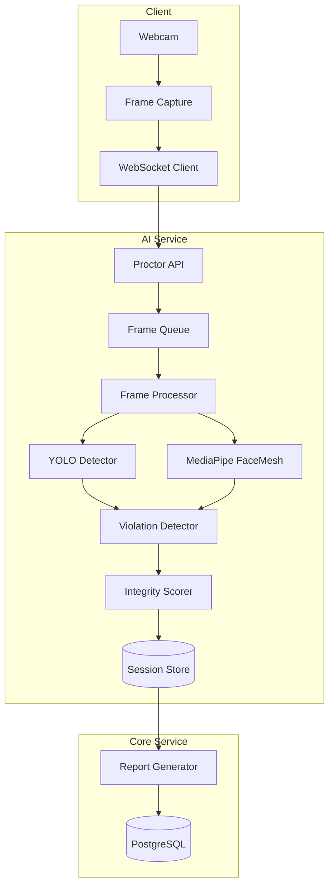

## Proctoring System

The proctoring system provides real-time monitoring during online assessments using computer vision and machine learning. It detects suspicious behavior such as face absence, multiple faces, gaze direction, and mobile phone usage.

### Architecture



### Technology Stack

| Component | Technology | Purpose |
|-----------|------------|---------|
| Object Detection | YOLO (Ultralytics) | Detect people, phones, objects |
| Face Analysis | MediaPipe FaceLandmarker | Face mesh, gaze estimation |
| Real-time Transport | WebSocket | Stream frames to server |
| Video Processing | OpenCV | Frame manipulation |
| Session Storage | Redis | Active session data |

### Detection Capabilities

| Detection Type | Method | Threshold |
|----------------|--------|-----------|
| Face absence | FaceLandmarker | No face > 3 seconds |
| Multiple faces | YOLO person count | > 1 person |
| Gaze deviation | Eye landmarks | > 30 degrees off-center |
| Head rotation | Face mesh angles | > 45 degrees |
| Mobile phone | YOLO class detection | Confidence > 0.5 |
| Tab switching | Browser API | visibility change |
| Screen recording | heuristics | Screen capture detection |

### StaticProctor Class

Core proctoring implementation using YOLO and MediaPipe:

```python
class StaticProctor:
    def __init__(self):
        # Load YOLO model
        self.yolo = YOLO('yolov8n.pt')
        self.yolo_classes = self.yolo.names
        
        # Load MediaPipe FaceLandmarker
        self.face_landmarker = mp.solutions.face_mesh.FaceMesh(
            static_image_mode=False,
            max_num_faces=2,
            refine_landmarks=True,
            min_detection_confidence=0.5,
            min_tracking_confidence=0.5
        )
        
        # Detection state
        self.violations = []
        self.frame_count = 0
        self.face_absent_frames = 0
        
    def process_frame(self, frame: np.ndarray) -> dict:
        """
        Process a single frame for proctoring analysis.
        """
        self.frame_count += 1
        results = {
            'frame_number': self.frame_count,
            'timestamp': time.time(),
            'detections': [],
            'violations': []
        }
        
        # Run YOLO detection
        yolo_results = self.yolo(frame, verbose=False)[0]
        
        # Check for multiple people
        people_count = sum(
            1 for box in yolo_results.boxes
            if self.yolo_classes[int(box.cls)] == 'person'
        )
        
        if people_count > 1:
            results['violations'].append({
                'type': 'multiple_faces',
                'count': people_count
            })
        
        # Check for mobile phone
        for box in yolo_results.boxes:
            class_name = self.yolo_classes[int(box.cls)]
            if class_name == 'cell phone' and box.conf > 0.5:
                results['violations'].append({
                    'type': 'mobile_phone',
                    'confidence': float(box.conf),
                    'bbox': box.xyxy[0].tolist()
                })
        
        # Run MediaPipe face analysis
        rgb_frame = cv2.cvtColor(frame, cv2.COLOR_BGR2RGB)
        face_results = self.face_landmarker.process(rgb_frame)
        
        if not face_results.multi_face_landmarks:
            self.face_absent_frames += 1
            if self.face_absent_frames > 90:  # ~3 seconds at 30fps
                results['violations'].append({
                    'type': 'face_absent',
                    'duration_frames': self.face_absent_frames
                })
        else:
            self.face_absent_frames = 0
            
            # Analyze gaze direction
            gaze = self._calculate_gaze(face_results.multi_face_landmarks[0])
            if abs(gaze['horizontal']) > 30 or abs(gaze['vertical']) > 20:
                results['violations'].append({
                    'type': 'gaze_deviation',
                    'horizontal': gaze['horizontal'],
                    'vertical': gaze['vertical']
                })
        
        return results
```

### Gaze Estimation

Calculate gaze direction from face landmarks:

```python
def _calculate_gaze(self, landmarks) -> dict:
    """
    Estimate gaze direction from eye landmarks.
    """
    # Left eye landmarks
    left_eye = [landmarks.landmark[i] for i in [33, 133, 160, 144, 145, 153]]
    
    # Right eye landmarks
    right_eye = [landmarks.landmark[i] for i in [362, 263, 387, 373, 380, 374]]
    
    # Iris landmarks (refined)
    left_iris = landmarks.landmark[468]
    right_iris = landmarks.landmark[473]
    
    # Calculate horizontal deviation
    left_center = np.mean([[p.x, p.y] for p in left_eye], axis=0)
    right_center = np.mean([[p.x, p.y] for p in right_eye], axis=0)
    
    left_deviation = (left_iris.x - left_center[0]) / 0.02  # Normalize
    right_deviation = (right_iris.x - right_center[0]) / 0.02
    
    horizontal = (left_deviation + right_deviation) / 2 * 45  # Degrees
    
    # Calculate vertical deviation
    left_vert = (left_iris.y - left_center[1]) / 0.015
    right_vert = (right_iris.y - right_center[1]) / 0.015
    
    vertical = (left_vert + right_vert) / 2 * 30  # Degrees
    
    return {
        'horizontal': horizontal,
        'vertical': vertical
    }
```

### Head Pose Estimation

```python
def _calculate_head_pose(self, landmarks, frame_shape) -> dict:
    """
    Calculate head rotation angles using face mesh.
    """
    # 3D model points for face
    model_points = np.array([
        (0.0, 0.0, 0.0),          # Nose tip
        (0.0, -330.0, -65.0),     # Chin
        (-225.0, 170.0, -135.0),  # Left eye corner
        (225.0, 170.0, -135.0),   # Right eye corner
        (-150.0, -150.0, -125.0), # Left mouth corner
        (150.0, -150.0, -125.0)   # Right mouth corner
    ], dtype=np.float64)
    
    # Corresponding 2D points from landmarks
    h, w = frame_shape[:2]
    indices = [1, 152, 33, 263, 61, 291]  # Landmark indices
    
    image_points = np.array([
        [landmarks.landmark[i].x * w, landmarks.landmark[i].y * h]
        for i in indices
    ], dtype=np.float64)
    
    # Camera matrix (approximate)
    focal_length = w
    center = (w / 2, h / 2)
    camera_matrix = np.array([
        [focal_length, 0, center[0]],
        [0, focal_length, center[1]],
        [0, 0, 1]
    ], dtype=np.float64)
    
    # Solve PnP
    success, rotation_vec, translation_vec = cv2.solvePnP(
        model_points, image_points, camera_matrix, None
    )
    
    # Convert to Euler angles
    rotation_mat, _ = cv2.Rodrigues(rotation_vec)
    angles = cv2.decomposeProjectionMatrix(
        np.hstack((rotation_mat, translation_vec.reshape(3, 1)))
    )[6]
    
    return {
        'yaw': angles[1][0],    # Left-right rotation
        'pitch': angles[0][0],  # Up-down rotation
        'roll': angles[2][0]    # Tilt
    }
```

### Integrity Scoring

```python
class IntegrityScorer:
    def __init__(self):
        self.weights = {
            'face_absent': 0.3,
            'multiple_faces': 0.4,
            'gaze_deviation': 0.1,
            'mobile_phone': 0.5,
            'head_rotation': 0.15,
            'tab_switch': 0.2
        }
        
    def calculate_score(self, session_violations: List[dict]) -> dict:
        """
        Calculate integrity score from session violations.
        """
        # Count violations by type
        violation_counts = {}
        for v in session_violations:
            v_type = v['type']
            violation_counts[v_type] = violation_counts.get(v_type, 0) + 1
        
        # Calculate weighted penalty
        penalty = 0
        for v_type, count in violation_counts.items():
            weight = self.weights.get(v_type, 0.1)
            # Diminishing returns for repeated violations
            penalty += weight * np.log1p(count)
        
        # Normalize to 0-100 score
        raw_score = max(0, 100 - penalty * 10)
        
        return {
            'score': round(raw_score, 1),
            'violation_summary': violation_counts,
            'risk_level': self._get_risk_level(raw_score)
        }
    
    def _get_risk_level(self, score: float) -> str:
        if score >= 90:
            return 'low'
        elif score >= 70:
            return 'medium'
        elif score >= 50:
            return 'high'
        else:
            return 'critical'
```

### API Endpoints

```python
@router.post("/sessions/start")
async def start_proctoring_session(request: StartSessionRequest):
    """
    Start a new proctoring session.
    """
    session_id = str(uuid4())
    
    # Initialize session in Redis
    session_data = {
        'user_id': request.user_id,
        'assessment_id': request.assessment_id,
        'started_at': datetime.utcnow().isoformat(),
        'status': 'active',
        'violations': []
    }
    
    await redis.set(
        f"proctor:session:{session_id}",
        json.dumps(session_data),
        ex=7200  # 2 hour expiry
    )
    
    return {"session_id": session_id}


@router.websocket("/sessions/{session_id}/stream")
async def stream_frames(websocket: WebSocket, session_id: str):
    """
    WebSocket endpoint for real-time frame streaming.
    """
    await websocket.accept()
    proctor = StaticProctor()
    
    try:
        while True:
            # Receive frame data
            data = await websocket.receive_bytes()
            
            # Decode frame
            nparr = np.frombuffer(data, np.uint8)
            frame = cv2.imdecode(nparr, cv2.IMREAD_COLOR)
            
            # Process frame
            results = proctor.process_frame(frame)
            
            # Store violations
            if results['violations']:
                await store_violations(session_id, results['violations'])
            
            # Send results back
            await websocket.send_json(results)
            
    except WebSocketDisconnect:
        # End session on disconnect
        await end_session(session_id)


@router.post("/sessions/{session_id}/end")
async def end_proctoring_session(session_id: str):
    """
    End proctoring session and generate report.
    """
    session_data = await get_session_data(session_id)
    
    # Calculate final score
    scorer = IntegrityScorer()
    score_result = scorer.calculate_score(session_data['violations'])
    
    # Generate report
    report = {
        'session_id': session_id,
        'user_id': session_data['user_id'],
        'assessment_id': session_data['assessment_id'],
        'started_at': session_data['started_at'],
        'ended_at': datetime.utcnow().isoformat(),
        'integrity_score': score_result['score'],
        'risk_level': score_result['risk_level'],
        'violation_summary': score_result['violation_summary'],
        'detailed_violations': session_data['violations']
    }
    
    # Store report to database
    await store_report(report)
    
    # Clear session from Redis
    await redis.delete(f"proctor:session:{session_id}")
    
    return report
```

### Client Integration

Frontend frame capture and streaming:

```typescript
class ProctoringClient {
  private websocket: WebSocket | null = null
  private video: HTMLVideoElement
  private canvas: HTMLCanvasElement
  private intervalId: number | null = null
  
  async start(sessionId: string): Promise<void> {
    // Request camera access
    const stream = await navigator.mediaDevices.getUserMedia({
      video: { width: 640, height: 480 }
    })
    
    this.video.srcObject = stream
    
    // Connect WebSocket
    this.websocket = new WebSocket(
      `wss://api.example.com/api/proctor/sessions/${sessionId}/stream`
    )
    
    this.websocket.onmessage = (event) => {
      const results = JSON.parse(event.data)
      this.handleResults(results)
    }
    
    // Start frame capture (10 FPS)
    this.intervalId = window.setInterval(() => {
      this.captureAndSend()
    }, 100)
  }
  
  private captureAndSend(): void {
    const ctx = this.canvas.getContext('2d')!
    ctx.drawImage(this.video, 0, 0, 640, 480)
    
    this.canvas.toBlob((blob) => {
      if (blob && this.websocket?.readyState === WebSocket.OPEN) {
        this.websocket.send(blob)
      }
    }, 'image/jpeg', 0.8)
  }
  
  private handleResults(results: ProctorResults): void {
    if (results.violations.length > 0) {
      // Show warning to user
      this.showViolationWarning(results.violations)
    }
  }
}
```

### Browser Event Monitoring

```typescript
// Tab visibility
document.addEventListener('visibilitychange', () => {
  if (document.hidden) {
    sendViolation({ type: 'tab_switch' })
  }
})

// Window blur
window.addEventListener('blur', () => {
  sendViolation({ type: 'window_blur' })
})

// Clipboard access attempt
document.addEventListener('copy', (e) => {
  e.preventDefault()
  sendViolation({ type: 'copy_attempt' })
})

// Right-click prevention
document.addEventListener('contextmenu', (e) => {
  e.preventDefault()
  sendViolation({ type: 'context_menu' })
})
```

### Report Schema

| Field | Type | Description |
|-------|------|-------------|
| `session_id` | UUID | Unique session identifier |
| `user_id` | UUID | Student ID |
| `assessment_id` | UUID | Assessment being taken |
| `integrity_score` | float | 0-100 score |
| `risk_level` | string | low/medium/high/critical |
| `violation_summary` | object | Count by violation type |
| `detailed_violations` | array | Full violation records |
| `frame_snapshots` | array | Saved frames for review |
