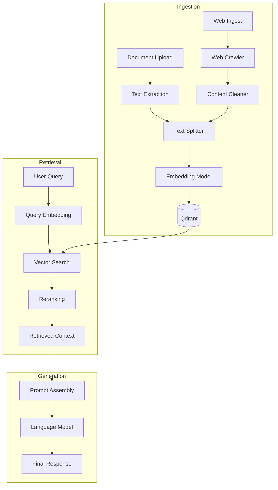
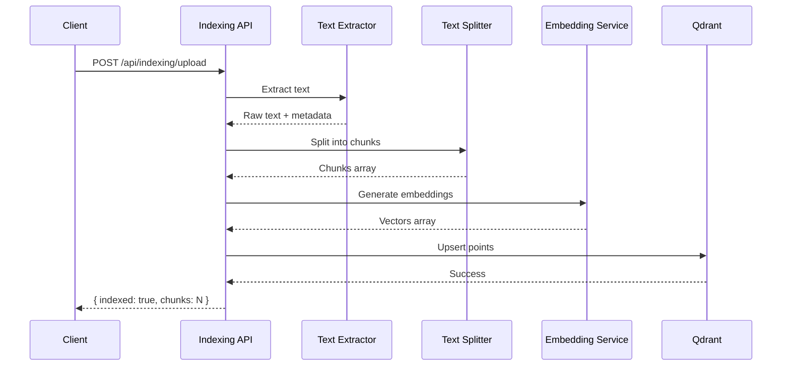

## RAG Pipeline

The Retrieval-Augmented Generation (RAG) pipeline enables the AI tutor to answer questions using context from uploaded documents, web content, and knowledge bases. It uses Qdrant as the vector store with HuggingFace embeddings.

### Architecture Overview



### Components

| Component | Technology | Purpose |
|-----------|------------|---------|
| Vector Store | Qdrant | Store and search embeddings |
| Embeddings | all-MiniLM-L6-v2 | Convert text to vectors |
| Text Splitter | RecursiveCharacterTextSplitter | Chunk documents |
| Reranker | Cross-encoder (optional) | Improve relevance |
| LLM | Mistral 7B via HuggingFace | Generate responses |

### Qdrant Collection Setup

```python
from qdrant_client import QdrantClient
from qdrant_client.models import (
    VectorParams, 
    Distance,
    PayloadSchemaType
)

def create_collection():
    client = QdrantClient(url=settings.QDRANT_URL)
    
    client.recreate_collection(
        collection_name="documents",
        vectors_config=VectorParams(
            size=384,  # all-MiniLM-L6-v2 dimension
            distance=Distance.COSINE
        ),
        # Optional: create indexes for filtering
        payload_schema={
            "classroom_id": PayloadSchemaType.KEYWORD,
            "document_type": PayloadSchemaType.KEYWORD,
            "created_at": PayloadSchemaType.DATETIME
        }
    )
```

Collection schema:

| Field | Type | Description |
|-------|------|-------------|
| `id` | UUID | Unique chunk identifier |
| `vector` | float[384] | Embedding vector |
| `text` | string | Original text chunk |
| `classroom_id` | keyword | Source classroom |
| `document_type` | keyword | material, assignment, etc. |
| `filename` | string | Source file name |
| `page_number` | integer | Page in source document |
| `created_at` | datetime | Indexing timestamp |

### Document Processing Pipeline

**PDF Extraction**

```python
import fitz  # PyMuPDF

def extract_pdf_with_metadata(file_path: str) -> List[dict]:
    """
    Extract text from PDF with page-level metadata.
    """
    doc = fitz.open(file_path)
    pages = []
    
    for page_num, page in enumerate(doc):
        text = page.get_text()
        
        # Extract images for OCR if needed
        images = page.get_images()
        
        pages.append({
            'page_number': page_num + 1,
            'text': text,
            'has_images': len(images) > 0
        })
    
    return pages
```

**Text Splitting**

```python
from langchain.text_splitter import RecursiveCharacterTextSplitter

text_splitter = RecursiveCharacterTextSplitter(
    chunk_size=512,
    chunk_overlap=64,
    separators=["\n\n", "\n", ". ", " ", ""],
    length_function=len
)

def split_document(text: str, metadata: dict) -> List[Document]:
    """
    Split text into chunks, preserving metadata.
    """
    chunks = text_splitter.split_text(text)
    
    return [
        Document(
            page_content=chunk,
            metadata={
                **metadata,
                'chunk_index': i
            }
        )
        for i, chunk in enumerate(chunks)
    ]
```

### Embedding Generation

```python
from sentence_transformers import SentenceTransformer

class EmbeddingService:
    def __init__(self, model_name: str = 'all-MiniLM-L6-v2'):
        self.model = SentenceTransformer(model_name)
        self.dimension = 384
        
    def embed_texts(self, texts: List[str]) -> List[List[float]]:
        """
        Generate embeddings for a batch of texts.
        """
        embeddings = self.model.encode(
            texts,
            batch_size=32,
            show_progress_bar=False,
            convert_to_numpy=True
        )
        return embeddings.tolist()
    
    def embed_query(self, query: str) -> List[float]:
        """
        Generate embedding for a single query.
        """
        return self.model.encode(query).tolist()
```

### Indexing Pipeline



Full indexing implementation:

```python
class DocumentIndexer:
    def __init__(self):
        self.qdrant = QdrantClient(url=settings.QDRANT_URL)
        self.embedder = EmbeddingService()
        self.splitter = RecursiveCharacterTextSplitter(
            chunk_size=512,
            chunk_overlap=64
        )
        
    async def index_document(
        self,
        file: UploadFile,
        classroom_id: str,
        document_type: str = "material"
    ) -> dict:
        """
        Full indexing pipeline for uploaded document.
        """
        # Extract text based on file type
        text, file_metadata = await self._extract_text(file)
        
        # Split into chunks
        chunks = self.splitter.split_text(text)
        
        # Generate embeddings
        embeddings = self.embedder.embed_texts(chunks)
        
        # Prepare points for Qdrant
        points = [
            PointStruct(
                id=str(uuid4()),
                vector=embedding,
                payload={
                    'text': chunk,
                    'classroom_id': classroom_id,
                    'document_type': document_type,
                    'filename': file.filename,
                    'chunk_index': i,
                    'created_at': datetime.utcnow().isoformat(),
                    **file_metadata
                }
            )
            for i, (chunk, embedding) in enumerate(zip(chunks, embeddings))
        ]
        
        # Upsert to Qdrant
        self.qdrant.upsert(
            collection_name='documents',
            points=points,
            wait=True
        )
        
        return {
            'indexed': True,
            'chunks': len(chunks),
            'document_id': file_metadata.get('document_id')
        }
```

### Retrieval Pipeline

```python
class RAGRetriever:
    def __init__(self):
        self.qdrant = QdrantClient(url=settings.QDRANT_URL)
        self.embedder = EmbeddingService()
        
    def retrieve(
        self,
        query: str,
        classroom_id: str = None,
        document_type: str = None,
        top_k: int = 5,
        score_threshold: float = 0.5
    ) -> List[RetrievedDocument]:
        """
        Retrieve relevant documents for a query.
        """
        # Generate query embedding
        query_vector = self.embedder.embed_query(query)
        
        # Build filters
        filters = []
        if classroom_id:
            filters.append(
                FieldCondition(
                    key="classroom_id",
                    match=MatchValue(value=classroom_id)
                )
            )
        if document_type:
            filters.append(
                FieldCondition(
                    key="document_type",
                    match=MatchValue(value=document_type)
                )
            )
        
        query_filter = Filter(must=filters) if filters else None
        
        # Search Qdrant
        results = self.qdrant.search(
            collection_name='documents',
            query_vector=query_vector,
            query_filter=query_filter,
            limit=top_k,
            score_threshold=score_threshold
        )
        
        return [
            RetrievedDocument(
                text=hit.payload['text'],
                score=hit.score,
                metadata=hit.payload
            )
            for hit in results
        ]
```

### Reranking (Optional)

For improved relevance, a cross-encoder reranker can be applied:

```python
from sentence_transformers import CrossEncoder

class Reranker:
    def __init__(self, model_name: str = 'cross-encoder/ms-marco-MiniLM-L-6-v2'):
        self.model = CrossEncoder(model_name)
        
    def rerank(
        self,
        query: str,
        documents: List[RetrievedDocument],
        top_k: int = 3
    ) -> List[RetrievedDocument]:
        """
        Rerank documents using cross-encoder.
        """
        pairs = [(query, doc.text) for doc in documents]
        scores = self.model.predict(pairs)
        
        # Sort by cross-encoder score
        ranked = sorted(
            zip(documents, scores),
            key=lambda x: x[1],
            reverse=True
        )
        
        return [
            RetrievedDocument(
                text=doc.text,
                score=score,
                metadata=doc.metadata
            )
            for doc, score in ranked[:top_k]
        ]
```

### Context Assembly

```python
def assemble_context(
    retrieved_docs: List[RetrievedDocument],
    max_tokens: int = 2000
) -> str:
    """
    Assemble retrieved documents into context string.
    """
    context_parts = []
    current_tokens = 0
    
    for doc in retrieved_docs:
        doc_tokens = len(doc.text.split())  # Approximate
        
        if current_tokens + doc_tokens > max_tokens:
            break
            
        source = doc.metadata.get('filename', 'Unknown')
        page = doc.metadata.get('page_number', '')
        
        context_parts.append(
            f"[Source: {source}{f', Page {page}' if page else ''}]\n{doc.text}"
        )
        current_tokens += doc_tokens
    
    return "\n\n---\n\n".join(context_parts)
```

### Prompt Template

```python
RAG_PROMPT_TEMPLATE = """
You are an educational AI tutor. Answer the student's question using the provided context.

Context:
{context}

Student Question: {question}

Instructions:
- Base your answer on the provided context
- If the context doesn't contain relevant information, say so
- Cite sources when possible (e.g., "According to [filename]...")
- Explain concepts clearly for the student's level
- Include examples when helpful

Answer:
"""

def build_rag_prompt(query: str, retrieved_docs: List[RetrievedDocument]) -> str:
    context = assemble_context(retrieved_docs)
    return RAG_PROMPT_TEMPLATE.format(
        context=context,
        question=query
    )
```

### Web Ingest Workers

Seven-worker pipeline for web content:

```python
class WebIngestPipeline:
    def __init__(self):
        self.workers = [
            TopicExtractorWorker(),
            DuckDuckGoSearchWorker(),
            WikipediaSearchWorker(),
            WikipediaContentWorker(),
            ParallelCrawlerWorker(),
            ContentCleanerWorker(),
            ChunkEmbedWorker()
        ]
        
    async def ingest(self, query: str, classroom_id: str) -> dict:
        """
        Run full web ingest pipeline.
        """
        state = {
            'query': query,
            'classroom_id': classroom_id,
            'topics': [],
            'urls': [],
            'content': [],
            'chunks': []
        }
        
        for worker in self.workers:
            state = await worker.process(state)
            
        return {
            'ingested': True,
            'sources': len(state['urls']),
            'chunks': len(state['chunks'])
        }
```

### Performance Optimization

| Technique | Implementation |
|-----------|----------------|
| Batch embedding | Process multiple texts in single call |
| Async indexing | Background task for large documents |
| Caching | Cache embeddings for frequent queries |
| Pre-filtering | Use Qdrant filters to reduce search space |
| HNSW tuning | Adjust ef_construct and m parameters |

Qdrant HNSW configuration:

```python
client.recreate_collection(
    collection_name="documents",
    vectors_config=VectorParams(
        size=384,
        distance=Distance.COSINE
    ),
    hnsw_config=HnswConfigDiff(
        m=16,              # Number of edges per node
        ef_construct=128,  # Build-time accuracy
        full_scan_threshold=10000
    )
)
```

### Monitoring

Track these metrics for RAG performance:

| Metric | Description |
|--------|-------------|
| Retrieval latency | Time to fetch documents |
| Embedding latency | Time to generate embeddings |
| Relevance score | Average score of top-k results |
| Cache hit rate | Percentage of cached queries |
| Index size | Number of chunks in Qdrant |
