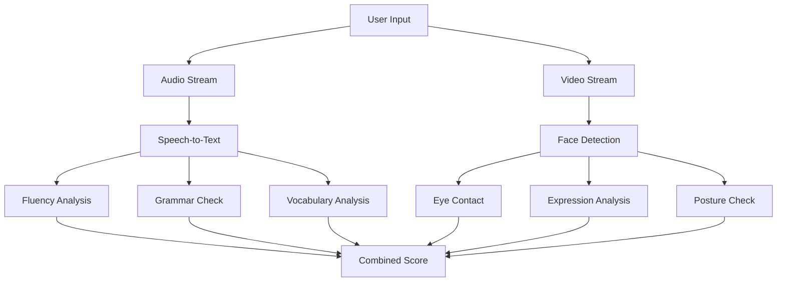

## Soft Skills Evaluation

The soft skills module evaluates communication abilities including fluency, grammar, vocabulary, visual presentation, and confidence. It's designed for interview preparation and presentation practice.

### Evaluation Dimensions



### Evaluation Metrics

| Metric | Weight | Description |
|--------|--------|-------------|
| Fluency | 25% | Speech rate, pauses, filler words |
| Grammar | 20% | Sentence structure, verb tenses |
| Vocabulary | 15% | Word variety, appropriate terms |
| Eye Contact | 15% | Looking at camera percentage |
| Expression | 10% | Appropriate facial expressions |
| Posture | 10% | Body position and stability |
| Confidence | 5% | Combined delivery assessment |

### Audio Analysis

**Fluency Metrics**

```python
class FluencyAnalyzer:
    def __init__(self):
        self.filler_words = [
            'um', 'uh', 'like', 'you know', 'basically',
            'actually', 'literally', 'so', 'right', 'okay'
        ]
        
    def analyze(self, transcript: str, audio_duration: float) -> dict:
        """
        Analyze fluency from transcript and audio timing.
        """
        words = transcript.lower().split()
        word_count = len(words)
        
        # Words per minute
        wpm = (word_count / audio_duration) * 60 if audio_duration > 0 else 0
        
        # Filler word count
        filler_count = sum(
            transcript.lower().count(f) for f in self.filler_words
        )
        filler_rate = filler_count / word_count if word_count > 0 else 0
        
        # Calculate score
        # Optimal WPM: 120-150 for presentations
        wpm_score = self._score_wpm(wpm)
        filler_score = max(0, 100 - filler_rate * 500)
        
        return {
            'words_per_minute': round(wpm, 1),
            'filler_count': filler_count,
            'filler_rate': round(filler_rate, 3),
            'fluency_score': round((wpm_score + filler_score) / 2, 1),
            'fillers_detected': self._find_fillers(transcript)
        }
    
    def _score_wpm(self, wpm: float) -> float:
        if 120 <= wpm <= 150:
            return 100
        elif wpm < 120:
            return max(0, 100 - (120 - wpm) * 2)
        else:
            return max(0, 100 - (wpm - 150) * 1.5)
```

**Grammar Analysis**

```python
import language_tool_python

class GrammarAnalyzer:
    def __init__(self):
        self.tool = language_tool_python.LanguageTool('en-US')
        
    def analyze(self, text: str) -> dict:
        """
        Check grammar and provide feedback.
        """
        matches = self.tool.check(text)
        
        # Categorize errors
        errors_by_type = {}
        for match in matches:
            category = match.category
            errors_by_type[category] = errors_by_type.get(category, 0) + 1
        
        # Calculate score
        word_count = len(text.split())
        error_rate = len(matches) / word_count if word_count > 0 else 0
        score = max(0, 100 - error_rate * 200)
        
        return {
            'error_count': len(matches),
            'errors_by_type': errors_by_type,
            'grammar_score': round(score, 1),
            'corrections': [
                {
                    'original': text[m.offset:m.offset + m.errorLength],
                    'suggestion': m.replacements[0] if m.replacements else None,
                    'message': m.message,
                    'category': m.category
                }
                for m in matches[:10]  # Limit to top 10
            ]
        }
```

**Vocabulary Analysis**

```python
from collections import Counter
import nltk
from nltk.corpus import wordnet

class VocabularyAnalyzer:
    def __init__(self):
        self.common_words = set(nltk.corpus.words.words()[:3000])
        
    def analyze(self, text: str) -> dict:
        """
        Analyze vocabulary richness and appropriateness.
        """
        words = nltk.word_tokenize(text.lower())
        words = [w for w in words if w.isalpha()]
        
        # Type-token ratio (vocabulary diversity)
        unique_words = set(words)
        ttr = len(unique_words) / len(words) if words else 0
        
        # Advanced word usage
        advanced_words = [
            w for w in unique_words
            if w not in self.common_words and len(w) > 5
        ]
        
        # Word frequency distribution
        word_freq = Counter(words)
        
        # Calculate score
        diversity_score = min(100, ttr * 200)
        advanced_score = min(100, len(advanced_words) * 5)
        
        return {
            'total_words': len(words),
            'unique_words': len(unique_words),
            'type_token_ratio': round(ttr, 3),
            'advanced_words': advanced_words[:20],
            'vocabulary_score': round((diversity_score + advanced_score) / 2, 1),
            'top_words': word_freq.most_common(10)
        }
```

### Video Analysis

**Eye Contact Detection**

```python
import mediapipe as mp
import numpy as np

class EyeContactAnalyzer:
    def __init__(self):
        self.face_mesh = mp.solutions.face_mesh.FaceMesh(
            static_image_mode=False,
            max_num_faces=1,
            refine_landmarks=True,
            min_detection_confidence=0.5
        )
        
        # Tracking variables
        self.total_frames = 0
        self.contact_frames = 0
        
    def process_frame(self, frame: np.ndarray) -> dict:
        """
        Analyze eye contact in a single frame.
        """
        self.total_frames += 1
        rgb_frame = cv2.cvtColor(frame, cv2.COLOR_BGR2RGB)
        results = self.face_mesh.process(rgb_frame)
        
        if not results.multi_face_landmarks:
            return {'eye_contact': False, 'reason': 'no_face'}
        
        landmarks = results.multi_face_landmarks[0]
        
        # Get iris positions
        left_iris = landmarks.landmark[468]
        right_iris = landmarks.landmark[473]
        
        # Get eye corners for reference
        left_inner = landmarks.landmark[133]
        left_outer = landmarks.landmark[33]
        right_inner = landmarks.landmark[362]
        right_outer = landmarks.landmark[263]
        
        # Calculate horizontal deviation from center
        left_center = (left_inner.x + left_outer.x) / 2
        right_center = (right_inner.x + right_outer.x) / 2
        
        left_deviation = abs(left_iris.x - left_center) / abs(left_inner.x - left_outer.x)
        right_deviation = abs(right_iris.x - right_center) / abs(right_inner.x - right_outer.x)
        
        avg_deviation = (left_deviation + right_deviation) / 2
        
        # Eye contact if deviation is small (looking at camera)
        is_contact = avg_deviation < 0.25
        
        if is_contact:
            self.contact_frames += 1
            
        return {
            'eye_contact': is_contact,
            'deviation': round(avg_deviation, 3),
            'contact_rate': round(self.contact_frames / self.total_frames, 3)
        }
    
    def get_summary(self) -> dict:
        contact_rate = self.contact_frames / self.total_frames if self.total_frames > 0 else 0
        return {
            'eye_contact_percentage': round(contact_rate * 100, 1),
            'eye_contact_score': round(contact_rate * 100, 1),
            'total_frames': self.total_frames
        }
```

**Expression Analysis**

```python
from fer import FER

class ExpressionAnalyzer:
    def __init__(self):
        self.detector = FER(mtcnn=True)
        self.expression_counts = {}
        self.total_frames = 0
        
    def process_frame(self, frame: np.ndarray) -> dict:
        """
        Detect facial expression in frame.
        """
        self.total_frames += 1
        
        result = self.detector.detect_emotions(frame)
        
        if not result:
            return {'expression': 'no_face', 'confidence': 0}
        
        emotions = result[0]['emotions']
        dominant = max(emotions, key=emotions.get)
        
        # Track expression distribution
        self.expression_counts[dominant] = self.expression_counts.get(dominant, 0) + 1
        
        return {
            'expression': dominant,
            'confidence': round(emotions[dominant], 2),
            'all_emotions': {k: round(v, 2) for k, v in emotions.items()}
        }
    
    def get_summary(self) -> dict:
        distribution = {
            k: round(v / self.total_frames * 100, 1)
            for k, v in self.expression_counts.items()
        }
        
        # Score based on appropriate expressions
        positive_expressions = ['happy', 'neutral']
        positive_rate = sum(
            self.expression_counts.get(e, 0) for e in positive_expressions
        ) / self.total_frames if self.total_frames > 0 else 0
        
        return {
            'expression_distribution': distribution,
            'dominant_expression': max(distribution, key=distribution.get) if distribution else 'unknown',
            'expression_score': round(positive_rate * 100, 1)
        }
```

### API Endpoints

```python
@router.post("/evaluate/start")
async def start_evaluation(request: StartEvaluationRequest):
    """
    Start a new soft skills evaluation session.
    """
    session_id = str(uuid4())
    
    session_data = {
        'user_id': request.user_id,
        'mode': request.mode,  # interview, presentation, speech
        'started_at': datetime.utcnow().isoformat(),
        'status': 'active'
    }
    
    await redis.set(
        f"softskills:session:{session_id}",
        json.dumps(session_data),
        ex=3600
    )
    
    return {"session_id": session_id}


@router.websocket("/evaluate/{session_id}/stream")
async def stream_evaluation(websocket: WebSocket, session_id: str):
    """
    WebSocket for real-time audio/video evaluation.
    """
    await websocket.accept()
    
    eye_analyzer = EyeContactAnalyzer()
    expression_analyzer = ExpressionAnalyzer()
    
    try:
        while True:
            data = await websocket.receive_json()
            
            results = {}
            
            if 'video_frame' in data:
                # Decode and process video frame
                frame = decode_frame(data['video_frame'])
                
                eye_result = eye_analyzer.process_frame(frame)
                expression_result = expression_analyzer.process_frame(frame)
                
                results['eye_contact'] = eye_result
                results['expression'] = expression_result
            
            if 'audio_transcript' in data:
                # Process transcript chunk
                # (Full analysis done at session end)
                pass
            
            await websocket.send_json(results)
            
    except WebSocketDisconnect:
        pass


@router.post("/evaluate/{session_id}/end")
async def end_evaluation(session_id: str, request: EndEvaluationRequest):
    """
    End evaluation and get comprehensive results.
    """
    # Get full transcript
    transcript = request.full_transcript
    audio_duration = request.audio_duration
    
    # Run all analyzers
    fluency = FluencyAnalyzer().analyze(transcript, audio_duration)
    grammar = GrammarAnalyzer().analyze(transcript)
    vocabulary = VocabularyAnalyzer().analyze(transcript)
    
    # Get video summaries from session
    session_data = await get_session_data(session_id)
    eye_contact = session_data.get('eye_contact_summary', {})
    expression = session_data.get('expression_summary', {})
    
    # Calculate combined score
    combined_score = (
        fluency['fluency_score'] * 0.25 +
        grammar['grammar_score'] * 0.20 +
        vocabulary['vocabulary_score'] * 0.15 +
        eye_contact.get('eye_contact_score', 50) * 0.15 +
        expression.get('expression_score', 50) * 0.10 +
        50 * 0.15  # Placeholder for other metrics
    )
    
    return {
        'session_id': session_id,
        'overall_score': round(combined_score, 1),
        'metrics': {
            'fluency': fluency,
            'grammar': grammar,
            'vocabulary': vocabulary,
            'eye_contact': eye_contact,
            'expression': expression
        },
        'feedback': generate_feedback(combined_score, {
            'fluency': fluency,
            'grammar': grammar,
            'vocabulary': vocabulary
        })
    }
```

### Feedback Generation

```python
def generate_feedback(score: float, metrics: dict) -> dict:
    """
    Generate actionable feedback based on evaluation results.
    """
    feedback = {
        'strengths': [],
        'improvements': [],
        'tips': []
    }
    
    # Fluency feedback
    if metrics['fluency']['fluency_score'] >= 80:
        feedback['strengths'].append("Good speaking pace and minimal filler words")
    else:
        if metrics['fluency']['filler_count'] > 5:
            feedback['improvements'].append(
                f"Reduce filler words (detected {metrics['fluency']['filler_count']})"
            )
            feedback['tips'].append(
                "Practice pausing instead of using filler words like 'um' and 'uh'"
            )
        
        wpm = metrics['fluency']['words_per_minute']
        if wpm < 100:
            feedback['improvements'].append("Speaking pace is too slow")
            feedback['tips'].append("Try to speak at 120-150 words per minute")
        elif wpm > 170:
            feedback['improvements'].append("Speaking pace is too fast")
            feedback['tips'].append("Slow down to ensure clarity")
    
    # Grammar feedback
    if metrics['grammar']['grammar_score'] >= 85:
        feedback['strengths'].append("Strong grammatical accuracy")
    else:
        errors = metrics['grammar']['errors_by_type']
        top_error = max(errors, key=errors.get) if errors else None
        if top_error:
            feedback['improvements'].append(f"Review {top_error.lower()} rules")
    
    # Vocabulary feedback
    if metrics['vocabulary']['vocabulary_score'] >= 75:
        feedback['strengths'].append("Good vocabulary range")
    else:
        feedback['improvements'].append("Expand vocabulary variety")
        feedback['tips'].append("Try to use more diverse and precise words")
    
    return feedback
```

### Evaluation Modes

| Mode | Duration | Focus |
|------|----------|-------|
| Interview | 10-30 min | Q&A responses, confidence |
| Presentation | 5-15 min | Structured delivery, engagement |
| Speech | 3-10 min | Fluency, expressiveness |
| Quick Check | 1-3 min | Basic metrics snapshot |

### Client Integration

```typescript
interface SoftSkillsMetrics {
  eye_contact: boolean
  expression: string
  confidence: number
}

class SoftSkillsClient {
  private ws: WebSocket
  private mediaRecorder: MediaRecorder
  private video: HTMLVideoElement
  private canvas: HTMLCanvasElement
  
  async start(sessionId: string): Promise<void> {
    // Setup media
    const stream = await navigator.mediaDevices.getUserMedia({
      video: true,
      audio: true
    })
    
    this.video.srcObject = stream
    
    // Connect WebSocket
    this.ws = new WebSocket(`wss://api.example.com/api/softskills/evaluate/${sessionId}/stream`)
    
    // Start audio recording for transcript
    this.mediaRecorder = new MediaRecorder(stream)
    
    // Send video frames at 5 FPS
    setInterval(() => this.sendFrame(), 200)
  }
  
  private sendFrame(): void {
    const ctx = this.canvas.getContext('2d')!
    ctx.drawImage(this.video, 0, 0)
    
    const frameData = this.canvas.toDataURL('image/jpeg', 0.7)
    
    this.ws.send(JSON.stringify({
      video_frame: frameData.split(',')[1]
    }))
  }
}
```

### Score Interpretation

| Score Range | Level | Interpretation |
|-------------|-------|----------------|
| 90-100 | Excellent | Ready for professional settings |
| 75-89 | Good | Minor improvements needed |
| 60-74 | Moderate | Practice recommended |
| 40-59 | Developing | Significant practice needed |
| 0-39 | Beginning | Focus on fundamentals |
